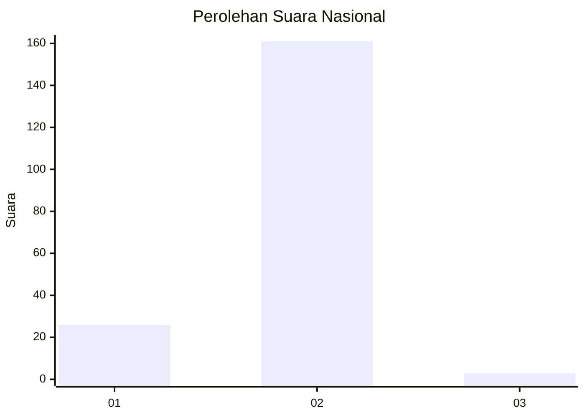
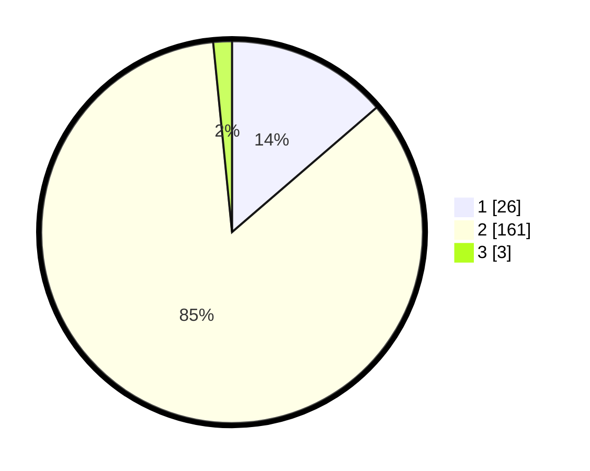

# Hasil

## Grafik

## Tabel

| No. | Nama Paslon    | Suara | Suara (raw) | Persentase |
|:--- |:-------------- | -----:| -----------:| ----------:|
| 1   | ANIES MUHAIMIN | 26    | [26][p-1]   | 13,68      |
| 2   | PRABOWO GIBRAN | 161   | [161][p-2]  | 84,74      |
| 3   | GANJAR MAHFUD  | 3     | [3][p-3]    | 1,58       |

[p-1]: https://github.com/gigit-pemilu/pemilu-2024/blob/main/pilpres/hitung-suara/sub/17-bengkulu/sub/08-kepahiang/sub/04-kepahiang/sub/1027-padang-lekat/sub/006-tps/sub/paslon-1.txt
[p-2]: https://github.com/gigit-pemilu/pemilu-2024/blob/main/pilpres/hitung-suara/sub/17-bengkulu/sub/08-kepahiang/sub/04-kepahiang/sub/1027-padang-lekat/sub/006-tps/sub/paslon-2.txt
[p-3]: https://github.com/gigit-pemilu/pemilu-2024/blob/main/pilpres/hitung-suara/sub/17-bengkulu/sub/08-kepahiang/sub/04-kepahiang/sub/1027-padang-lekat/sub/006-tps/sub/paslon-3.txt

## Foto C Plano

https://sirekap-obj-formc.kpu.go.id/44bc/pemilu/ppwp/17/08/04/10/27/1708041027006-20240215-025307--f51c5282-af6e-4eb1-b7d0-b0d5fb20aee2.jpg

https://sirekap-obj-formc.kpu.go.id/44bc/pemilu/ppwp/17/08/04/10/27/1708041027006-20240215-033542--adf9ac31-1491-431d-b969-335849470ce5.jpg

https://sirekap-obj-formc.kpu.go.id/44bc/pemilu/ppwp/17/08/04/10/27/1708041027006-20240215-030017--ab2a2eac-2a08-4471-809e-235a14f429b6.jpg

## Metadata

| Key        | Value               |
| ---------- | ------------------- |
| Time Stamp | 2024-02-15 22:30:27 |

