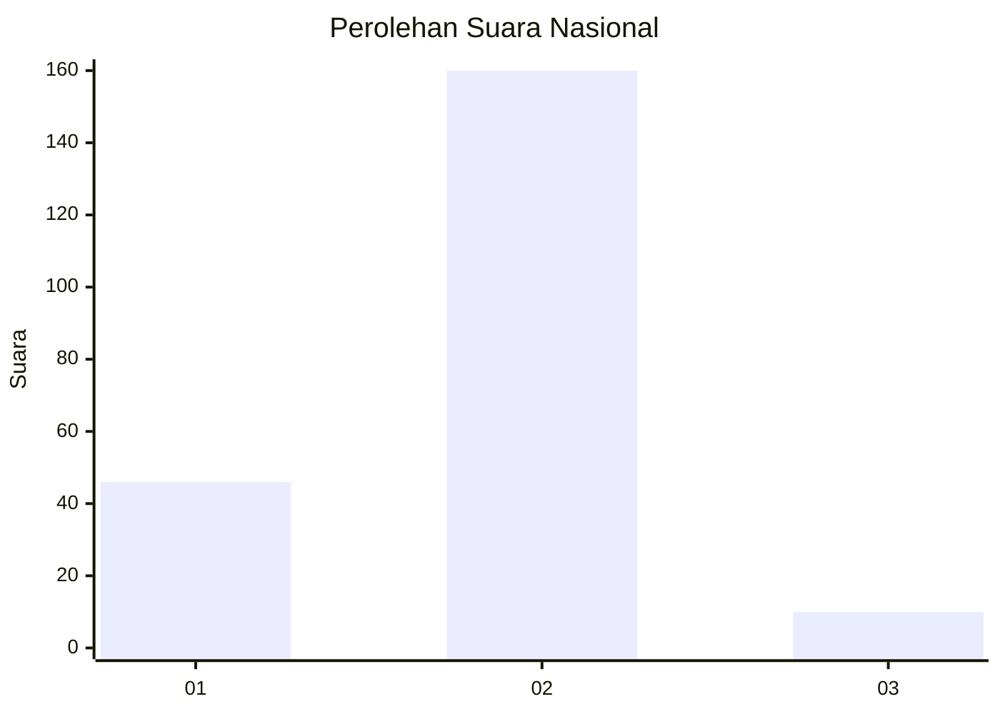
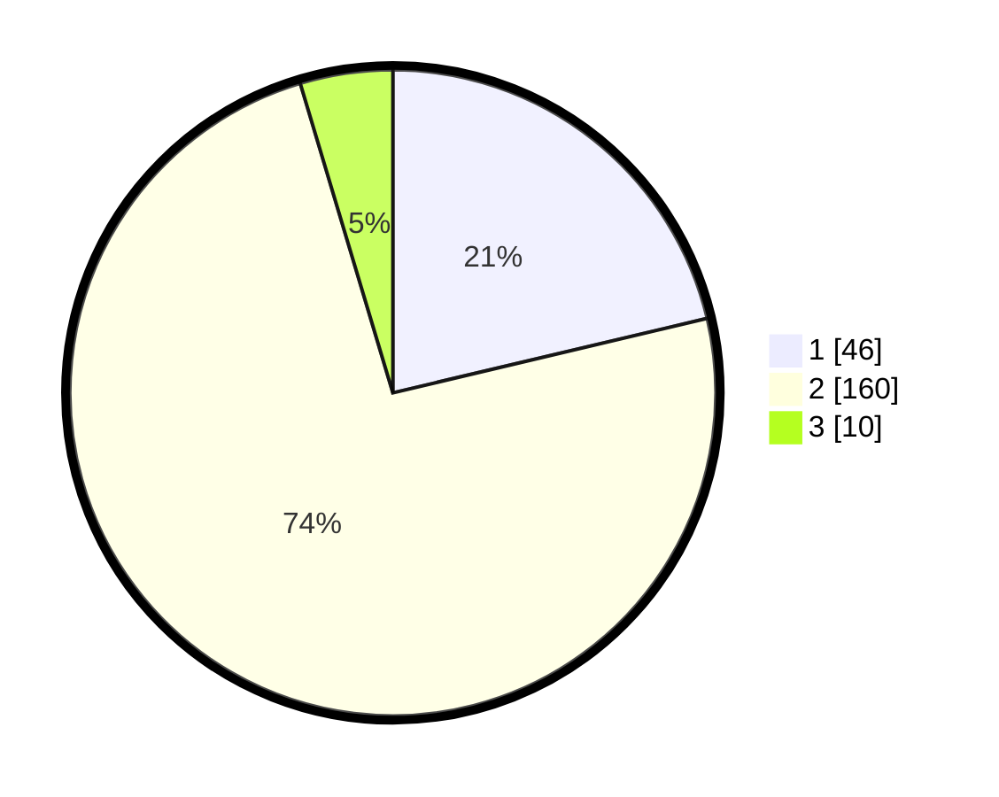

# Hasil

## Grafik

## Tabel

| No. | Nama Paslon    | Suara | Suara (raw) | Persentase |
|:--- |:-------------- | -----:| -----------:| ----------:|
| 1   | ANIES MUHAIMIN | 46    | [46][p-1]   | 21,30      |
| 2   | PRABOWO GIBRAN | 160   | [160][p-2]  | 74,07      |
| 3   | GANJAR MAHFUD  | 10    | [10][p-3]   | 4,63       |

[p-1]: https://github.com/gigit-pemilu/pemilu-2024/blob/main/pilpres/hitung-suara/sub/17-bengkulu/sub/08-kepahiang/sub/04-kepahiang/sub/2002-tebat-monok/sub/004-tps/sub/paslon-1.txt
[p-2]: https://github.com/gigit-pemilu/pemilu-2024/blob/main/pilpres/hitung-suara/sub/17-bengkulu/sub/08-kepahiang/sub/04-kepahiang/sub/2002-tebat-monok/sub/004-tps/sub/paslon-2.txt
[p-3]: https://github.com/gigit-pemilu/pemilu-2024/blob/main/pilpres/hitung-suara/sub/17-bengkulu/sub/08-kepahiang/sub/04-kepahiang/sub/2002-tebat-monok/sub/004-tps/sub/paslon-3.txt

## Foto C Plano

https://sirekap-obj-formc.kpu.go.id/c333/pemilu/ppwp/17/08/04/20/02/1708042002004-20240214-235440--d2c11f33-4a1c-467b-89fc-3278d997b8f5.jpg

https://sirekap-obj-formc.kpu.go.id/c333/pemilu/ppwp/17/08/04/20/02/1708042002004-20240214-235456--e070237d-158a-49f8-aa57-06b66055af0c.jpg

https://sirekap-obj-formc.kpu.go.id/c333/pemilu/ppwp/17/08/04/20/02/1708042002004-20240214-235546--bf43b41a-8f4b-49c3-8fe4-8f79575251bb.jpg

## Metadata

| Key        | Value               |
| ---------- | ------------------- |
| Time Stamp | 2024-02-15 15:00:29 |

