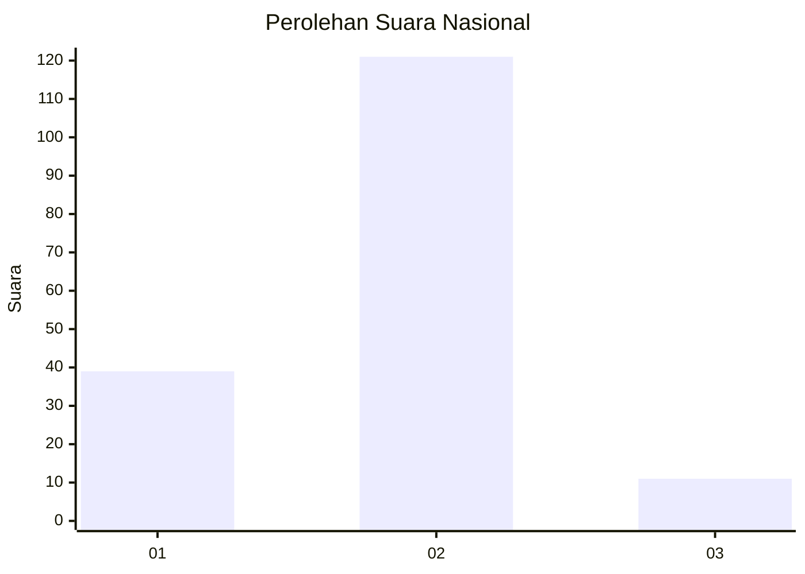

# Hasil

## Grafik

## Tabel

| No. | Nama Paslon    | Suara | Suara (raw) | Persentase |
|:--- |:-------------- | -----:| -----------:| ----------:|
| 1   | ANIES MUHAIMIN | 39    | [39][p-1]   | 22,81      |
| 2   | PRABOWO GIBRAN | 121   | [121][p-2]  | 70,76      |
| 3   | GANJAR MAHFUD  | 11    | [11][p-3]   | 6,43       |

[p-1]: https://github.com/gigit-pemilu/pemilu-2024/blob/main/pilpres/hitung-suara/sub/17-bengkulu/sub/08-kepahiang/sub/04-kepahiang/sub/2002-tebat-monok/sub/012-tps/sub/paslon-1.txt
[p-2]: https://github.com/gigit-pemilu/pemilu-2024/blob/main/pilpres/hitung-suara/sub/17-bengkulu/sub/08-kepahiang/sub/04-kepahiang/sub/2002-tebat-monok/sub/012-tps/sub/paslon-2.txt
[p-3]: https://github.com/gigit-pemilu/pemilu-2024/blob/main/pilpres/hitung-suara/sub/17-bengkulu/sub/08-kepahiang/sub/04-kepahiang/sub/2002-tebat-monok/sub/012-tps/sub/paslon-3.txt

## Foto C Plano

https://sirekap-obj-formc.kpu.go.id/66b6/pemilu/ppwp/17/08/04/20/02/1708042002012-20240215-012505--16ed9aa1-98d1-4317-a62b-f2548ec9b7f7.jpg

https://sirekap-obj-formc.kpu.go.id/66b6/pemilu/ppwp/17/08/04/20/02/1708042002012-20240215-012655--ca1191df-4709-484d-8d66-12a67cdb1c95.jpg

https://sirekap-obj-formc.kpu.go.id/66b6/pemilu/ppwp/17/08/04/20/02/1708042002012-20240215-012825--c4318a31-ebe0-4722-a657-ff1ea036cc9c.jpg

## Metadata

| Key        | Value               |
| ---------- | ------------------- |
| Time Stamp | 2024-02-15 12:00:28 |

