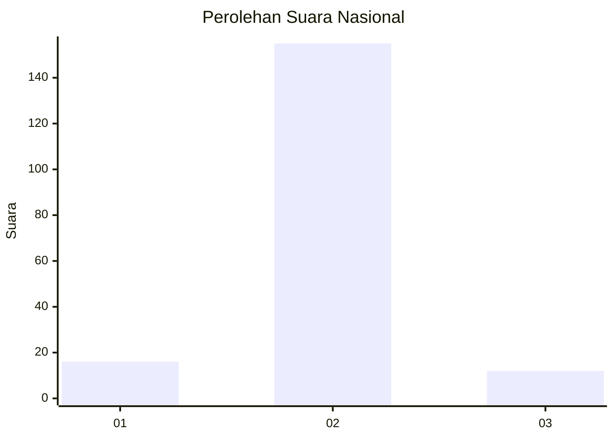
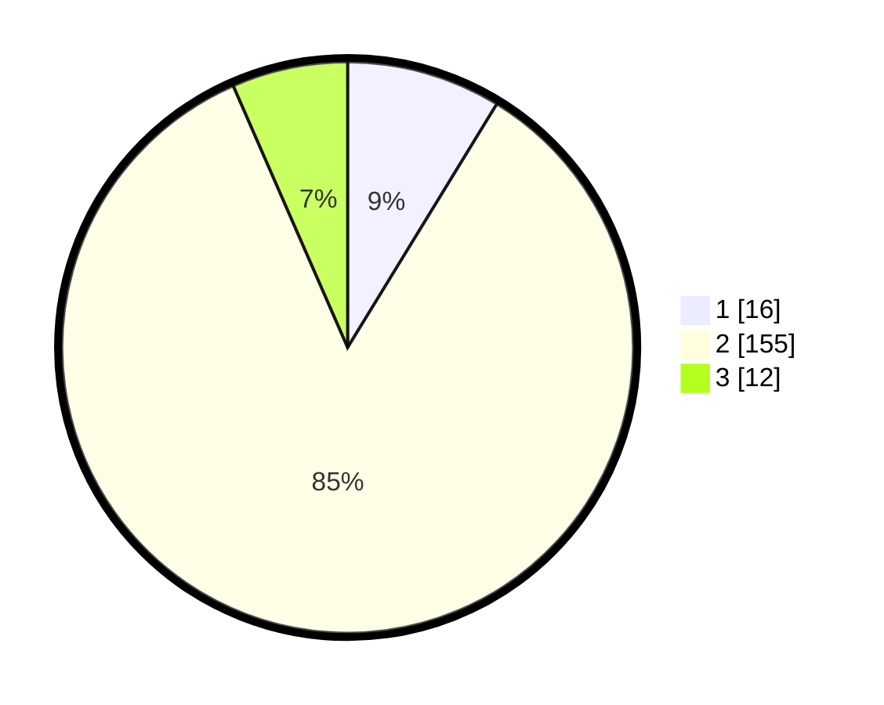

# Hasil

## Grafik

## Tabel

| No. | Nama Paslon    | Suara | Suara (raw) | Persentase |
|:--- |:-------------- | -----:| -----------:| ----------:|
| 1   | ANIES MUHAIMIN | 16    | [16][p-1]   | 8,74       |
| 2   | PRABOWO GIBRAN | 155   | [155][p-2]  | 84,70      |
| 3   | GANJAR MAHFUD  | 12    | [12][p-3]   | 6,56       |

[p-1]: https://github.com/gigit-pemilu/pemilu-2024/blob/main/pilpres/hitung-suara/sub/17-bengkulu/sub/08-kepahiang/sub/04-kepahiang/sub/2014-taba-tebelet/sub/003-tps/sub/paslon-1.txt
[p-2]: https://github.com/gigit-pemilu/pemilu-2024/blob/main/pilpres/hitung-suara/sub/17-bengkulu/sub/08-kepahiang/sub/04-kepahiang/sub/2014-taba-tebelet/sub/003-tps/sub/paslon-2.txt
[p-3]: https://github.com/gigit-pemilu/pemilu-2024/blob/main/pilpres/hitung-suara/sub/17-bengkulu/sub/08-kepahiang/sub/04-kepahiang/sub/2014-taba-tebelet/sub/003-tps/sub/paslon-3.txt

## Foto C Plano

https://sirekap-obj-formc.kpu.go.id/6fcb/pemilu/ppwp/17/08/04/20/14/1708042014003-20240214-220336--04457f3b-64c6-4bb4-ac82-4cee83af4117.jpg

https://sirekap-obj-formc.kpu.go.id/6fcb/pemilu/ppwp/17/08/04/20/14/1708042014003-20240214-220508--9691fb5b-9715-42b3-a54d-0031a18bdba0.jpg

https://sirekap-obj-formc.kpu.go.id/6fcb/pemilu/ppwp/17/08/04/20/14/1708042014003-20240214-220614--95a3dabd-ce1c-4517-a5ce-b69bcc6b2c7e.jpg

## Metadata

| Key        | Value               |
| ---------- | ------------------- |
| Time Stamp | 2024-02-15 12:00:28 |

