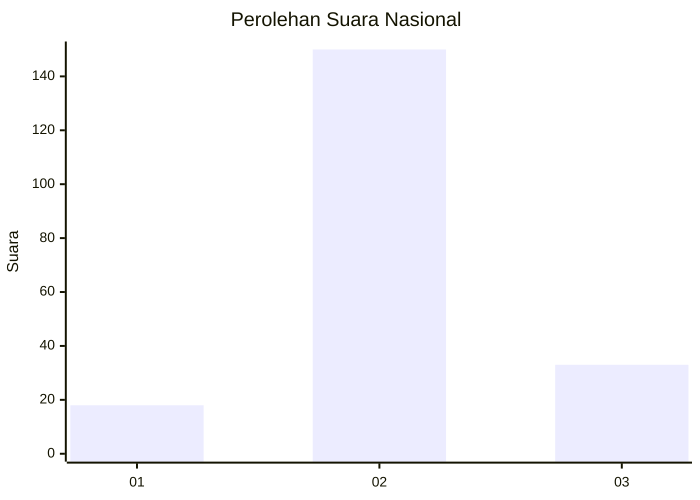
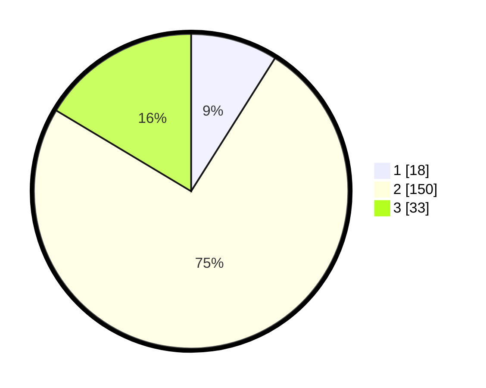

# Hasil

## Grafik

## Tabel

| No. | Nama Paslon    | Suara | Suara (raw) | Persentase |
|:--- |:-------------- | -----:| -----------:| ----------:|
| 1   | ANIES MUHAIMIN | 18    | [18][p-1]   | 8,96       |
| 2   | PRABOWO GIBRAN | 150   | [150][p-2]  | 74,63      |
| 3   | GANJAR MAHFUD  | 33    | [33][p-3]   | 16,42      |

[p-1]: https://github.com/gigit-pemilu/pemilu-2024/blob/main/pilpres/hitung-suara/sub/17-bengkulu/sub/08-kepahiang/sub/06-kebawetan/sub/1005-tangsi-baru/sub/005-tps/sub/paslon-1.txt
[p-2]: https://github.com/gigit-pemilu/pemilu-2024/blob/main/pilpres/hitung-suara/sub/17-bengkulu/sub/08-kepahiang/sub/06-kebawetan/sub/1005-tangsi-baru/sub/005-tps/sub/paslon-2.txt
[p-3]: https://github.com/gigit-pemilu/pemilu-2024/blob/main/pilpres/hitung-suara/sub/17-bengkulu/sub/08-kepahiang/sub/06-kebawetan/sub/1005-tangsi-baru/sub/005-tps/sub/paslon-3.txt

## Foto C Plano

https://sirekap-obj-formc.kpu.go.id/7892/pemilu/ppwp/17/08/06/10/05/1708061005005-20240215-003238--093edc4a-f6b3-4dc2-915a-021002a02dcc.jpg

https://sirekap-obj-formc.kpu.go.id/7892/pemilu/ppwp/17/08/06/10/05/1708061005005-20240215-003328--a163ca26-b725-4cc1-891f-fd21f056c3b2.jpg

https://sirekap-obj-formc.kpu.go.id/7892/pemilu/ppwp/17/08/06/10/05/1708061005005-20240215-003532--76bebc87-85b7-479c-978b-83298b77bd49.jpg

## Metadata

| Key        | Value               |
| ---------- | ------------------- |
| Time Stamp | 2024-02-15 22:30:27 |

