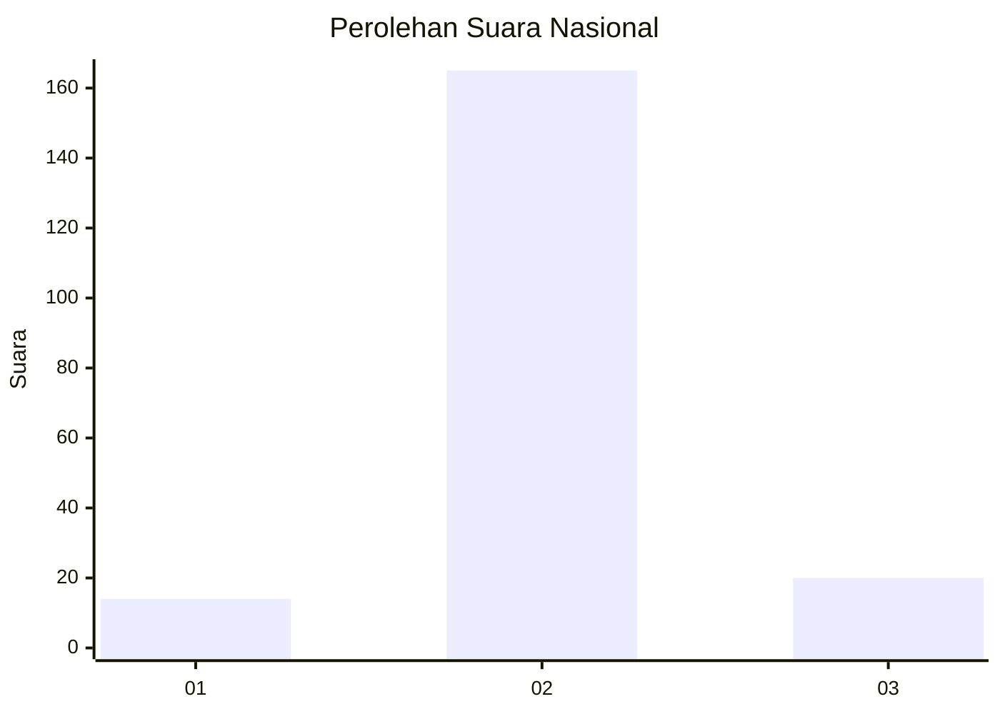
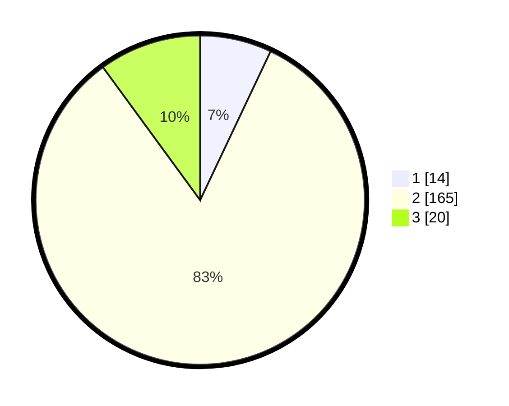

# Hasil

## Grafik

## Tabel

| No. | Nama Paslon    | Suara | Suara (raw) | Persentase |
|:--- |:-------------- | -----:| -----------:| ----------:|
| 1   | ANIES MUHAIMIN | 14    | [14][p-1]   | 7,04       |
| 2   | PRABOWO GIBRAN | 165   | [165][p-2]  | 82,91      |
| 3   | GANJAR MAHFUD  | 20    | [20][p-3]   | 10,05      |

[p-1]: https://github.com/gigit-pemilu/pemilu-2024/blob/main/pilpres/hitung-suara/sub/17-bengkulu/sub/08-kepahiang/sub/06-kebawetan/sub/2010-pematang-donok/sub/004-tps/sub/paslon-1.txt
[p-2]: https://github.com/gigit-pemilu/pemilu-2024/blob/main/pilpres/hitung-suara/sub/17-bengkulu/sub/08-kepahiang/sub/06-kebawetan/sub/2010-pematang-donok/sub/004-tps/sub/paslon-2.txt
[p-3]: https://github.com/gigit-pemilu/pemilu-2024/blob/main/pilpres/hitung-suara/sub/17-bengkulu/sub/08-kepahiang/sub/06-kebawetan/sub/2010-pematang-donok/sub/004-tps/sub/paslon-3.txt

## Foto C Plano

https://sirekap-obj-formc.kpu.go.id/9e4e/pemilu/ppwp/17/08/06/20/10/1708062010004-20240217-000509--b9611278-8bcd-4d9f-8ffe-c6e459d0b86a.jpg

https://sirekap-obj-formc.kpu.go.id/9e4e/pemilu/ppwp/17/08/06/20/10/1708062010004-20240217-002651--bac8c7a3-7197-434f-b78f-e7c261abba9e.jpg

https://sirekap-obj-formc.kpu.go.id/9e4e/pemilu/ppwp/17/08/06/20/10/1708062010004-20240216-235549--b5c4c567-2df8-4bed-90ec-7121e07c3bad.jpg

## Metadata

| Key        | Value               |
| ---------- | ------------------- |
| Time Stamp | 2024-02-19 06:16:00 |

