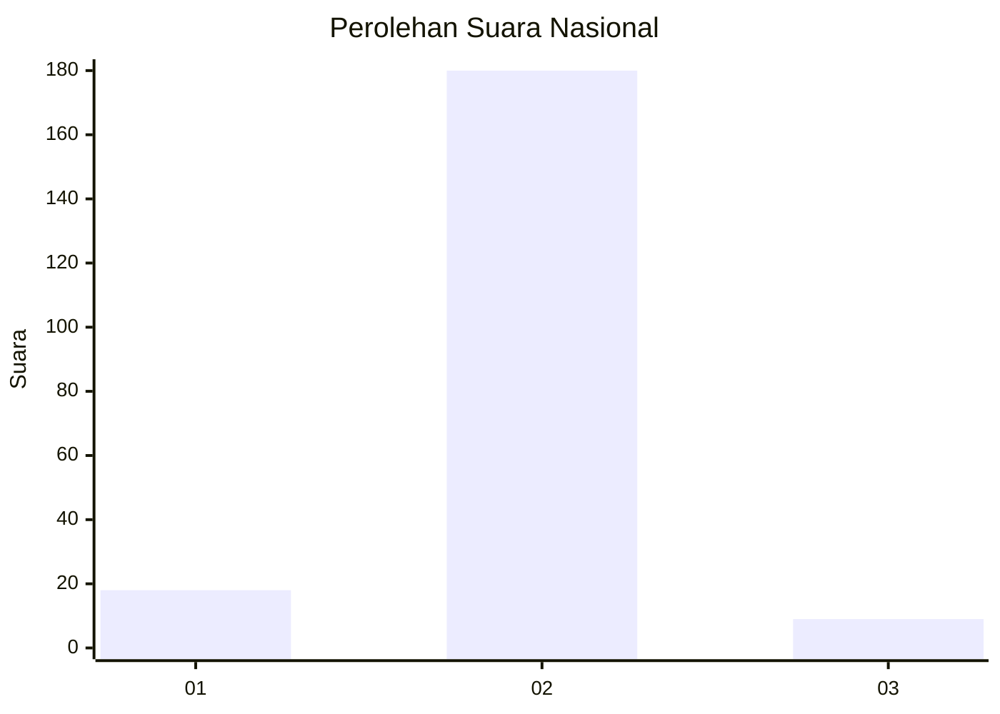
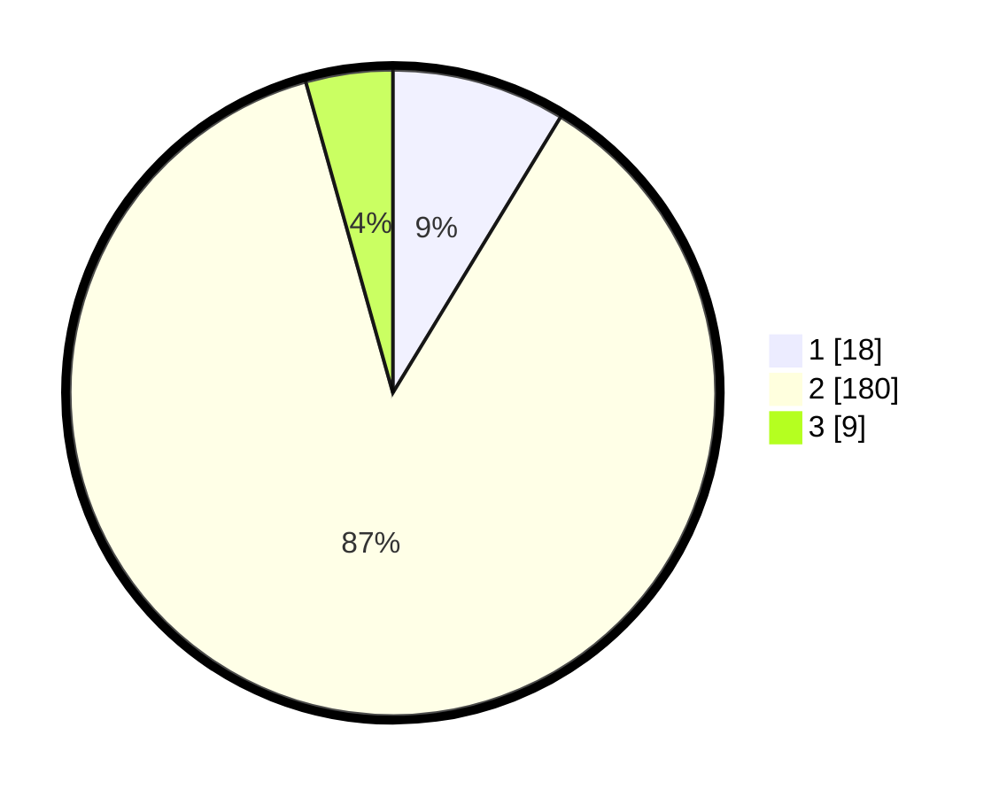

# Hasil

## Grafik

## Tabel

| No. | Nama Paslon    | Suara | Suara (raw) | Persentase |
|:--- |:-------------- | -----:| -----------:| ----------:|
| 1   | ANIES MUHAIMIN | 18    | [18][p-1]   | 8,70       |
| 2   | PRABOWO GIBRAN | 180   | [180][p-2]  | 86,96      |
| 3   | GANJAR MAHFUD  | 9     | [9][p-3]    | 4,35       |

[p-1]: https://github.com/gigit-pemilu/pemilu-2024/blob/main/pilpres/hitung-suara/sub/17-bengkulu/sub/08-kepahiang/sub/08-muara-kemumu/sub/2002-batu-kalung/sub/001-tps/sub/paslon-1.txt
[p-2]: https://github.com/gigit-pemilu/pemilu-2024/blob/main/pilpres/hitung-suara/sub/17-bengkulu/sub/08-kepahiang/sub/08-muara-kemumu/sub/2002-batu-kalung/sub/001-tps/sub/paslon-2.txt
[p-3]: https://github.com/gigit-pemilu/pemilu-2024/blob/main/pilpres/hitung-suara/sub/17-bengkulu/sub/08-kepahiang/sub/08-muara-kemumu/sub/2002-batu-kalung/sub/001-tps/sub/paslon-3.txt

## Foto C Plano

https://sirekap-obj-formc.kpu.go.id/5c90/pemilu/ppwp/17/08/08/20/02/1708082002001-20240215-022742--91a72f38-ccd8-4b63-8440-73f0a1745405.jpg

https://sirekap-obj-formc.kpu.go.id/5c90/pemilu/ppwp/17/08/08/20/02/1708082002001-20240215-020835--655aff4e-5ee1-444e-901c-705f38851f29.jpg

https://sirekap-obj-formc.kpu.go.id/5c90/pemilu/ppwp/17/08/08/20/02/1708082002001-20240215-020925--b44f0fe5-92d2-42f9-b95c-8ebe9c1afd9b.jpg

## Metadata

| Key        | Value               |
| ---------- | ------------------- |
| Time Stamp | 2024-02-15 16:00:26 |

