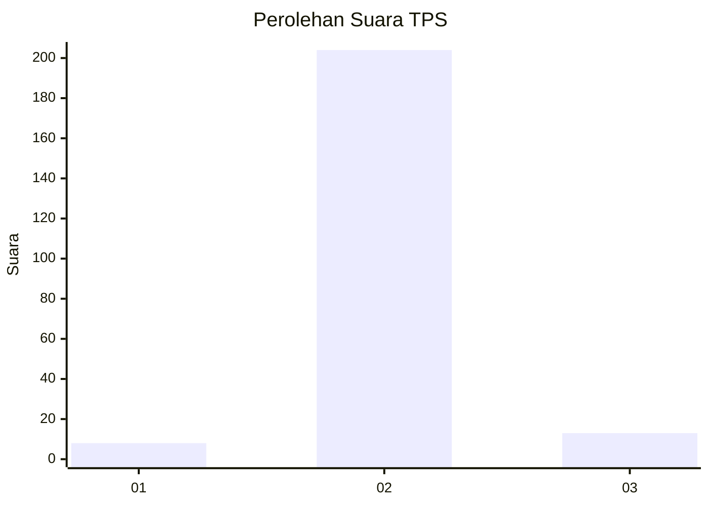
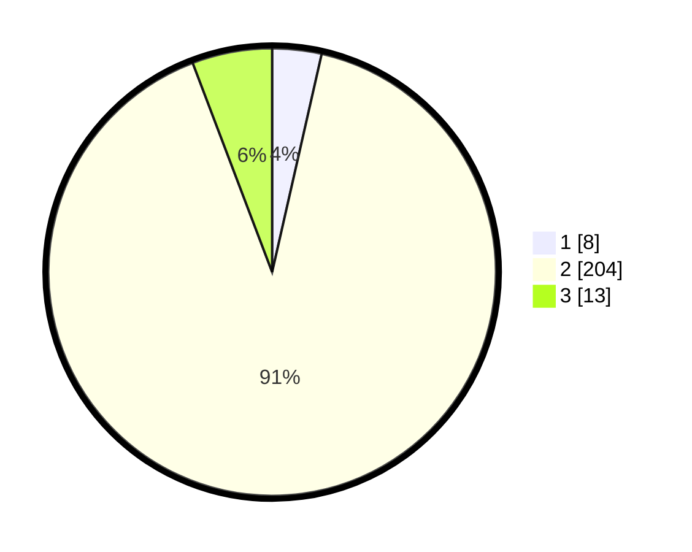

# Hasil

## Grafik

## Tabel

| No. | Nama Paslon    | Suara | Suara (raw) | Persentase |
|:--- |:-------------- | -----:| -----------:| ----------:|
| 1   | ANIES MUHAIMIN | 8     | [8][p-1]    | 3,56       |
| 2   | PRABOWO GIBRAN | 204   | [204][p-2]  | 90,67      |
| 3   | GANJAR MAHFUD  | 13    | [13][p-3]   | 5,78       |

[p-1]: https://github.com/gigit-pemilu/pemilu-2024-17-bengkulu/blob/main/pilpres/hitung-suara/sub/17-bengkulu/sub/08-kepahiang/sub/08-muara-kemumu/sub/2002-batu-kalung/sub/006-tps/sub/paslon-1.txt
[p-2]: https://github.com/gigit-pemilu/pemilu-2024-17-bengkulu/blob/main/pilpres/hitung-suara/sub/17-bengkulu/sub/08-kepahiang/sub/08-muara-kemumu/sub/2002-batu-kalung/sub/006-tps/sub/paslon-2.txt
[p-3]: https://github.com/gigit-pemilu/pemilu-2024-17-bengkulu/blob/main/pilpres/hitung-suara/sub/17-bengkulu/sub/08-kepahiang/sub/08-muara-kemumu/sub/2002-batu-kalung/sub/006-tps/sub/paslon-3.txt

## Foto C Plano

https://sirekap-obj-formc.kpu.go.id/7ae8/pemilu/ppwp/17/08/08/20/02/1708082002006-20240214-222621--5d05c819-8468-441c-9983-0875f7510c9e.jpg

https://sirekap-obj-formc.kpu.go.id/7ae8/pemilu/ppwp/17/08/08/20/02/1708082002006-20240214-223156--56aea8f9-a55d-45df-8034-47bad78e9bf0.jpg

https://sirekap-obj-formc.kpu.go.id/7ae8/pemilu/ppwp/17/08/08/20/02/1708082002006-20240214-223419--71755ee9-d06c-4fb3-bbbb-03b7641ebb27.jpg

## Metadata

| Key        | Value               |
| ---------- | ------------------- |
| Time Stamp | 2024-02-15 22:00:27 |

