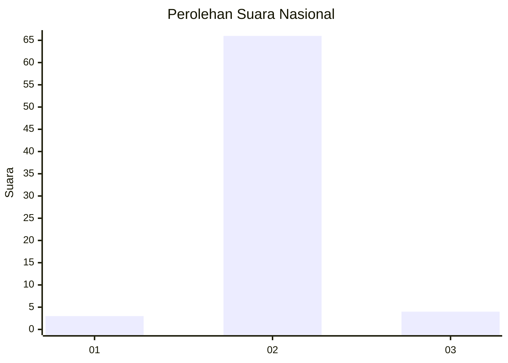
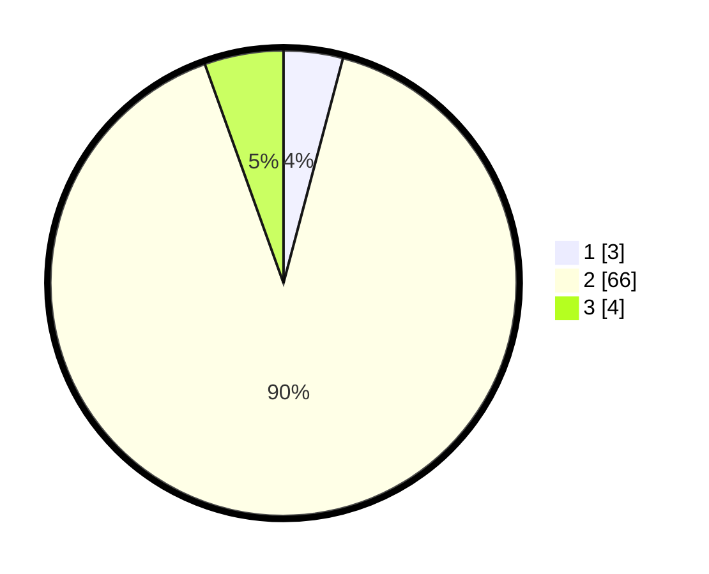

# Hasil

## Grafik

## Tabel

| No. | Nama Paslon    | Suara | Suara (raw) | Persentase |
|:--- |:-------------- | -----:| -----------:| ----------:|
| 1   | ANIES MUHAIMIN | 3     | [3][p-1]    | 4,11       |
| 2   | PRABOWO GIBRAN | 66    | [66][p-2]   | 90,41      |
| 3   | GANJAR MAHFUD  | 4     | [4][p-3]    | 5,48       |

[p-1]: https://github.com/gigit-pemilu/pemilu-2024/blob/main/pilpres/hitung-suara/sub/17-bengkulu/sub/08-kepahiang/sub/08-muara-kemumu/sub/2002-batu-kalung/sub/007-tps/sub/paslon-1.txt
[p-2]: https://github.com/gigit-pemilu/pemilu-2024/blob/main/pilpres/hitung-suara/sub/17-bengkulu/sub/08-kepahiang/sub/08-muara-kemumu/sub/2002-batu-kalung/sub/007-tps/sub/paslon-2.txt
[p-3]: https://github.com/gigit-pemilu/pemilu-2024/blob/main/pilpres/hitung-suara/sub/17-bengkulu/sub/08-kepahiang/sub/08-muara-kemumu/sub/2002-batu-kalung/sub/007-tps/sub/paslon-3.txt

## Foto C Plano

https://sirekap-obj-formc.kpu.go.id/0703/pemilu/ppwp/17/08/08/20/02/1708082002007-20240214-222516--170e7787-21ca-424c-a0e0-667cfd3b3576.jpg

https://sirekap-obj-formc.kpu.go.id/0703/pemilu/ppwp/17/08/08/20/02/1708082002007-20240214-222601--0898fd20-74f6-4c95-a3c9-73c2bd169fd5.jpg

https://sirekap-obj-formc.kpu.go.id/0703/pemilu/ppwp/17/08/08/20/02/1708082002007-20240214-222621--9b3f0727-ba37-497b-ae55-300146fcff78.jpg

## Metadata

| Key        | Value               |
| ---------- | ------------------- |
| Time Stamp | 2024-02-15 15:00:29 |

