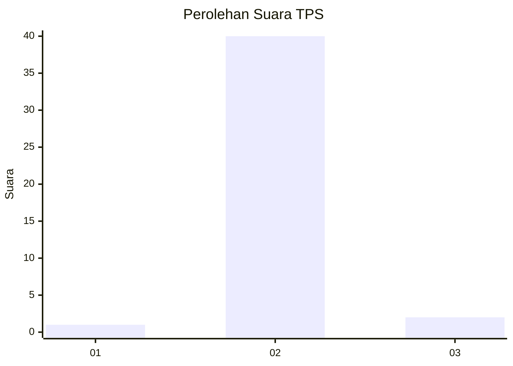
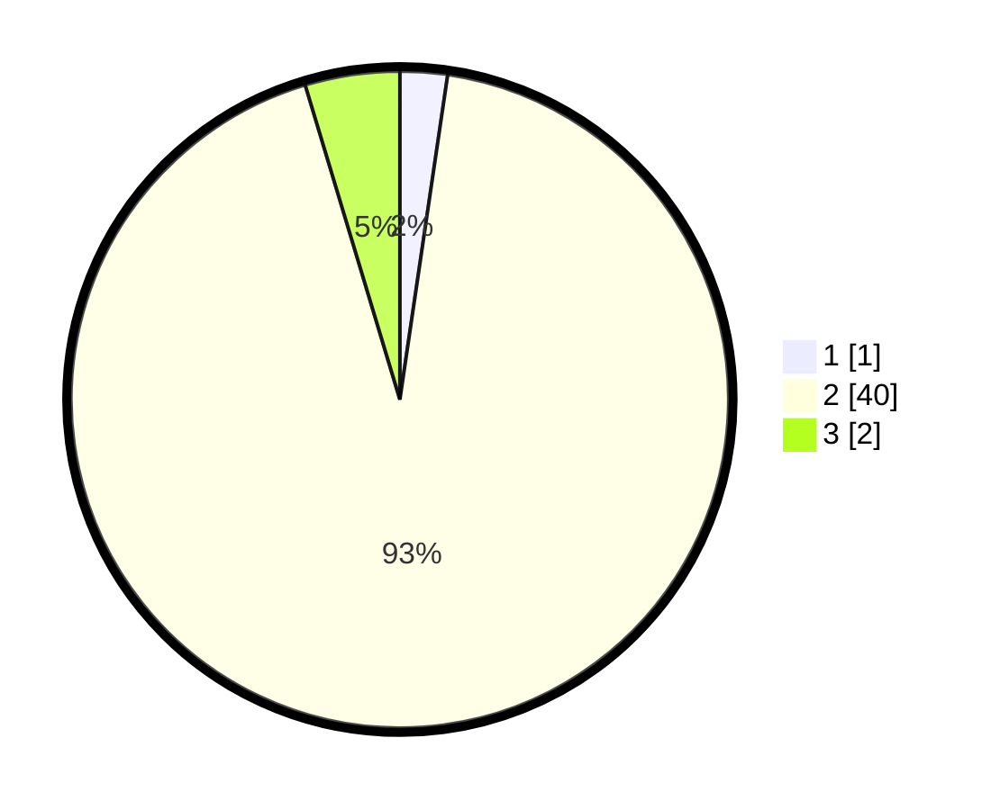

# Hasil

## Grafik

## Tabel

| No. | Nama Paslon    | Suara | Suara (raw) | Persentase |
|:--- |:-------------- | -----:| -----------:| ----------:|
| 1   | ANIES MUHAIMIN | 1     | [1][p-1]    | 2,33       |
| 2   | PRABOWO GIBRAN | 40    | [40][p-2]   | 93,02      |
| 3   | GANJAR MAHFUD  | 2     | [2][p-3]    | 4,65       |

[p-1]: https://github.com/gigit-pemilu/pemilu-2024-17-bengkulu/blob/main/pilpres/hitung-suara/sub/17-bengkulu/sub/08-kepahiang/sub/08-muara-kemumu/sub/2002-batu-kalung/sub/008-tps/sub/paslon-1.txt
[p-2]: https://github.com/gigit-pemilu/pemilu-2024-17-bengkulu/blob/main/pilpres/hitung-suara/sub/17-bengkulu/sub/08-kepahiang/sub/08-muara-kemumu/sub/2002-batu-kalung/sub/008-tps/sub/paslon-2.txt
[p-3]: https://github.com/gigit-pemilu/pemilu-2024-17-bengkulu/blob/main/pilpres/hitung-suara/sub/17-bengkulu/sub/08-kepahiang/sub/08-muara-kemumu/sub/2002-batu-kalung/sub/008-tps/sub/paslon-3.txt

## Foto C Plano

https://sirekap-obj-formc.kpu.go.id/8d73/pemilu/ppwp/17/08/08/20/02/1708082002008-20240214-221010--bcb25f5d-031d-453e-80c2-c4fb72dd475a.jpg

https://sirekap-obj-formc.kpu.go.id/8d73/pemilu/ppwp/17/08/08/20/02/1708082002008-20240215-004633--da204fb6-e80e-4006-a5d4-2529656c694c.jpg

https://sirekap-obj-formc.kpu.go.id/8d73/pemilu/ppwp/17/08/08/20/02/1708082002008-20240215-004744--365b3a3b-93ed-478e-a908-dadb9e901bbc.jpg

## Metadata

| Key        | Value               |
| ---------- | ------------------- |
| Time Stamp | 2024-02-15 22:30:27 |

