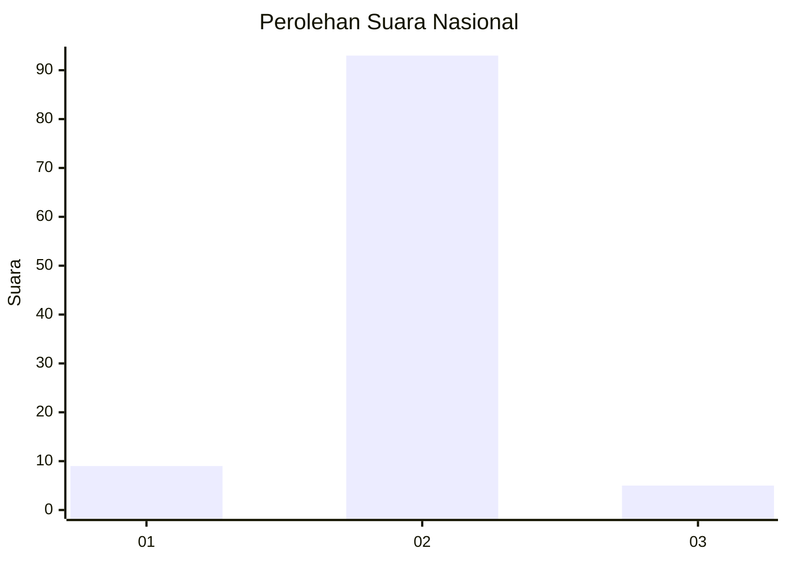
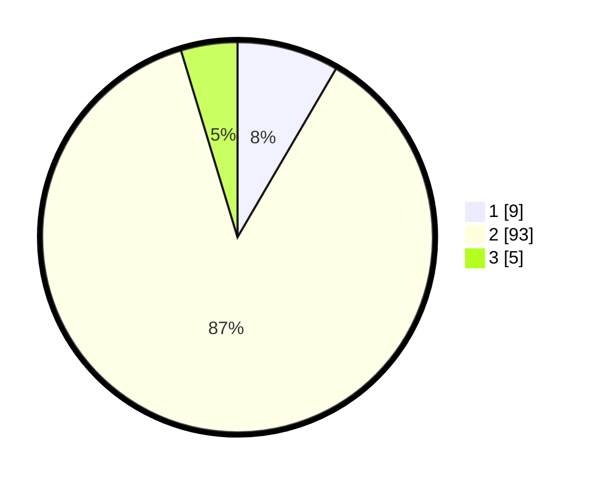

# Hasil

## Grafik

## Tabel

| No. | Nama Paslon    | Suara | Suara (raw) | Persentase |
|:--- |:-------------- | -----:| -----------:| ----------:|
| 1   | ANIES MUHAIMIN | 9     | [9][p-1]    | 8,41       |
| 2   | PRABOWO GIBRAN | 93    | [93][p-2]   | 86,92      |
| 3   | GANJAR MAHFUD  | 5     | [5][p-3]    | 4,67       |

[p-1]: https://github.com/gigit-pemilu/pemilu-2024/blob/main/pilpres/hitung-suara/sub/17-bengkulu/sub/08-kepahiang/sub/08-muara-kemumu/sub/2003-batu-bandung/sub/010-tps/sub/paslon-1.txt
[p-2]: https://github.com/gigit-pemilu/pemilu-2024/blob/main/pilpres/hitung-suara/sub/17-bengkulu/sub/08-kepahiang/sub/08-muara-kemumu/sub/2003-batu-bandung/sub/010-tps/sub/paslon-2.txt
[p-3]: https://github.com/gigit-pemilu/pemilu-2024/blob/main/pilpres/hitung-suara/sub/17-bengkulu/sub/08-kepahiang/sub/08-muara-kemumu/sub/2003-batu-bandung/sub/010-tps/sub/paslon-3.txt

## Foto C Plano

https://sirekap-obj-formc.kpu.go.id/b5dc/pemilu/ppwp/17/08/08/20/03/1708082003010-20240214-220527--343a8cc5-fdf9-46dc-9010-9018b6075157.jpg

https://sirekap-obj-formc.kpu.go.id/b5dc/pemilu/ppwp/17/08/08/20/03/1708082003010-20240214-221210--a0d4a0a4-f67c-47b9-a6a9-ee8c8eae1d9d.jpg

https://sirekap-obj-formc.kpu.go.id/b5dc/pemilu/ppwp/17/08/08/20/03/1708082003010-20240214-221450--be2fbc5c-46b1-42ad-9de2-ed2cf09b1e95.jpg

## Metadata

| Key        | Value               |
| ---------- | ------------------- |
| Time Stamp | 2024-02-15 23:29:50 |

