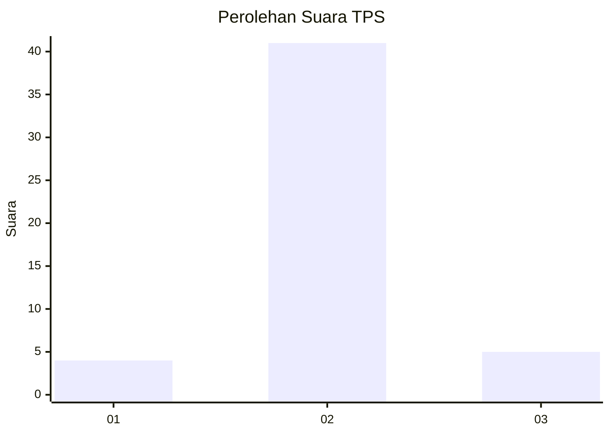
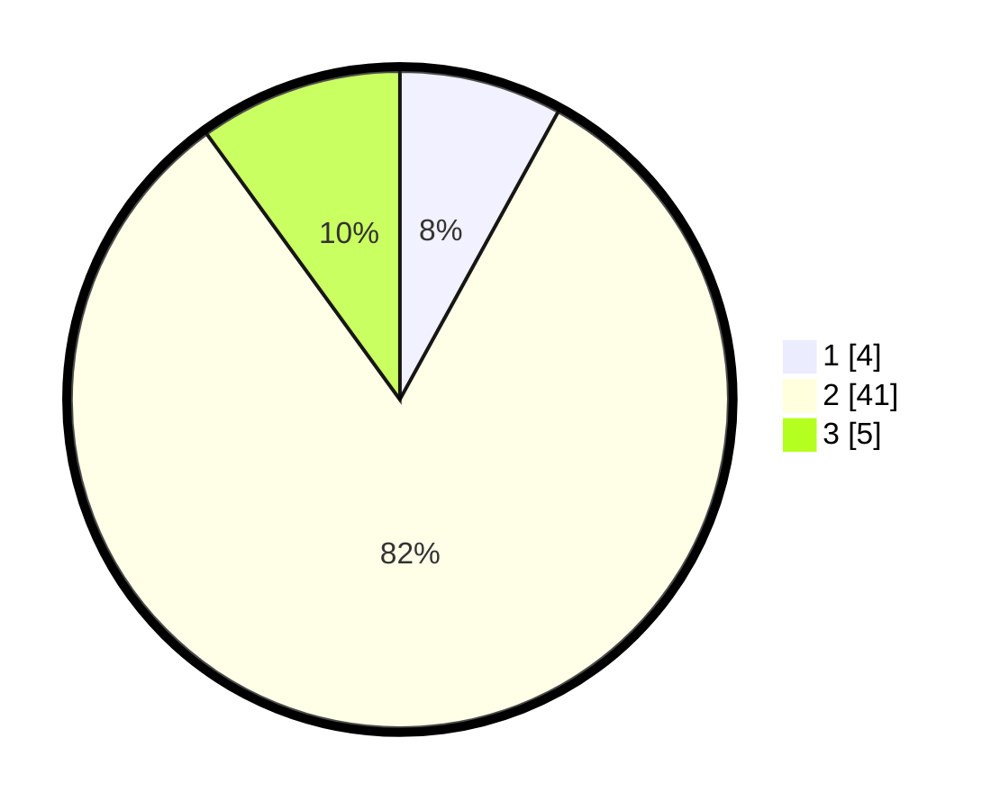

# Hasil

## Grafik

## Tabel

| No. | Nama Paslon    | Suara | Suara (raw) | Persentase |
|:--- |:-------------- | -----:| -----------:| ----------:|
| 1   | ANIES MUHAIMIN | 4     | [4][p-1]    | 8,00       |
| 2   | PRABOWO GIBRAN | 41    | [41][p-2]   | 82,00      |
| 3   | GANJAR MAHFUD  | 5     | [5][p-3]    | 10,00      |

[p-1]: https://github.com/gigit-pemilu/pemilu-2024-17-bengkulu/blob/main/pilpres/hitung-suara/sub/17-bengkulu/sub/08-kepahiang/sub/08-muara-kemumu/sub/2003-batu-bandung/sub/012-tps/sub/paslon-1.txt
[p-2]: https://github.com/gigit-pemilu/pemilu-2024-17-bengkulu/blob/main/pilpres/hitung-suara/sub/17-bengkulu/sub/08-kepahiang/sub/08-muara-kemumu/sub/2003-batu-bandung/sub/012-tps/sub/paslon-2.txt
[p-3]: https://github.com/gigit-pemilu/pemilu-2024-17-bengkulu/blob/main/pilpres/hitung-suara/sub/17-bengkulu/sub/08-kepahiang/sub/08-muara-kemumu/sub/2003-batu-bandung/sub/012-tps/sub/paslon-3.txt

## Foto C Plano

https://sirekap-obj-formc.kpu.go.id/4c09/pemilu/ppwp/17/08/08/20/03/1708082003012-20240214-222059--0c015171-fae9-462b-89aa-e8bc6121a115.jpg

https://sirekap-obj-formc.kpu.go.id/4c09/pemilu/ppwp/17/08/08/20/03/1708082003012-20240214-222300--69a61afd-aaad-485a-b86b-1b5007497b4b.jpg

https://sirekap-obj-formc.kpu.go.id/4c09/pemilu/ppwp/17/08/08/20/03/1708082003012-20240214-223909--5a7fe963-cbd6-4e92-a9b8-ca1a0177e5e2.jpg

## Metadata

| Key        | Value               |
| ---------- | ------------------- |
| Time Stamp | 2024-02-15 12:00:28 |

