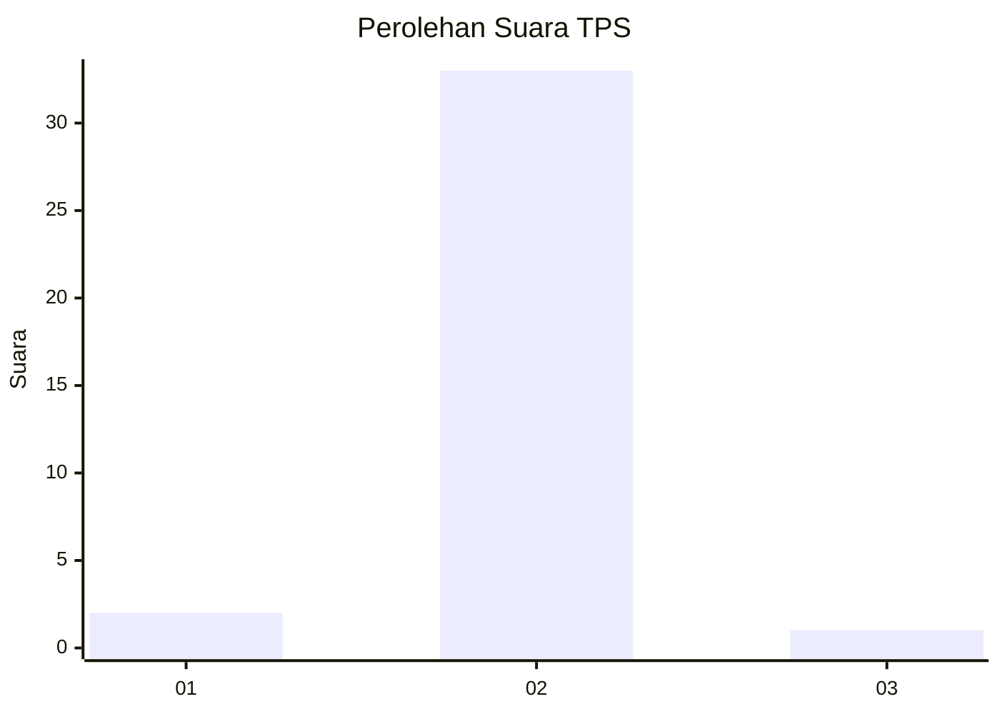
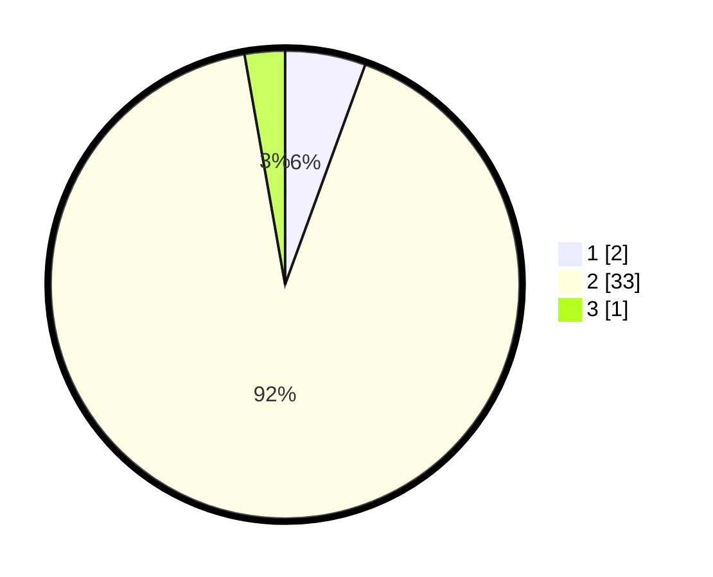

# Hasil

## Grafik

## Tabel

| No. | Nama Paslon    | Suara | Suara (raw) | Persentase |
|:--- |:-------------- | -----:| -----------:| ----------:|
| 1   | ANIES MUHAIMIN | 2     | [2][p-1]    | 5,56       |
| 2   | PRABOWO GIBRAN | 33    | [33][p-2]   | 91,67      |
| 3   | GANJAR MAHFUD  | 1     | [1][p-3]    | 2,78       |

[p-1]: https://github.com/gigit-pemilu/pemilu-2024-17-bengkulu/blob/main/pilpres/hitung-suara/sub/17-bengkulu/sub/08-kepahiang/sub/08-muara-kemumu/sub/2003-batu-bandung/sub/016-tps/sub/paslon-1.txt
[p-2]: https://github.com/gigit-pemilu/pemilu-2024-17-bengkulu/blob/main/pilpres/hitung-suara/sub/17-bengkulu/sub/08-kepahiang/sub/08-muara-kemumu/sub/2003-batu-bandung/sub/016-tps/sub/paslon-2.txt
[p-3]: https://github.com/gigit-pemilu/pemilu-2024-17-bengkulu/blob/main/pilpres/hitung-suara/sub/17-bengkulu/sub/08-kepahiang/sub/08-muara-kemumu/sub/2003-batu-bandung/sub/016-tps/sub/paslon-3.txt

## Foto C Plano

https://sirekap-obj-formc.kpu.go.id/7c9e/pemilu/ppwp/17/08/08/20/03/1708082003016-20240215-000720--d0e92a08-f5b8-44d8-857f-11ccd74c4849.jpg

https://sirekap-obj-formc.kpu.go.id/7c9e/pemilu/ppwp/17/08/08/20/03/1708082003016-20240215-000843--37c39c88-5931-4b32-bbec-9b294fa01794.jpg

https://sirekap-obj-formc.kpu.go.id/7c9e/pemilu/ppwp/17/08/08/20/03/1708082003016-20240215-001046--fdcd4c82-c860-43b5-a9bd-9325b967b3cc.jpg

## Metadata

| Key        | Value               |
| ---------- | ------------------- |
| Time Stamp | 2024-02-15 12:00:28 |

