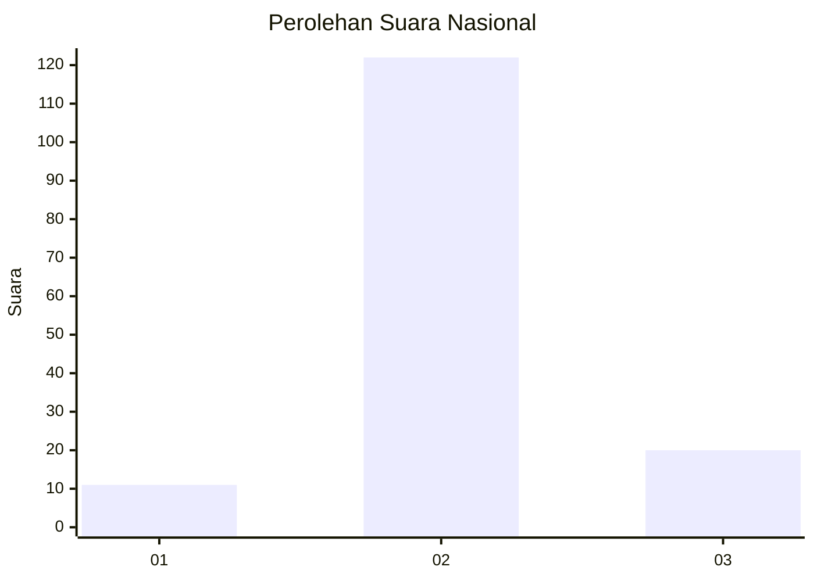
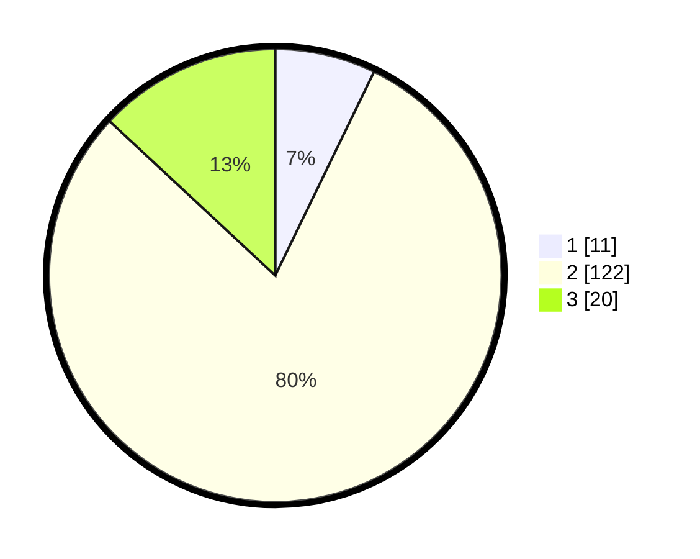

# Hasil

## Grafik

## Tabel

| No. | Nama Paslon    | Suara | Suara (raw) | Persentase |
|:--- |:-------------- | -----:| -----------:| ----------:|
| 1   | ANIES MUHAIMIN | 11    | [11][p-1]   | 7,19       |
| 2   | PRABOWO GIBRAN | 122   | [122][p-2]  | 79,74      |
| 3   | GANJAR MAHFUD  | 20    | [20][p-3]   | 13,07      |

[p-1]: https://github.com/gigit-pemilu/pemilu-2024/blob/main/pilpres/hitung-suara/sub/17-bengkulu/sub/08-kepahiang/sub/08-muara-kemumu/sub/2005-sosokan-taba/sub/004-tps/sub/paslon-1.txt
[p-2]: https://github.com/gigit-pemilu/pemilu-2024/blob/main/pilpres/hitung-suara/sub/17-bengkulu/sub/08-kepahiang/sub/08-muara-kemumu/sub/2005-sosokan-taba/sub/004-tps/sub/paslon-2.txt
[p-3]: https://github.com/gigit-pemilu/pemilu-2024/blob/main/pilpres/hitung-suara/sub/17-bengkulu/sub/08-kepahiang/sub/08-muara-kemumu/sub/2005-sosokan-taba/sub/004-tps/sub/paslon-3.txt

## Foto C Plano

https://sirekap-obj-formc.kpu.go.id/a3f7/pemilu/ppwp/17/08/08/20/05/1708082005004-20240215-082358--bc8aeb3b-641e-4d59-8a44-93a4f4541ac5.jpg

https://sirekap-obj-formc.kpu.go.id/a3f7/pemilu/ppwp/17/08/08/20/05/1708082005004-20240215-082734--2b70e589-643a-4e1a-a6f1-0feb7a88eab0.jpg

https://sirekap-obj-formc.kpu.go.id/a3f7/pemilu/ppwp/17/08/08/20/05/1708082005004-20240215-083150--c1cc9e84-b4c3-40c7-9c46-b32532176d33.jpg

## Metadata

| Key        | Value               |
| ---------- | ------------------- |
| Time Stamp | 2024-02-15 23:29:50 |

