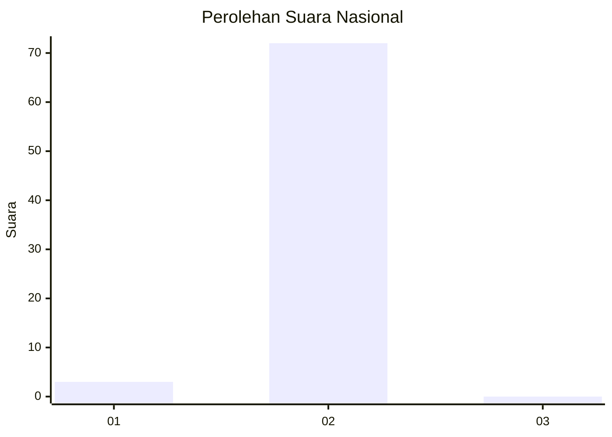
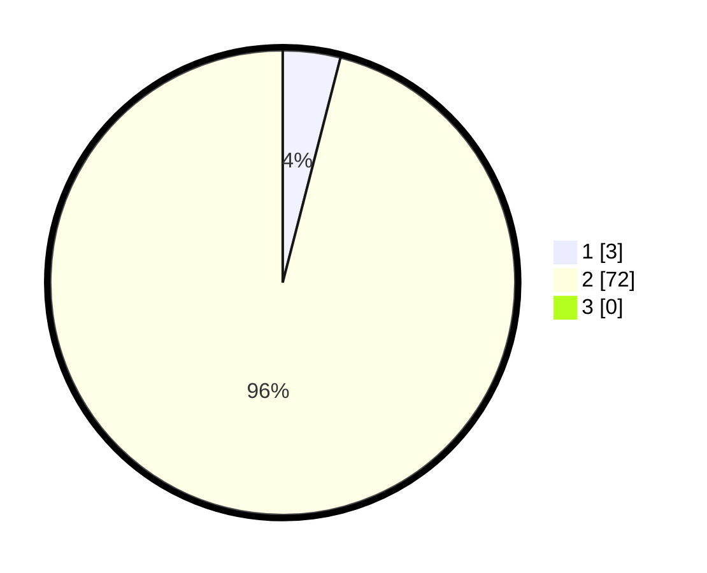

# Hasil

## Grafik

## Tabel

| No. | Nama Paslon    | Suara | Suara (raw) | Persentase |
|:--- |:-------------- | -----:| -----------:| ----------:|
| 1   | ANIES MUHAIMIN | 3     | [3][p-1]    | 4,00       |
| 2   | PRABOWO GIBRAN | 72    | [72][p-2]   | 96,00      |
| 3   | GANJAR MAHFUD  | 0     | [0][p-3]    | 0,00       |

[p-1]: https://github.com/gigit-pemilu/pemilu-2024/blob/main/pilpres/hitung-suara/sub/17-bengkulu/sub/08-kepahiang/sub/08-muara-kemumu/sub/2005-sosokan-taba/sub/007-tps/sub/paslon-1.txt
[p-2]: https://github.com/gigit-pemilu/pemilu-2024/blob/main/pilpres/hitung-suara/sub/17-bengkulu/sub/08-kepahiang/sub/08-muara-kemumu/sub/2005-sosokan-taba/sub/007-tps/sub/paslon-2.txt
[p-3]: https://github.com/gigit-pemilu/pemilu-2024/blob/main/pilpres/hitung-suara/sub/17-bengkulu/sub/08-kepahiang/sub/08-muara-kemumu/sub/2005-sosokan-taba/sub/007-tps/sub/paslon-3.txt

## Foto C Plano

https://sirekap-obj-formc.kpu.go.id/85f9/pemilu/ppwp/17/08/08/20/05/1708082005007-20240215-001518--048e99dc-0fe2-410c-90a0-224619811dcb.jpg

https://sirekap-obj-formc.kpu.go.id/85f9/pemilu/ppwp/17/08/08/20/05/1708082005007-20240215-073654--4fd02cfc-814d-44da-ba12-0108ffe92ce0.jpg

https://sirekap-obj-formc.kpu.go.id/85f9/pemilu/ppwp/17/08/08/20/05/1708082005007-20240215-002003--1d4ce3a4-ed29-4de1-9100-61bd75a70ca6.jpg

## Metadata

| Key        | Value               |
| ---------- | ------------------- |
| Time Stamp | 2024-02-24 22:31:28 |

