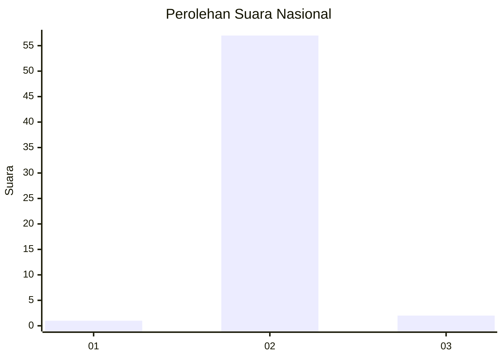
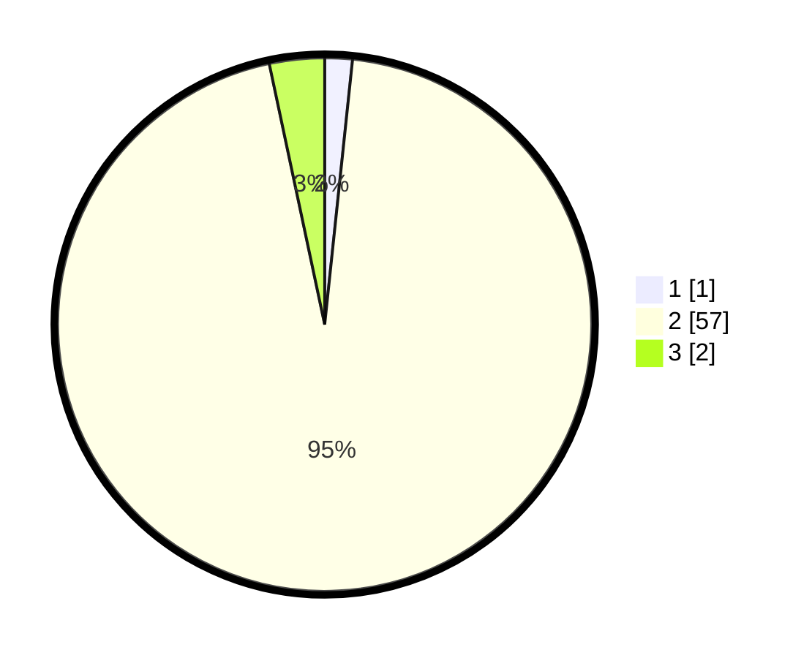

# Hasil

## Grafik

## Tabel

| No. | Nama Paslon    | Suara | Suara (raw) | Persentase |
|:--- |:-------------- | -----:| -----------:| ----------:|
| 1   | ANIES MUHAIMIN | 1     | [1][p-1]    | 1,67       |
| 2   | PRABOWO GIBRAN | 57    | [57][p-2]   | 95,00      |
| 3   | GANJAR MAHFUD  | 2     | [2][p-3]    | 3,33       |

[p-1]: https://github.com/gigit-pemilu/pemilu-2024/blob/main/pilpres/hitung-suara/sub/17-bengkulu/sub/08-kepahiang/sub/08-muara-kemumu/sub/2005-sosokan-taba/sub/012-tps/sub/paslon-1.txt
[p-2]: https://github.com/gigit-pemilu/pemilu-2024/blob/main/pilpres/hitung-suara/sub/17-bengkulu/sub/08-kepahiang/sub/08-muara-kemumu/sub/2005-sosokan-taba/sub/012-tps/sub/paslon-2.txt
[p-3]: https://github.com/gigit-pemilu/pemilu-2024/blob/main/pilpres/hitung-suara/sub/17-bengkulu/sub/08-kepahiang/sub/08-muara-kemumu/sub/2005-sosokan-taba/sub/012-tps/sub/paslon-3.txt

## Foto C Plano

https://sirekap-obj-formc.kpu.go.id/598f/pemilu/ppwp/17/08/08/20/05/1708082005012-20240215-101608--6aad2968-8e4a-4aca-b12a-923b9b54aea9.jpg

https://sirekap-obj-formc.kpu.go.id/598f/pemilu/ppwp/17/08/08/20/05/1708082005012-20240215-101817--b3982530-5902-4b43-b0e5-fe3711321b4c.jpg

https://sirekap-obj-formc.kpu.go.id/598f/pemilu/ppwp/17/08/08/20/05/1708082005012-20240215-100355--9e416022-35d0-4738-b2a1-480a7666d24c.jpg

## Metadata

| Key        | Value               |
| ---------- | ------------------- |
| Time Stamp | 2024-02-15 23:29:50 |

