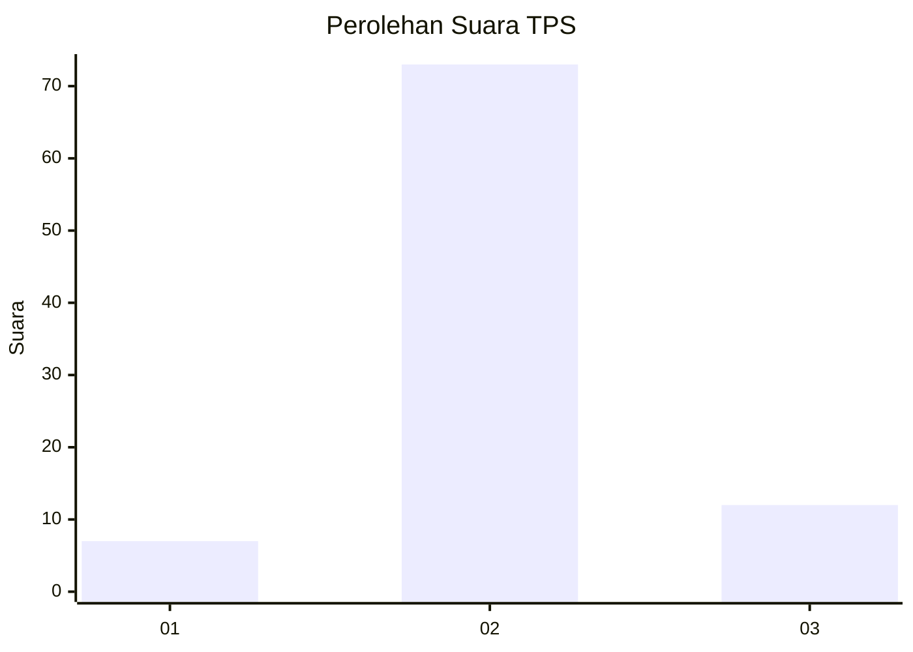
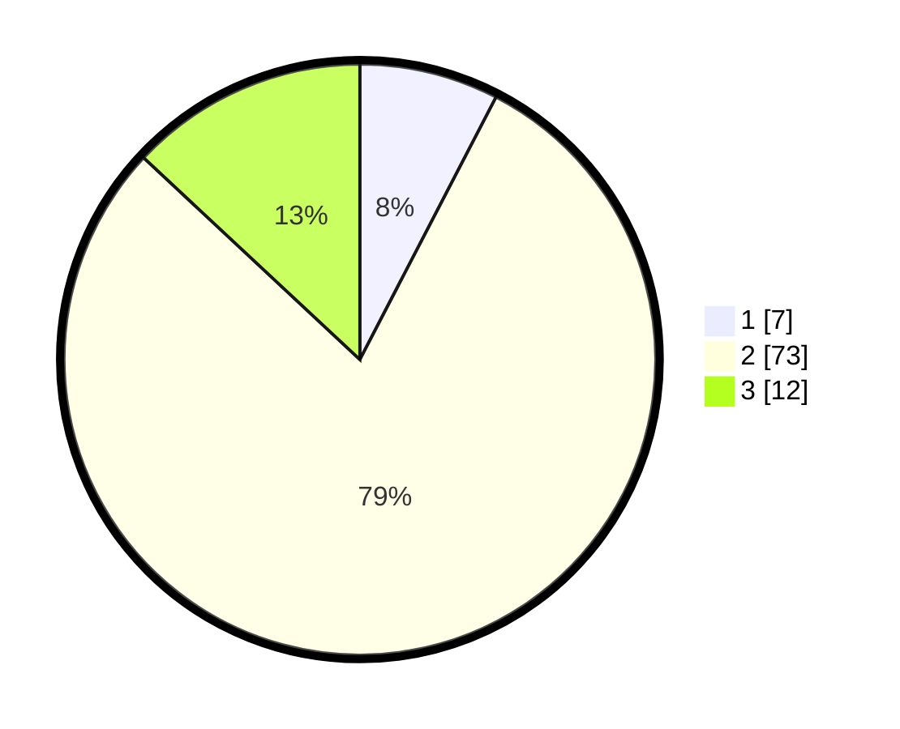

# Hasil

## Grafik

## Tabel

| No. | Nama Paslon    | Suara | Suara (raw) | Persentase |
|:--- |:-------------- | -----:| -----------:| ----------:|
| 1   | ANIES MUHAIMIN | 7     | [7][p-1]    | 7,61       |
| 2   | PRABOWO GIBRAN | 73    | [73][p-2]   | 79,35      |
| 3   | GANJAR MAHFUD  | 12    | [12][p-3]   | 13,04      |

[p-1]: https://github.com/gigit-pemilu/pemilu-2024-17-bengkulu/blob/main/pilpres/hitung-suara/sub/17-bengkulu/sub/08-kepahiang/sub/08-muara-kemumu/sub/2008-warung-pojok/sub/004-tps/sub/paslon-1.txt
[p-2]: https://github.com/gigit-pemilu/pemilu-2024-17-bengkulu/blob/main/pilpres/hitung-suara/sub/17-bengkulu/sub/08-kepahiang/sub/08-muara-kemumu/sub/2008-warung-pojok/sub/004-tps/sub/paslon-2.txt
[p-3]: https://github.com/gigit-pemilu/pemilu-2024-17-bengkulu/blob/main/pilpres/hitung-suara/sub/17-bengkulu/sub/08-kepahiang/sub/08-muara-kemumu/sub/2008-warung-pojok/sub/004-tps/sub/paslon-3.txt

## Foto C Plano

https://sirekap-obj-formc.kpu.go.id/e151/pemilu/ppwp/17/08/08/20/08/1708082008004-20240215-043434--59c7d6f6-32eb-400f-a648-156e79f90ea4.jpg

https://sirekap-obj-formc.kpu.go.id/e151/pemilu/ppwp/17/08/08/20/08/1708082008004-20240215-042738--16d09829-84d9-48d4-9366-045b17070918.jpg

https://sirekap-obj-formc.kpu.go.id/e151/pemilu/ppwp/17/08/08/20/08/1708082008004-20240215-043604--3e162450-230d-4994-86f6-1a5fcace7db1.jpg

## Metadata

| Key        | Value               |
| ---------- | ------------------- |
| Time Stamp | 2024-02-15 12:00:28 |

