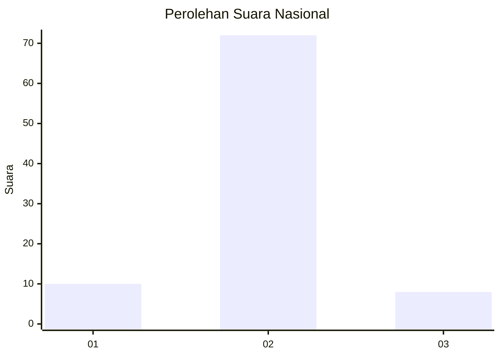
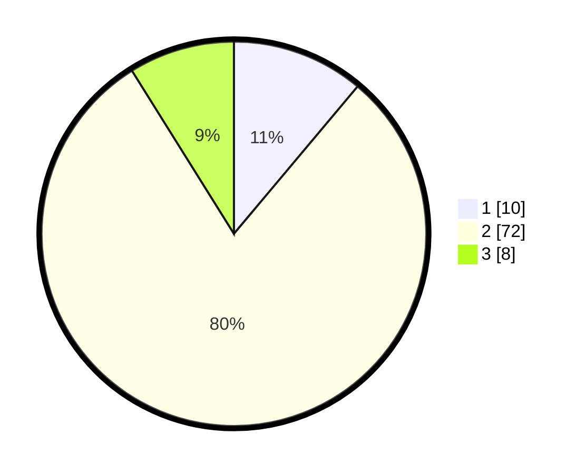

# Hasil

## Grafik

## Tabel

| No. | Nama Paslon    | Suara | Suara (raw) | Persentase |
|:--- |:-------------- | -----:| -----------:| ----------:|
| 1   | ANIES MUHAIMIN | 10    | [10][p-1]   | 11,11      |
| 2   | PRABOWO GIBRAN | 72    | [72][p-2]   | 80,00      |
| 3   | GANJAR MAHFUD  | 8     | [8][p-3]    | 8,89       |

[p-1]: https://github.com/gigit-pemilu/pemilu-2024/blob/main/pilpres/hitung-suara/sub/17-bengkulu/sub/09-bengkulu-tengah/sub/11-semidang-lagan/sub/2009-lagan/sub/002-tps/sub/paslon-1.txt
[p-2]: https://github.com/gigit-pemilu/pemilu-2024/blob/main/pilpres/hitung-suara/sub/17-bengkulu/sub/09-bengkulu-tengah/sub/11-semidang-lagan/sub/2009-lagan/sub/002-tps/sub/paslon-2.txt
[p-3]: https://github.com/gigit-pemilu/pemilu-2024/blob/main/pilpres/hitung-suara/sub/17-bengkulu/sub/09-bengkulu-tengah/sub/11-semidang-lagan/sub/2009-lagan/sub/002-tps/sub/paslon-3.txt

## Foto C Plano

https://sirekap-obj-formc.kpu.go.id/a83e/pemilu/ppwp/17/09/11/20/09/1709112009002-20240214-193531--edcff3e5-1cda-4d92-9f8a-b22935e62848.jpg

https://sirekap-obj-formc.kpu.go.id/a83e/pemilu/ppwp/17/09/11/20/09/1709112009002-20240214-141645--2f707f9b-9262-4929-b0e6-66adf20370c6.jpg

https://sirekap-obj-formc.kpu.go.id/a83e/pemilu/ppwp/17/09/11/20/09/1709112009002-20240214-223255--f00e3da2-9bf6-4315-86c4-ca09f5027c3c.jpg

## Metadata

| Key        | Value               |
| ---------- | ------------------- |
| Time Stamp | 2024-02-26 06:00:00 |

