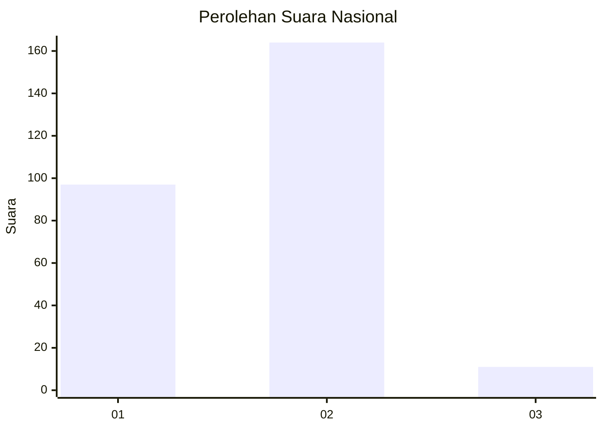
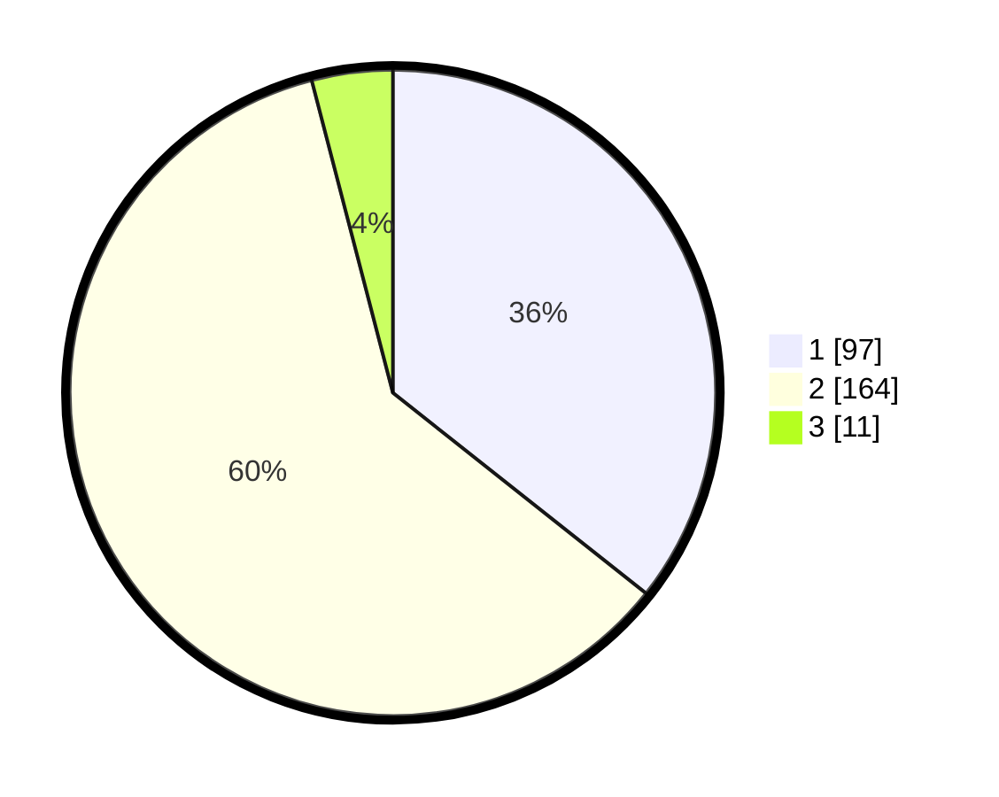

# Hasil

## Grafik

## Tabel

| No. | Nama Paslon    | Suara | Suara (raw) | Persentase |
|:--- |:-------------- | -----:| -----------:| ----------:|
| 1   | ANIES MUHAIMIN | 97    | [97][p-1]   | 35,66      |
| 2   | PRABOWO GIBRAN | 164   | [164][p-2]  | 60,29      |
| 3   | GANJAR MAHFUD  | 11    | [11][p-3]   | 4,04       |

[p-1]: https://github.com/gigit-pemilu/pemilu-2024/blob/main/pilpres/hitung-suara/sub/17-bengkulu/sub/71-kota-bengkulu/sub/01-selebar/sub/1001-pagar-dewa/sub/002-tps/sub/paslon-1.txt
[p-2]: https://github.com/gigit-pemilu/pemilu-2024/blob/main/pilpres/hitung-suara/sub/17-bengkulu/sub/71-kota-bengkulu/sub/01-selebar/sub/1001-pagar-dewa/sub/002-tps/sub/paslon-2.txt
[p-3]: https://github.com/gigit-pemilu/pemilu-2024/blob/main/pilpres/hitung-suara/sub/17-bengkulu/sub/71-kota-bengkulu/sub/01-selebar/sub/1001-pagar-dewa/sub/002-tps/sub/paslon-3.txt

## Foto C Plano

https://sirekap-obj-formc.kpu.go.id/0c98/pemilu/ppwp/17/71/01/10/01/1771011001002-20240223-151913--9942e159-a61a-4f22-b979-1a5cc94d0f0e.jpg

https://sirekap-obj-formc.kpu.go.id/0c98/pemilu/ppwp/17/71/01/10/01/1771011001002-20240223-152034--b175e4f9-1772-4b6a-93cd-87d537f7ea66.jpg

https://sirekap-obj-formc.kpu.go.id/0c98/pemilu/ppwp/17/71/01/10/01/1771011001002-20240223-152118--34221d33-d2cb-4283-a04f-aeb5c829d0cc.jpg

## Metadata

| Key        | Value               |
| ---------- | ------------------- |
| Time Stamp | 2024-02-24 22:31:28 |

