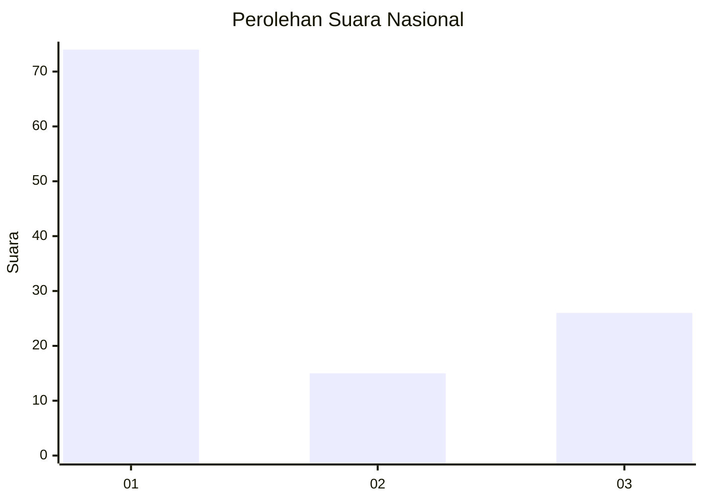
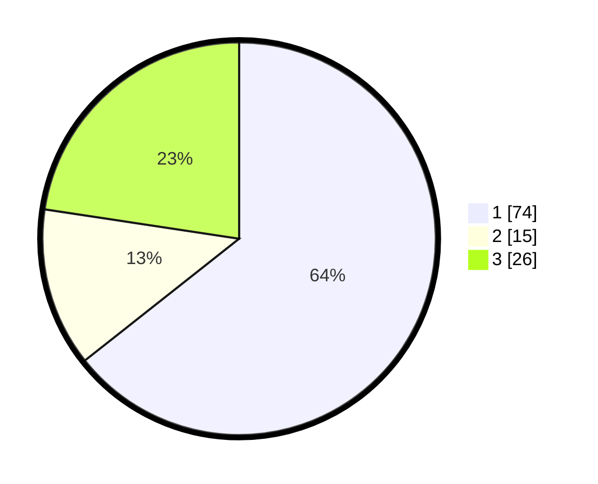

# Hasil

## Grafik

## Tabel

| No. | Nama Paslon    | Suara | Suara (raw) | Persentase |
|:--- |:-------------- | -----:| -----------:| ----------:|
| 1   | ANIES MUHAIMIN | 74    | [74][p-1]   | 64,35      |
| 2   | PRABOWO GIBRAN | 15    | [15][p-2]   | 13,04      |
| 3   | GANJAR MAHFUD  | 26    | [26][p-3]   | 22,61      |

[p-1]: https://github.com/gigit-pemilu/pemilu-2024/blob/main/pilpres/hitung-suara/sub/17-bengkulu/sub/71-kota-bengkulu/sub/01-selebar/sub/1001-pagar-dewa/sub/014-tps/sub/paslon-1.txt
[p-2]: https://github.com/gigit-pemilu/pemilu-2024/blob/main/pilpres/hitung-suara/sub/17-bengkulu/sub/71-kota-bengkulu/sub/01-selebar/sub/1001-pagar-dewa/sub/014-tps/sub/paslon-2.txt
[p-3]: https://github.com/gigit-pemilu/pemilu-2024/blob/main/pilpres/hitung-suara/sub/17-bengkulu/sub/71-kota-bengkulu/sub/01-selebar/sub/1001-pagar-dewa/sub/014-tps/sub/paslon-3.txt

## Foto C Plano

https://sirekap-obj-formc.kpu.go.id/aa68/pemilu/ppwp/17/71/01/10/01/1771011001014-20240223-151220--91f88e96-c1bd-42c5-ad42-b7816b382ca6.jpg

https://sirekap-obj-formc.kpu.go.id/aa68/pemilu/ppwp/17/71/01/10/01/1771011001014-20240223-151344--ed1e2213-cd98-484b-954b-a0ac50e46bb2.jpg

https://sirekap-obj-formc.kpu.go.id/aa68/pemilu/ppwp/17/71/01/10/01/1771011001014-20240223-151528--ec3706b7-3e3c-4901-9924-8508d2e52895.jpg

## Metadata

| Key        | Value               |
| ---------- | ------------------- |
| Time Stamp | 2024-02-24 22:31:28 |

