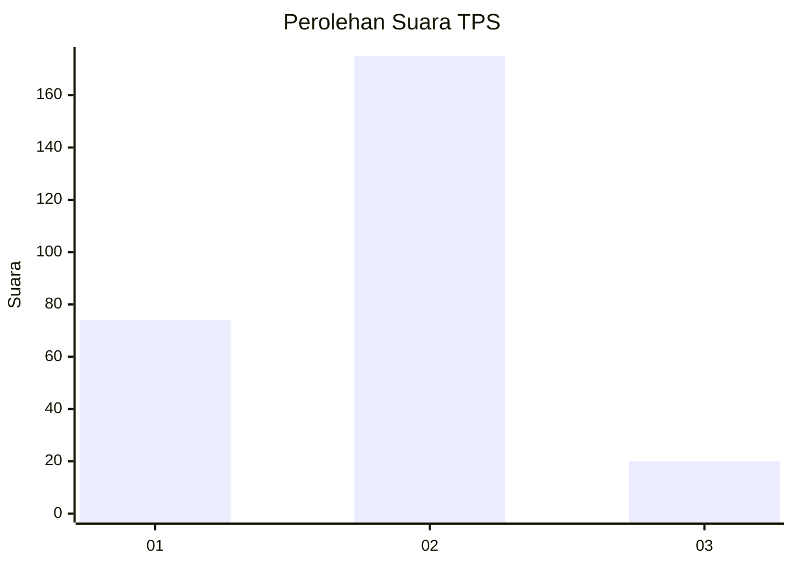
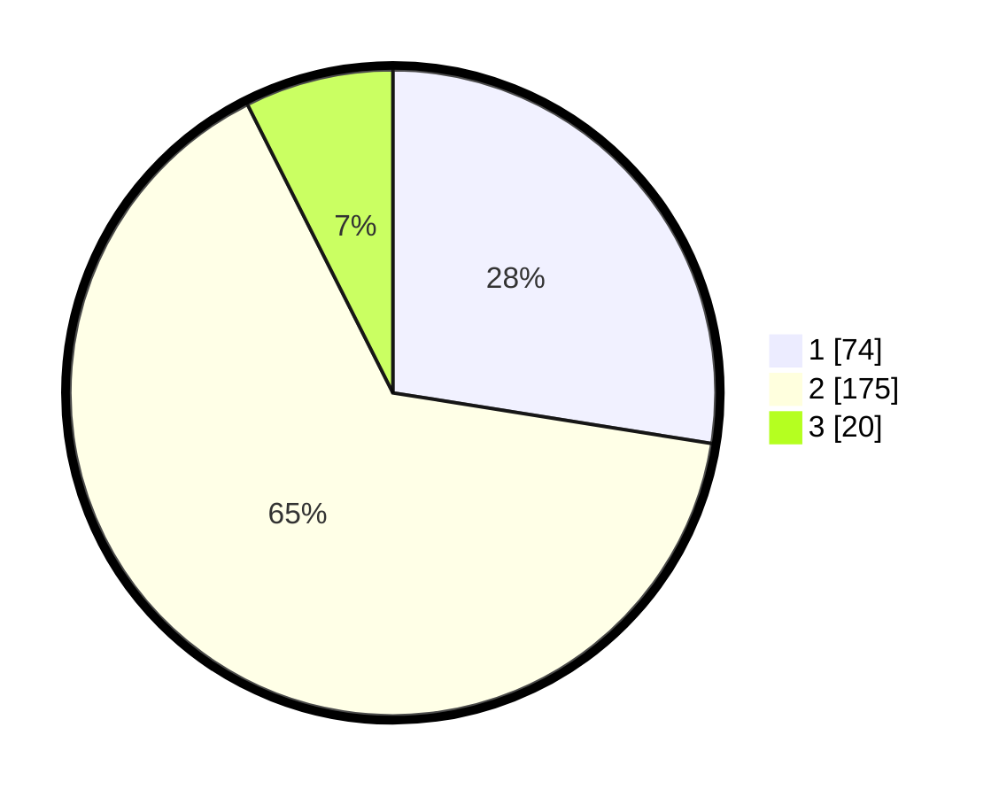

# Hasil

## Grafik

## Tabel

| No. | Nama Paslon    | Suara | Suara (raw) | Persentase |
|:--- |:-------------- | -----:| -----------:| ----------:|
| 1   | ANIES MUHAIMIN | 74    | [74][p-1]   | 27,51      |
| 2   | PRABOWO GIBRAN | 175   | [175][p-2]  | 65,06      |
| 3   | GANJAR MAHFUD  | 20    | [20][p-3]   | 7,43       |

[p-1]: https://github.com/gigit-pemilu/pemilu-2024-17-bengkulu/blob/main/pilpres/hitung-suara/sub/17-bengkulu/sub/71-kota-bengkulu/sub/01-selebar/sub/1001-pagar-dewa/sub/023-tps/sub/paslon-1.txt
[p-2]: https://github.com/gigit-pemilu/pemilu-2024-17-bengkulu/blob/main/pilpres/hitung-suara/sub/17-bengkulu/sub/71-kota-bengkulu/sub/01-selebar/sub/1001-pagar-dewa/sub/023-tps/sub/paslon-2.txt
[p-3]: https://github.com/gigit-pemilu/pemilu-2024-17-bengkulu/blob/main/pilpres/hitung-suara/sub/17-bengkulu/sub/71-kota-bengkulu/sub/01-selebar/sub/1001-pagar-dewa/sub/023-tps/sub/paslon-3.txt

## Foto C Plano

https://sirekap-obj-formc.kpu.go.id/9801/pemilu/ppwp/17/71/01/10/01/1771011001023-20240223-152848--4e71600c-c38e-4b42-8689-64c11010585e.jpg

https://sirekap-obj-formc.kpu.go.id/9801/pemilu/ppwp/17/71/01/10/01/1771011001023-20240223-153339--8df00d63-bd50-4530-afae-33edd58669c2.jpg

https://sirekap-obj-formc.kpu.go.id/9801/pemilu/ppwp/17/71/01/10/01/1771011001023-20240223-153447--c87fd317-0935-4e9a-8201-45796458adae.jpg

## Metadata

| Key        | Value               |
| ---------- | ------------------- |
| Time Stamp | 2024-02-24 22:31:28 |

