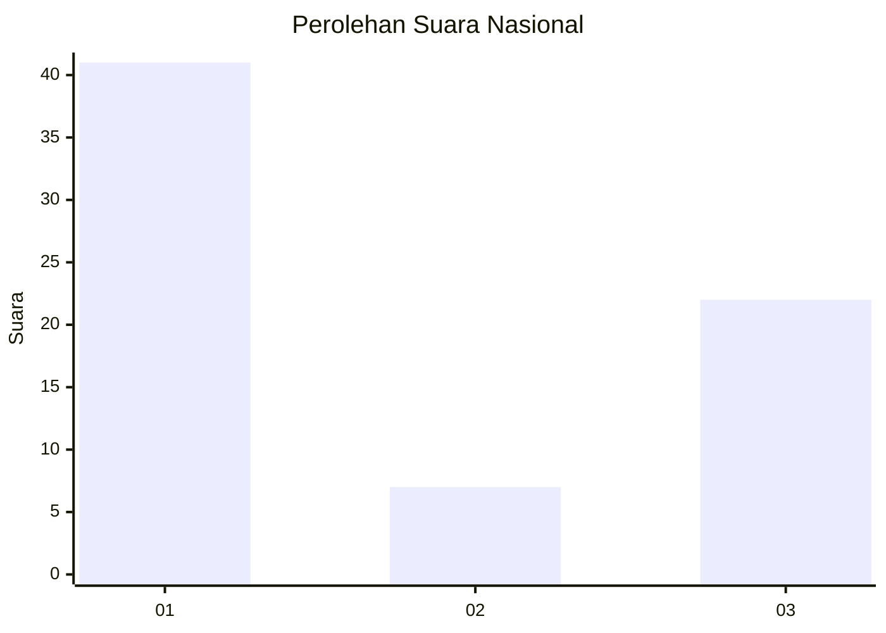
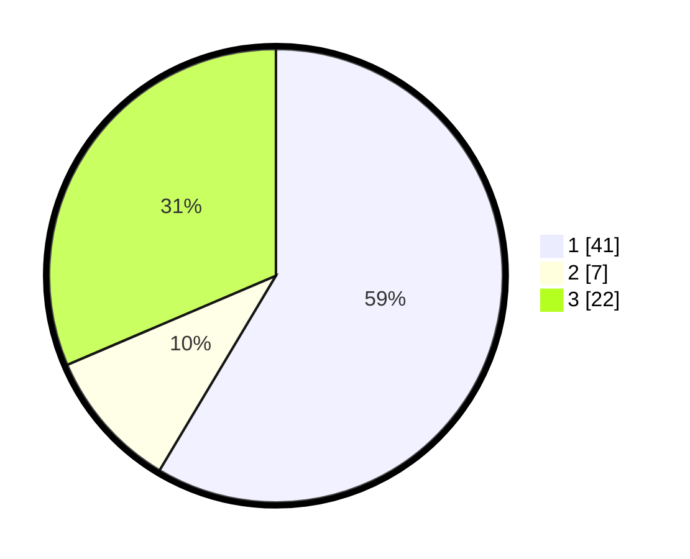

# Hasil

## Grafik

## Tabel

| No. | Nama Paslon    | Suara | Suara (raw) | Persentase |
|:--- |:-------------- | -----:| -----------:| ----------:|
| 1   | ANIES MUHAIMIN | 41    | [41][p-1]   | 58,57      |
| 2   | PRABOWO GIBRAN | 7     | [7][p-2]    | 10,00      |
| 3   | GANJAR MAHFUD  | 22    | [22][p-3]   | 31,43      |

[p-1]: https://github.com/gigit-pemilu/pemilu-2024/blob/main/pilpres/hitung-suara/sub/17-bengkulu/sub/71-kota-bengkulu/sub/01-selebar/sub/1001-pagar-dewa/sub/055-tps/sub/paslon-1.txt
[p-2]: https://github.com/gigit-pemilu/pemilu-2024/blob/main/pilpres/hitung-suara/sub/17-bengkulu/sub/71-kota-bengkulu/sub/01-selebar/sub/1001-pagar-dewa/sub/055-tps/sub/paslon-2.txt
[p-3]: https://github.com/gigit-pemilu/pemilu-2024/blob/main/pilpres/hitung-suara/sub/17-bengkulu/sub/71-kota-bengkulu/sub/01-selebar/sub/1001-pagar-dewa/sub/055-tps/sub/paslon-3.txt

## Foto C Plano

https://sirekap-obj-formc.kpu.go.id/ca60/pemilu/ppwp/17/71/01/10/01/1771011001055-20240223-170907--bb5b2a08-ca81-4e4c-a48f-6761c069be95.jpg

https://sirekap-obj-formc.kpu.go.id/ca60/pemilu/ppwp/17/71/01/10/01/1771011001055-20240223-171030--18405468-f571-46d4-acdf-4cf933b0d541.jpg

https://sirekap-obj-formc.kpu.go.id/ca60/pemilu/ppwp/17/71/01/10/01/1771011001055-20240223-171152--36f19f27-b28f-4f33-8634-84fa3bd9de11.jpg

## Metadata

| Key        | Value               |
| ---------- | ------------------- |
| Time Stamp | 2024-02-24 22:31:28 |

## DATA PEMILIH TETAP

Jumlah pemilih dalam DPT: **210**.
 * L: **105**.
 * P: **105**.

## DATA PENGGUNA HAK PILIH

Jumlah pengguna hak pilih dalam DPT: **767**.
 * L: **878**.
 * P: **889**.

Jumlah pengguna hak pilih dalam DPTb: **1**.
 * L: **0**.
 * P: **202**.

Jumlah pengguna hak pilih dalam DPK: **0**.
 * L: **0**.
 * P: **0**.

Jumlah pengguna hak pilih: **168**.
 * L: **78**.
 * P: **30**.

## JUMLAH SUARA SAH DAN TIDAK SAH

JUMLAH SELURUH SUARA SAH: **166**.

JUMLAH SUARA TIDAK SAH: **2**.

JUMLAH SELURUH SUARA SAH DAN SUARA TIDAK SAH: **168**.

