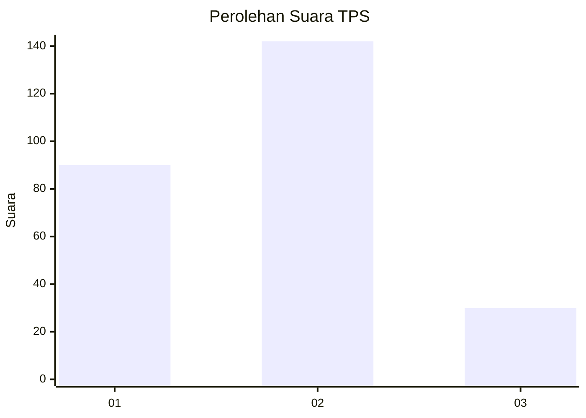
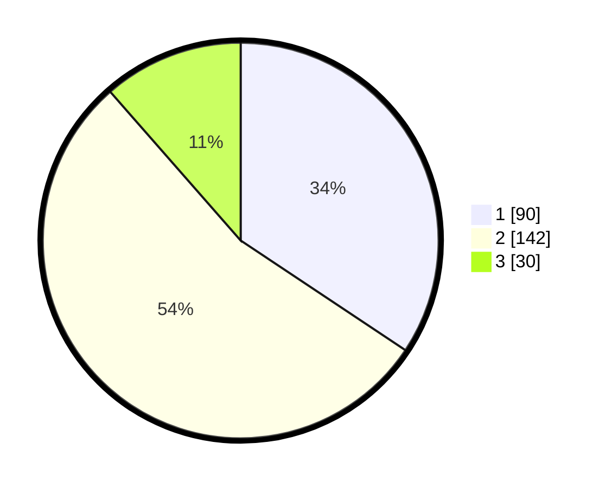

# Hasil

## Grafik

## Tabel

| No. | Nama Paslon    | Suara | Suara (raw) | Persentase |
|:--- |:-------------- | -----:| -----------:| ----------:|
| 1   | ANIES MUHAIMIN | 90    | [90][p-1]   | 34,35      |
| 2   | PRABOWO GIBRAN | 142   | [142][p-2]  | 54,20      |
| 3   | GANJAR MAHFUD  | 30    | [30][p-3]   | 11,45      |

[p-1]: https://github.com/gigit-pemilu/pemilu-2024-17-bengkulu/blob/main/pilpres/hitung-suara/sub/17-bengkulu/sub/71-kota-bengkulu/sub/01-selebar/sub/1002-sukarami/sub/010-tps/sub/paslon-1.txt
[p-2]: https://github.com/gigit-pemilu/pemilu-2024-17-bengkulu/blob/main/pilpres/hitung-suara/sub/17-bengkulu/sub/71-kota-bengkulu/sub/01-selebar/sub/1002-sukarami/sub/010-tps/sub/paslon-2.txt
[p-3]: https://github.com/gigit-pemilu/pemilu-2024-17-bengkulu/blob/main/pilpres/hitung-suara/sub/17-bengkulu/sub/71-kota-bengkulu/sub/01-selebar/sub/1002-sukarami/sub/010-tps/sub/paslon-3.txt

## Foto C Plano

https://sirekap-obj-formc.kpu.go.id/abf2/pemilu/ppwp/17/71/01/10/02/1771011002010-20240223-130545--11cba404-ff98-45cc-b1e5-ed0439d87e10.jpg

https://sirekap-obj-formc.kpu.go.id/abf2/pemilu/ppwp/17/71/01/10/02/1771011002010-20240223-130751--0a777192-7652-4780-b967-94e39ac2908f.jpg

https://sirekap-obj-formc.kpu.go.id/abf2/pemilu/ppwp/17/71/01/10/02/1771011002010-20240223-130933--2b212593-5e61-4fcf-aadf-ebb320691a46.jpg

## Metadata

| Key        | Value               |
| ---------- | ------------------- |
| Time Stamp | 2024-02-24 22:31:28 |

