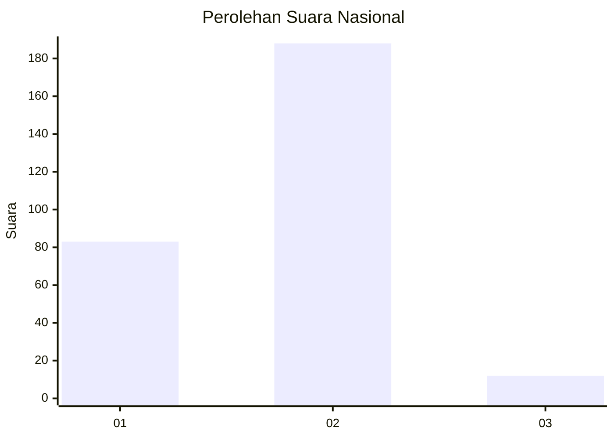
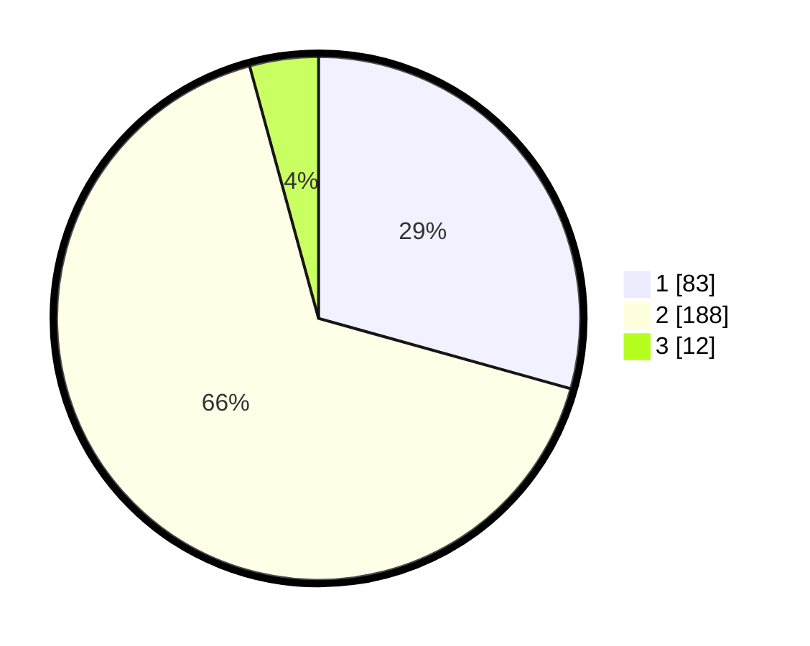

# Hasil

## Grafik

## Tabel

| No. | Nama Paslon    | Suara | Suara (raw) | Persentase |
|:--- |:-------------- | -----:| -----------:| ----------:|
| 1   | ANIES MUHAIMIN | 83    | [83][p-1]   | 29,33      |
| 2   | PRABOWO GIBRAN | 188   | [188][p-2]  | 66,43      |
| 3   | GANJAR MAHFUD  | 12    | [12][p-3]   | 4,24       |

[p-1]: https://github.com/gigit-pemilu/pemilu-2024/blob/main/pilpres/hitung-suara/sub/17-bengkulu/sub/71-kota-bengkulu/sub/01-selebar/sub/1002-sukarami/sub/023-tps/sub/paslon-1.txt
[p-2]: https://github.com/gigit-pemilu/pemilu-2024/blob/main/pilpres/hitung-suara/sub/17-bengkulu/sub/71-kota-bengkulu/sub/01-selebar/sub/1002-sukarami/sub/023-tps/sub/paslon-2.txt
[p-3]: https://github.com/gigit-pemilu/pemilu-2024/blob/main/pilpres/hitung-suara/sub/17-bengkulu/sub/71-kota-bengkulu/sub/01-selebar/sub/1002-sukarami/sub/023-tps/sub/paslon-3.txt

## Foto C Plano

https://sirekap-obj-formc.kpu.go.id/70e1/pemilu/ppwp/17/71/01/10/02/1771011002023-20240214-200217--0d823a15-1e64-4cea-8183-824be99ece39.jpg

https://sirekap-obj-formc.kpu.go.id/70e1/pemilu/ppwp/17/71/01/10/02/1771011002023-20240214-194635--0b234362-78e8-4e43-a74d-ae13a2fd6b3a.jpg

https://sirekap-obj-formc.kpu.go.id/70e1/pemilu/ppwp/17/71/01/10/02/1771011002023-20240214-195852--1cafa056-ba08-46eb-8cff-1ee514a23e9b.jpg

## Metadata

| Key        | Value               |
| ---------- | ------------------- |
| Time Stamp | 2024-02-17 14:45:18 |

