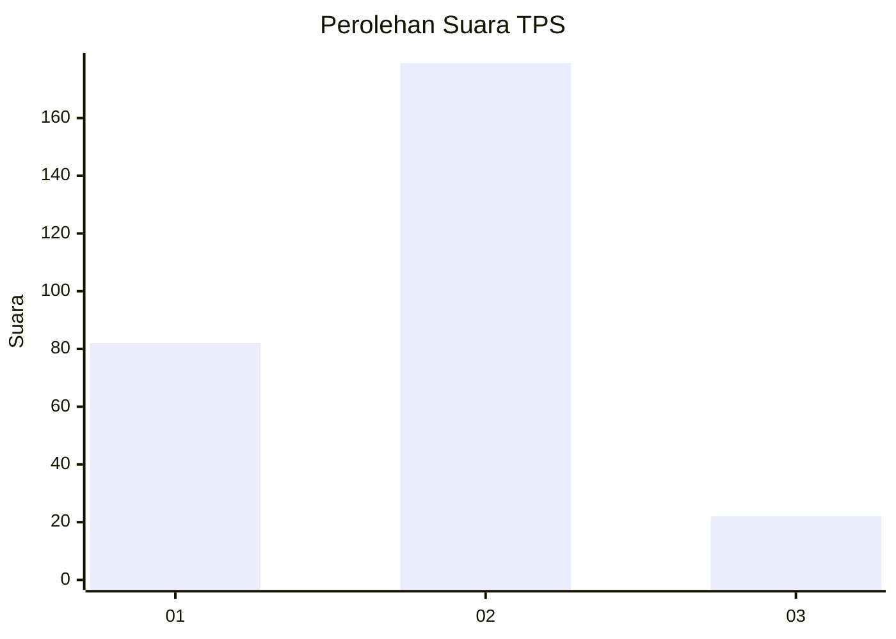
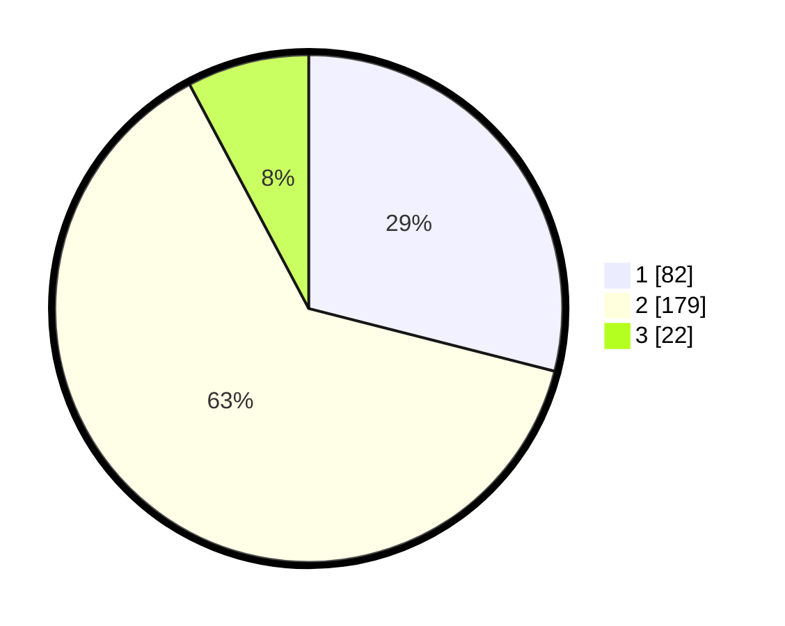

# Hasil

## Grafik

## Tabel

| No. | Nama Paslon    | Suara | Suara (raw) | Persentase |
|:--- |:-------------- | -----:| -----------:| ----------:|
| 1   | ANIES MUHAIMIN | 82    | [82][p-1]   | 28,98      |
| 2   | PRABOWO GIBRAN | 179   | [179][p-2]  | 63,25      |
| 3   | GANJAR MAHFUD  | 22    | [22][p-3]   | 7,77       |

[p-1]: https://github.com/gigit-pemilu/pemilu-2024-17-bengkulu/blob/main/pilpres/hitung-suara/sub/17-bengkulu/sub/71-kota-bengkulu/sub/01-selebar/sub/1003-pekan-sabtu/sub/002-tps/sub/paslon-1.txt
[p-2]: https://github.com/gigit-pemilu/pemilu-2024-17-bengkulu/blob/main/pilpres/hitung-suara/sub/17-bengkulu/sub/71-kota-bengkulu/sub/01-selebar/sub/1003-pekan-sabtu/sub/002-tps/sub/paslon-2.txt
[p-3]: https://github.com/gigit-pemilu/pemilu-2024-17-bengkulu/blob/main/pilpres/hitung-suara/sub/17-bengkulu/sub/71-kota-bengkulu/sub/01-selebar/sub/1003-pekan-sabtu/sub/002-tps/sub/paslon-3.txt

## Foto C Plano

https://sirekap-obj-formc.kpu.go.id/6dc2/pemilu/ppwp/17/71/01/10/03/1771011003002-20240225-085451--3a4fbac8-6bdf-4447-ac09-e26713029dee.jpg

https://sirekap-obj-formc.kpu.go.id/6dc2/pemilu/ppwp/17/71/01/10/03/1771011003002-20240225-085910--d1a50856-9358-4535-aa8e-419d038a02d5.jpg

https://sirekap-obj-formc.kpu.go.id/6dc2/pemilu/ppwp/17/71/01/10/03/1771011003002-20240225-090258--3a6ed8bd-08a1-4896-ace7-72fb515b1b5c.jpg

## Metadata

| Key        | Value               |
| ---------- | ------------------- |
| Time Stamp | 2024-02-25 10:00:00 |

## DATA PEMILIH TETAP

Jumlah pemilih dalam DPT: **295**.
 * L: **139**.
 * P: **156**.

## DATA PENGGUNA HAK PILIH

Jumlah pengguna hak pilih dalam DPT: **245**.
 * L: **114**.
 * P: **131**.

Jumlah pengguna hak pilih dalam DPTb: **1**.
 * L: **0**.
 * P: **1**.

Jumlah pengguna hak pilih dalam DPK: **41**.
 * L: **15**.
 * P: **26**.

Jumlah pengguna hak pilih: **287**.
 * L: **129**.
 * P: **158**.

## JUMLAH SUARA SAH DAN TIDAK SAH

JUMLAH SELURUH SUARA SAH: **283**.

JUMLAH SUARA TIDAK SAH: **4**.

JUMLAH SELURUH SUARA SAH DAN SUARA TIDAK SAH: **287**.

