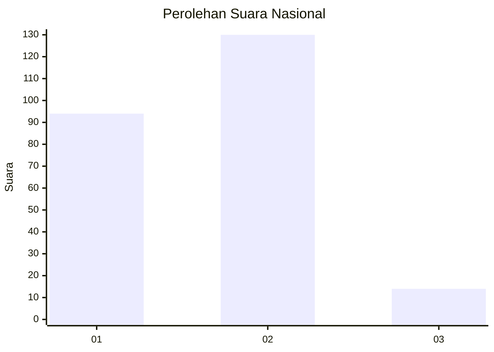
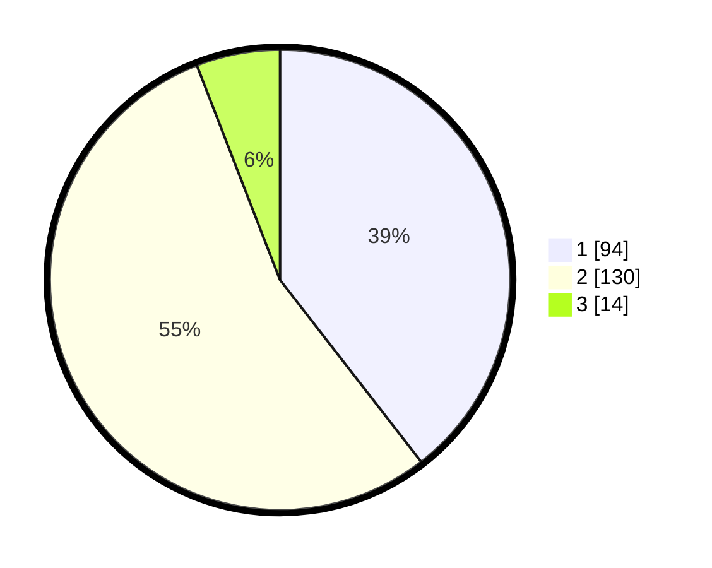

# Hasil

## Grafik

## Tabel

| No. | Nama Paslon    | Suara | Suara (raw) | Persentase |
|:--- |:-------------- | -----:| -----------:| ----------:|
| 1   | ANIES MUHAIMIN | 94    | [94][p-1]   | 39,50      |
| 2   | PRABOWO GIBRAN | 130   | [130][p-2]  | 54,62      |
| 3   | GANJAR MAHFUD  | 14    | [14][p-3]   | 5,88       |

[p-1]: https://github.com/gigit-pemilu/pemilu-2024/blob/main/pilpres/hitung-suara/sub/17-bengkulu/sub/71-kota-bengkulu/sub/01-selebar/sub/1003-pekan-sabtu/sub/009-tps/sub/paslon-1.txt
[p-2]: https://github.com/gigit-pemilu/pemilu-2024/blob/main/pilpres/hitung-suara/sub/17-bengkulu/sub/71-kota-bengkulu/sub/01-selebar/sub/1003-pekan-sabtu/sub/009-tps/sub/paslon-2.txt
[p-3]: https://github.com/gigit-pemilu/pemilu-2024/blob/main/pilpres/hitung-suara/sub/17-bengkulu/sub/71-kota-bengkulu/sub/01-selebar/sub/1003-pekan-sabtu/sub/009-tps/sub/paslon-3.txt

## Foto C Plano

https://sirekap-obj-formc.kpu.go.id/7a13/pemilu/ppwp/17/71/01/10/03/1771011003009-20240225-150047--e73d5653-9719-4f12-8db6-9d5bacc88124.jpg

https://sirekap-obj-formc.kpu.go.id/7a13/pemilu/ppwp/17/71/01/10/03/1771011003009-20240225-152225--a2fefc00-2aab-4338-94b3-6ef590017e32.jpg

https://sirekap-obj-formc.kpu.go.id/7a13/pemilu/ppwp/17/71/01/10/03/1771011003009-20240225-151901--3642c70f-bbb7-493c-9869-5c3554804241.jpg

## Metadata

| Key        | Value               |
| ---------- | ------------------- |
| Time Stamp | 2024-02-25 21:00:00 |

## DATA PEMILIH TETAP

Jumlah pemilih dalam DPT: **288**.
 * L: **156**.
 * P: **131**.

## DATA PENGGUNA HAK PILIH

Jumlah pengguna hak pilih dalam DPT: **535**.
 * L: **455**.
 * P: **525**.

Jumlah pengguna hak pilih dalam DPTb: **337**.
 * L: **489**.
 * P: **782**.

Jumlah pengguna hak pilih dalam DPK: **694**.
 * L: **664**.
 * P: **644**.

Jumlah pengguna hak pilih: **444**.
 * L: **444**.
 * P: **484**.

## JUMLAH SUARA SAH DAN TIDAK SAH

JUMLAH SELURUH SUARA SAH: **238**.

JUMLAH SUARA TIDAK SAH: **2**.

JUMLAH SELURUH SUARA SAH DAN SUARA TIDAK SAH: **240**.

