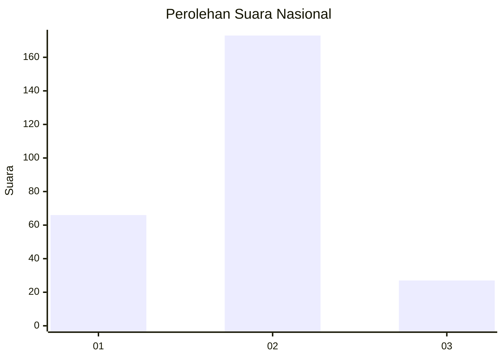
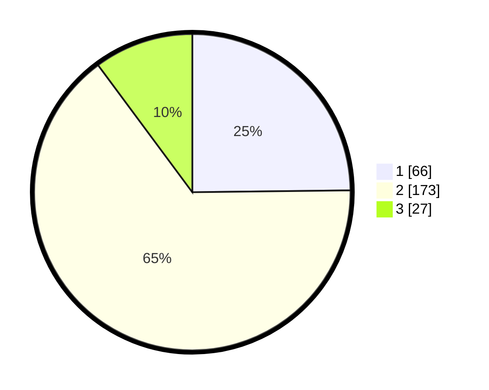

# Hasil

## Grafik

## Tabel

| No. | Nama Paslon    | Suara | Suara (raw) | Persentase |
|:--- |:-------------- | -----:| -----------:| ----------:|
| 1   | ANIES MUHAIMIN | 66    | [66][p-1]   | 24,81      |
| 2   | PRABOWO GIBRAN | 173   | [173][p-2]  | 65,04      |
| 3   | GANJAR MAHFUD  | 27    | [27][p-3]   | 10,15      |

[p-1]: https://github.com/gigit-pemilu/pemilu-2024/blob/main/pilpres/hitung-suara/sub/17-bengkulu/sub/71-kota-bengkulu/sub/01-selebar/sub/1004-bumi-ayu/sub/001-tps/sub/paslon-1.txt
[p-2]: https://github.com/gigit-pemilu/pemilu-2024/blob/main/pilpres/hitung-suara/sub/17-bengkulu/sub/71-kota-bengkulu/sub/01-selebar/sub/1004-bumi-ayu/sub/001-tps/sub/paslon-2.txt
[p-3]: https://github.com/gigit-pemilu/pemilu-2024/blob/main/pilpres/hitung-suara/sub/17-bengkulu/sub/71-kota-bengkulu/sub/01-selebar/sub/1004-bumi-ayu/sub/001-tps/sub/paslon-3.txt

## Foto C Plano

https://sirekap-obj-formc.kpu.go.id/6ef9/pemilu/ppwp/17/71/01/10/04/1771011004001-20240215-054156--7c0973c9-f8c3-4e82-88ee-3b29c0af0a82.jpg

https://sirekap-obj-formc.kpu.go.id/6ef9/pemilu/ppwp/17/71/01/10/04/1771011004001-20240215-053742--6b496992-0ee9-451f-b1dd-501d8179a39e.jpg

https://sirekap-obj-formc.kpu.go.id/6ef9/pemilu/ppwp/17/71/01/10/04/1771011004001-20240215-055114--b568c04b-1a41-4bc0-bb31-e8dd4ae0af00.jpg

## Metadata

| Key        | Value               |
| ---------- | ------------------- |
| Time Stamp | 2024-02-17 13:37:34 |

