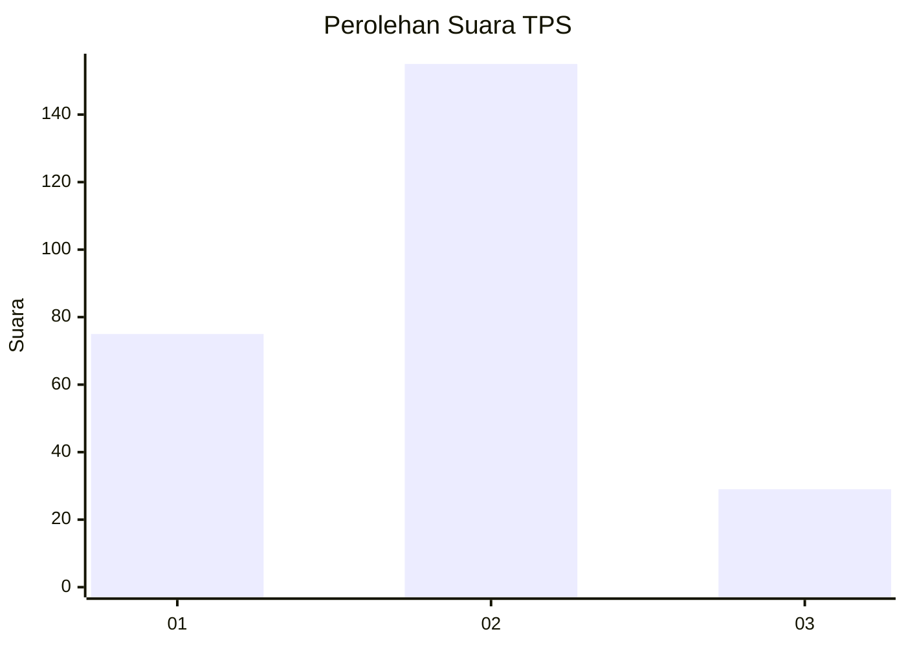
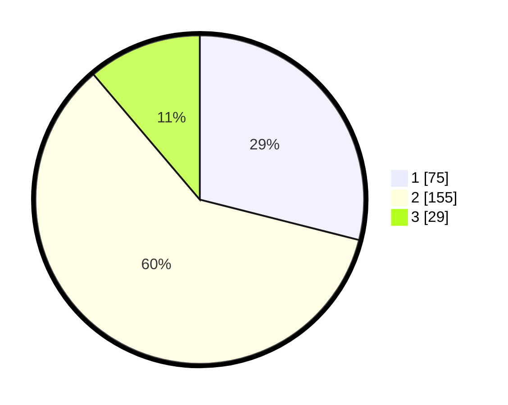

# Hasil

## Grafik

## Tabel

| No. | Nama Paslon    | Suara | Suara (raw) | Persentase |
|:--- |:-------------- | -----:| -----------:| ----------:|
| 1   | ANIES MUHAIMIN | 75    | [75][p-1]   | 28,96      |
| 2   | PRABOWO GIBRAN | 155   | [155][p-2]  | 59,85      |
| 3   | GANJAR MAHFUD  | 29    | [29][p-3]   | 11,20      |

[p-1]: https://github.com/gigit-pemilu/pemilu-2024-17-bengkulu/blob/main/pilpres/hitung-suara/sub/17-bengkulu/sub/71-kota-bengkulu/sub/01-selebar/sub/1004-bumi-ayu/sub/025-tps/sub/paslon-1.txt
[p-2]: https://github.com/gigit-pemilu/pemilu-2024-17-bengkulu/blob/main/pilpres/hitung-suara/sub/17-bengkulu/sub/71-kota-bengkulu/sub/01-selebar/sub/1004-bumi-ayu/sub/025-tps/sub/paslon-2.txt
[p-3]: https://github.com/gigit-pemilu/pemilu-2024-17-bengkulu/blob/main/pilpres/hitung-suara/sub/17-bengkulu/sub/71-kota-bengkulu/sub/01-selebar/sub/1004-bumi-ayu/sub/025-tps/sub/paslon-3.txt

## Foto C Plano

https://sirekap-obj-formc.kpu.go.id/7da9/pemilu/ppwp/17/71/01/10/04/1771011004025-20240217-201014--cf69fc0d-6c86-43af-a704-59a4c208ee83.jpg

https://sirekap-obj-formc.kpu.go.id/7da9/pemilu/ppwp/17/71/01/10/04/1771011004025-20240217-201019--9ebcfba7-88ba-4c45-8d03-ac159c4b7b6b.jpg

https://sirekap-obj-formc.kpu.go.id/7da9/pemilu/ppwp/17/71/01/10/04/1771011004025-20240217-232956--02a23ee0-8f24-401a-b91d-c62724d06822.jpg

## Metadata

| Key        | Value               |
| ---------- | ------------------- |
| Time Stamp | 2024-02-19 06:16:00 |

