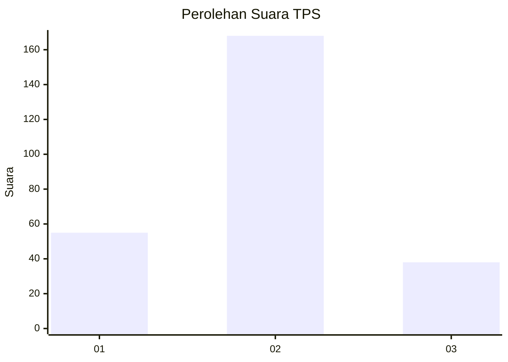
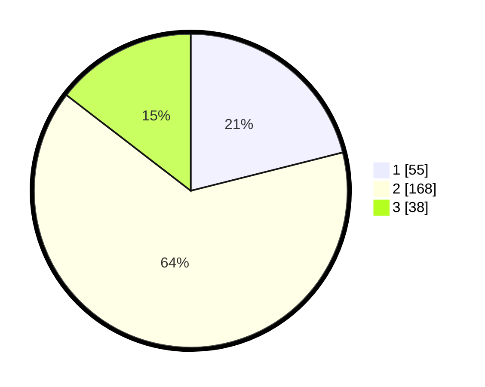

# Hasil

## Grafik

## Tabel

| No. | Nama Paslon    | Suara | Suara (raw) | Persentase |
|:--- |:-------------- | -----:| -----------:| ----------:|
| 1   | ANIES MUHAIMIN | 55    | [55][p-1]   | 21,07      |
| 2   | PRABOWO GIBRAN | 168   | [168][p-2]  | 64,37      |
| 3   | GANJAR MAHFUD  | 38    | [38][p-3]   | 14,56      |

[p-1]: https://github.com/gigit-pemilu/pemilu-2024-17-bengkulu/blob/main/pilpres/hitung-suara/sub/17-bengkulu/sub/71-kota-bengkulu/sub/01-selebar/sub/1004-bumi-ayu/sub/027-tps/sub/paslon-1.txt
[p-2]: https://github.com/gigit-pemilu/pemilu-2024-17-bengkulu/blob/main/pilpres/hitung-suara/sub/17-bengkulu/sub/71-kota-bengkulu/sub/01-selebar/sub/1004-bumi-ayu/sub/027-tps/sub/paslon-2.txt
[p-3]: https://github.com/gigit-pemilu/pemilu-2024-17-bengkulu/blob/main/pilpres/hitung-suara/sub/17-bengkulu/sub/71-kota-bengkulu/sub/01-selebar/sub/1004-bumi-ayu/sub/027-tps/sub/paslon-3.txt

## Foto C Plano

https://sirekap-obj-formc.kpu.go.id/aa2a/pemilu/ppwp/17/71/01/10/04/1771011004027-20240214-185755--fe5fd814-13ff-4eda-8376-957d92609891.jpg

https://sirekap-obj-formc.kpu.go.id/aa2a/pemilu/ppwp/17/71/01/10/04/1771011004027-20240214-185309--96d67316-ab7e-4473-a63e-e11780531164.jpg

https://sirekap-obj-formc.kpu.go.id/aa2a/pemilu/ppwp/17/71/01/10/04/1771011004027-20240214-190142--4c18da23-7c20-42d4-a65b-55abe13b4ae5.jpg

## Metadata

| Key        | Value               |
| ---------- | ------------------- |
| Time Stamp | 2024-02-17 13:37:34 |

