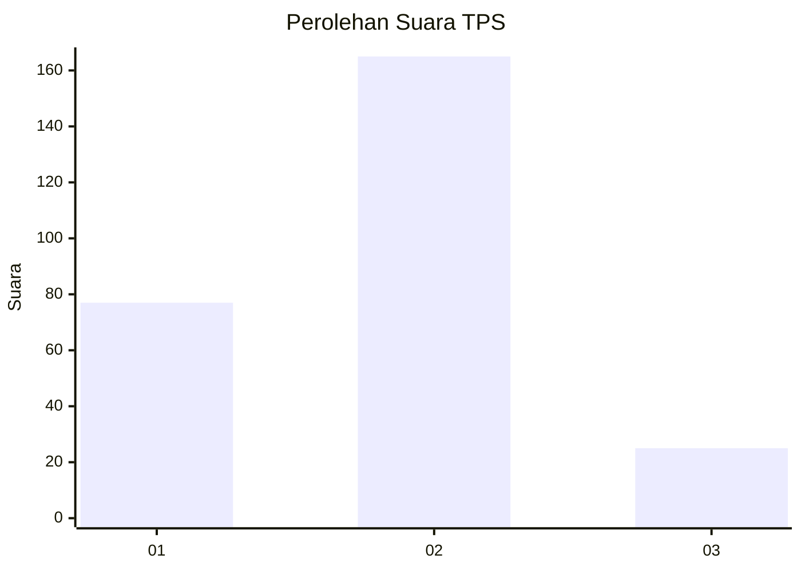
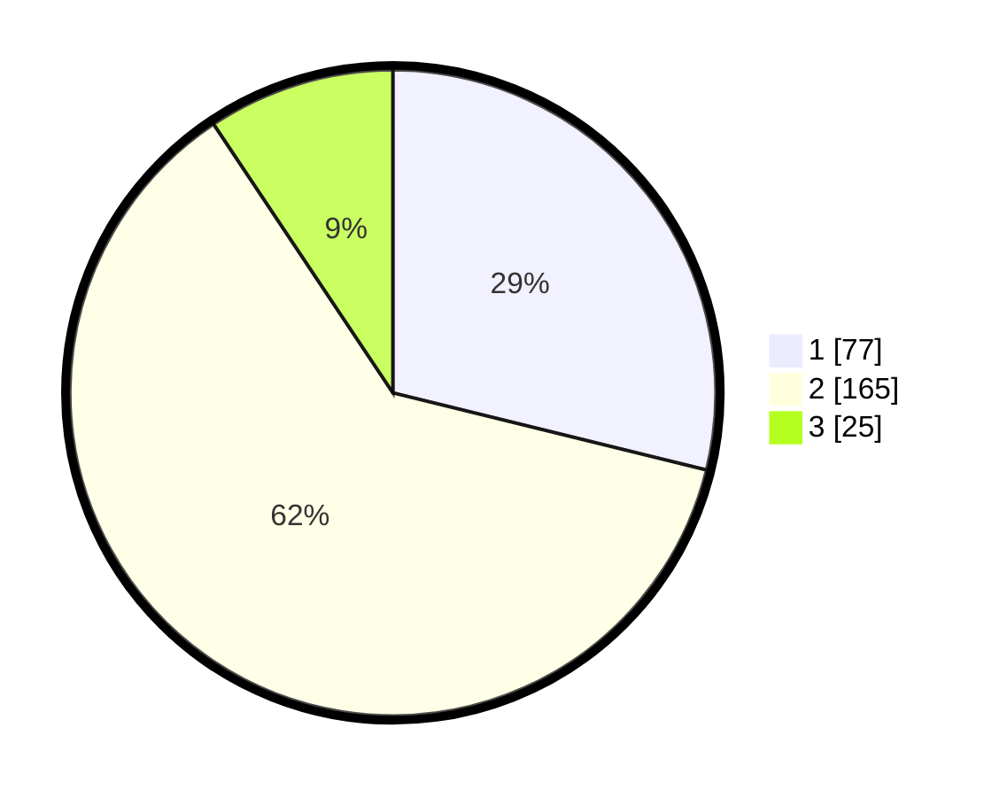

# Hasil

## Grafik

## Tabel

| No. | Nama Paslon    | Suara | Suara (raw) | Persentase |
|:--- |:-------------- | -----:| -----------:| ----------:|
| 1   | ANIES MUHAIMIN | 77    | [77][p-1]   | 28,84      |
| 2   | PRABOWO GIBRAN | 165   | [165][p-2]  | 61,80      |
| 3   | GANJAR MAHFUD  | 25    | [25][p-3]   | 9,36       |

[p-1]: https://github.com/gigit-pemilu/pemilu-2024-17-bengkulu/blob/main/pilpres/hitung-suara/sub/17-bengkulu/sub/71-kota-bengkulu/sub/01-selebar/sub/1005-betungan/sub/003-tps/sub/paslon-1.txt
[p-2]: https://github.com/gigit-pemilu/pemilu-2024-17-bengkulu/blob/main/pilpres/hitung-suara/sub/17-bengkulu/sub/71-kota-bengkulu/sub/01-selebar/sub/1005-betungan/sub/003-tps/sub/paslon-2.txt
[p-3]: https://github.com/gigit-pemilu/pemilu-2024-17-bengkulu/blob/main/pilpres/hitung-suara/sub/17-bengkulu/sub/71-kota-bengkulu/sub/01-selebar/sub/1005-betungan/sub/003-tps/sub/paslon-3.txt

## Foto C Plano

https://sirekap-obj-formc.kpu.go.id/a94b/pemilu/ppwp/17/71/01/10/05/1771011005003-20240214-212048--28cd1266-0b48-44ad-9908-e94f9b1c0eb9.jpg

https://sirekap-obj-formc.kpu.go.id/a94b/pemilu/ppwp/17/71/01/10/05/1771011005003-20240214-212136--9a03a475-f29d-4ed9-a95c-9614f8816b17.jpg

https://sirekap-obj-formc.kpu.go.id/a94b/pemilu/ppwp/17/71/01/10/05/1771011005003-20240214-212226--421dd692-4860-43eb-9994-a54e1c003a0d.jpg

## Metadata

| Key        | Value               |
| ---------- | ------------------- |
| Time Stamp | 2024-02-17 13:37:34 |

