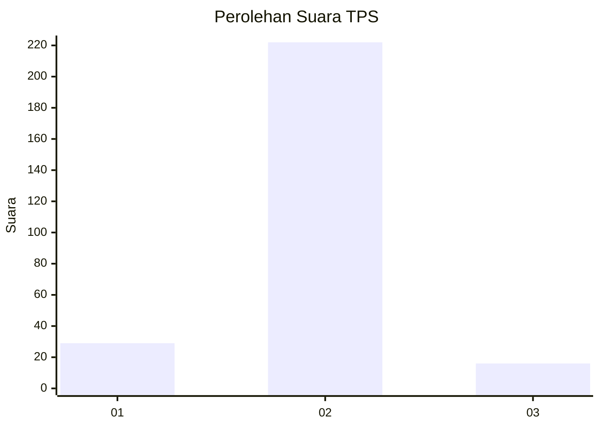
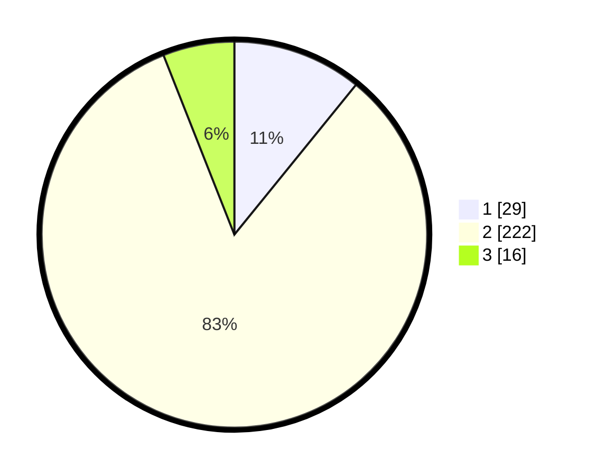

# Hasil

## Grafik

## Tabel

| No. | Nama Paslon    | Suara | Suara (raw) | Persentase |
|:--- |:-------------- | -----:| -----------:| ----------:|
| 1   | ANIES MUHAIMIN | 29    | [29][p-1]   | 10,86      |
| 2   | PRABOWO GIBRAN | 222   | [222][p-2]  | 83,15      |
| 3   | GANJAR MAHFUD  | 16    | [16][p-3]   | 5,99       |

[p-1]: https://github.com/gigit-pemilu/pemilu-2024-17-bengkulu/blob/main/pilpres/hitung-suara/sub/17-bengkulu/sub/71-kota-bengkulu/sub/01-selebar/sub/1005-betungan/sub/010-tps/sub/paslon-1.txt
[p-2]: https://github.com/gigit-pemilu/pemilu-2024-17-bengkulu/blob/main/pilpres/hitung-suara/sub/17-bengkulu/sub/71-kota-bengkulu/sub/01-selebar/sub/1005-betungan/sub/010-tps/sub/paslon-2.txt
[p-3]: https://github.com/gigit-pemilu/pemilu-2024-17-bengkulu/blob/main/pilpres/hitung-suara/sub/17-bengkulu/sub/71-kota-bengkulu/sub/01-selebar/sub/1005-betungan/sub/010-tps/sub/paslon-3.txt

## Foto C Plano

https://sirekap-obj-formc.kpu.go.id/73e9/pemilu/ppwp/17/71/01/10/05/1771011005010-20240223-121738--a5ba6e45-9522-4adc-84a7-0b36e9277df2.jpg

https://sirekap-obj-formc.kpu.go.id/73e9/pemilu/ppwp/17/71/01/10/05/1771011005010-20240223-121815--4789f961-a900-45aa-9608-64fc64846a85.jpg

https://sirekap-obj-formc.kpu.go.id/73e9/pemilu/ppwp/17/71/01/10/05/1771011005010-20240223-121851--34770b2e-c44d-4ff5-a81b-8130ff187143.jpg

## Metadata

| Key        | Value               |
| ---------- | ------------------- |
| Time Stamp | 2024-02-24 22:31:28 |

