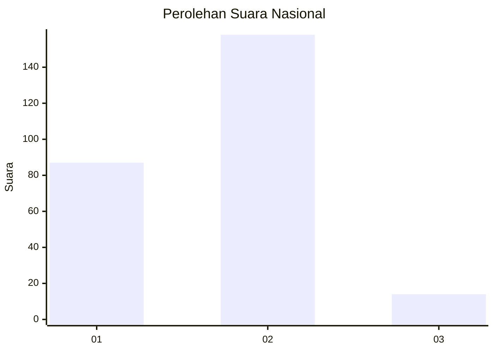
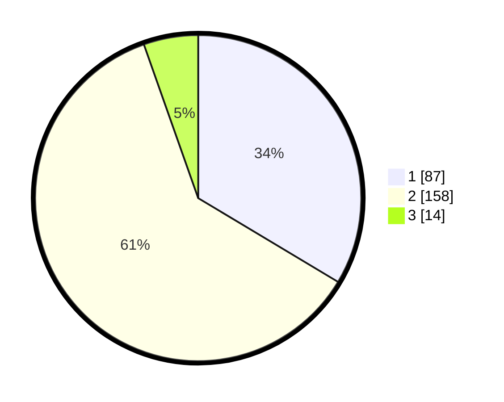

# Hasil

## Grafik

## Tabel

| No. | Nama Paslon    | Suara | Suara (raw) | Persentase |
|:--- |:-------------- | -----:| -----------:| ----------:|
| 1   | ANIES MUHAIMIN | 87    | [87][p-1]   | 33,59      |
| 2   | PRABOWO GIBRAN | 158   | [158][p-2]  | 61,00      |
| 3   | GANJAR MAHFUD  | 14    | [14][p-3]   | 5,41       |

[p-1]: https://github.com/gigit-pemilu/pemilu-2024/blob/main/pilpres/hitung-suara/sub/17-bengkulu/sub/71-kota-bengkulu/sub/01-selebar/sub/1005-betungan/sub/019-tps/sub/paslon-1.txt
[p-2]: https://github.com/gigit-pemilu/pemilu-2024/blob/main/pilpres/hitung-suara/sub/17-bengkulu/sub/71-kota-bengkulu/sub/01-selebar/sub/1005-betungan/sub/019-tps/sub/paslon-2.txt
[p-3]: https://github.com/gigit-pemilu/pemilu-2024/blob/main/pilpres/hitung-suara/sub/17-bengkulu/sub/71-kota-bengkulu/sub/01-selebar/sub/1005-betungan/sub/019-tps/sub/paslon-3.txt

## Foto C Plano

https://sirekap-obj-formc.kpu.go.id/14de/pemilu/ppwp/17/71/01/10/05/1771011005019-20240223-122447--febed310-cd2a-4a0f-b022-dda422b56e72.jpg

https://sirekap-obj-formc.kpu.go.id/14de/pemilu/ppwp/17/71/01/10/05/1771011005019-20240223-122527--3d25c8d4-24b8-49c5-8a0a-a52f965b13a0.jpg

https://sirekap-obj-formc.kpu.go.id/14de/pemilu/ppwp/17/71/01/10/05/1771011005019-20240223-122615--f9130cee-adfa-41ef-b434-240b04738d47.jpg

## Metadata

| Key        | Value               |
| ---------- | ------------------- |
| Time Stamp | 2024-02-24 22:31:28 |

