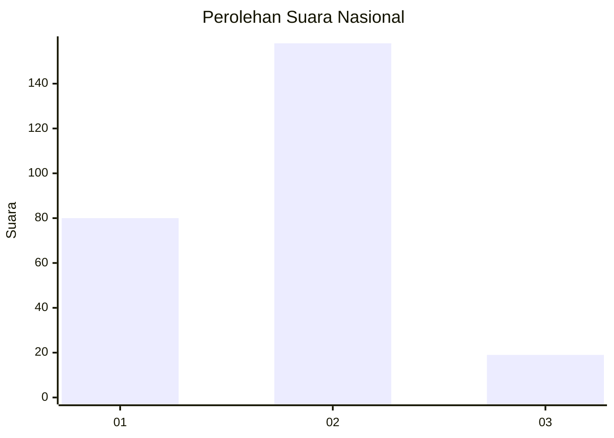
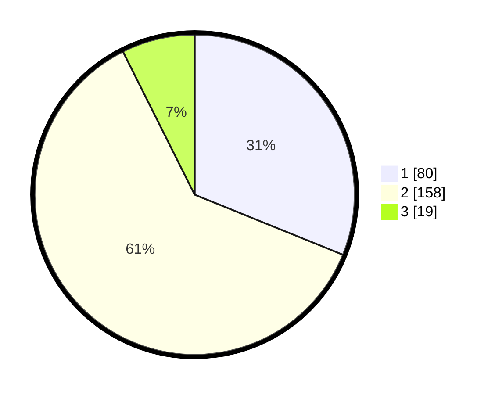

# Hasil

## Grafik

## Tabel

| No. | Nama Paslon    | Suara | Suara (raw) | Persentase |
|:--- |:-------------- | -----:| -----------:| ----------:|
| 1   | ANIES MUHAIMIN | 80    | [80][p-1]   | 31,13      |
| 2   | PRABOWO GIBRAN | 158   | [158][p-2]  | 61,48      |
| 3   | GANJAR MAHFUD  | 19    | [19][p-3]   | 7,39       |

[p-1]: https://github.com/gigit-pemilu/pemilu-2024/blob/main/pilpres/hitung-suara/sub/17-bengkulu/sub/71-kota-bengkulu/sub/01-selebar/sub/1005-betungan/sub/021-tps/sub/paslon-1.txt
[p-2]: https://github.com/gigit-pemilu/pemilu-2024/blob/main/pilpres/hitung-suara/sub/17-bengkulu/sub/71-kota-bengkulu/sub/01-selebar/sub/1005-betungan/sub/021-tps/sub/paslon-2.txt
[p-3]: https://github.com/gigit-pemilu/pemilu-2024/blob/main/pilpres/hitung-suara/sub/17-bengkulu/sub/71-kota-bengkulu/sub/01-selebar/sub/1005-betungan/sub/021-tps/sub/paslon-3.txt

## Foto C Plano

https://sirekap-obj-formc.kpu.go.id/0b6f/pemilu/ppwp/17/71/01/10/05/1771011005021-20240215-041613--b13d6ab8-7253-44a2-a55b-828766589a06.jpg

https://sirekap-obj-formc.kpu.go.id/0b6f/pemilu/ppwp/17/71/01/10/05/1771011005021-20240215-041725--1313ef64-efc4-4436-bd94-88c4c5a512a0.jpg

https://sirekap-obj-formc.kpu.go.id/0b6f/pemilu/ppwp/17/71/01/10/05/1771011005021-20240215-041827--efdfe2b6-ee19-4ef3-ae74-adba3231e33a.jpg

## Metadata

| Key        | Value               |
| ---------- | ------------------- |
| Time Stamp | 2024-02-17 14:45:18 |

