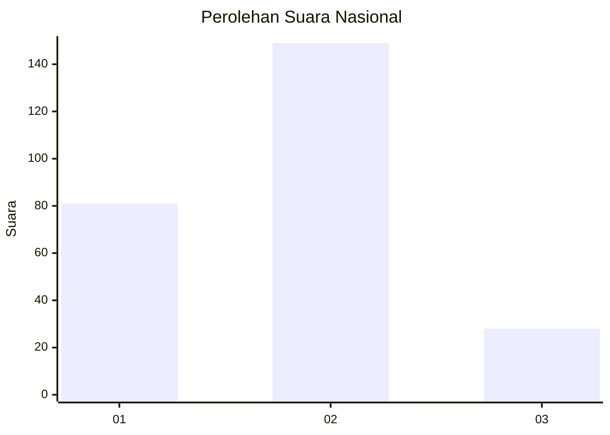
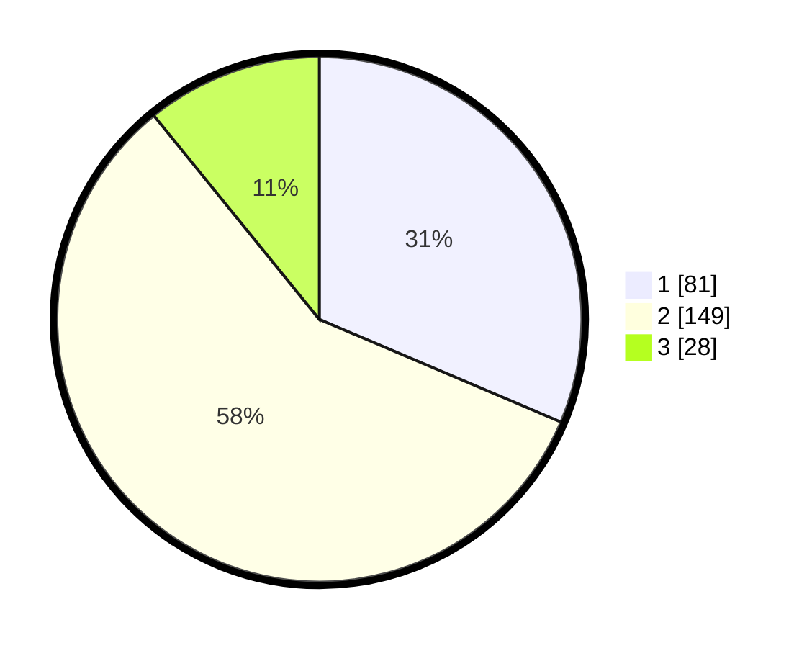

# Hasil

## Grafik

## Tabel

| No. | Nama Paslon    | Suara | Suara (raw) | Persentase |
|:--- |:-------------- | -----:| -----------:| ----------:|
| 1   | ANIES MUHAIMIN | 81    | [81][p-1]   | 31,40      |
| 2   | PRABOWO GIBRAN | 149   | [149][p-2]  | 57,75      |
| 3   | GANJAR MAHFUD  | 28    | [28][p-3]   | 10,85      |

[p-1]: https://github.com/gigit-pemilu/pemilu-2024/blob/main/pilpres/hitung-suara/sub/17-bengkulu/sub/71-kota-bengkulu/sub/01-selebar/sub/1006-sumur-dewa/sub/025-tps/sub/paslon-1.txt
[p-2]: https://github.com/gigit-pemilu/pemilu-2024/blob/main/pilpres/hitung-suara/sub/17-bengkulu/sub/71-kota-bengkulu/sub/01-selebar/sub/1006-sumur-dewa/sub/025-tps/sub/paslon-2.txt
[p-3]: https://github.com/gigit-pemilu/pemilu-2024/blob/main/pilpres/hitung-suara/sub/17-bengkulu/sub/71-kota-bengkulu/sub/01-selebar/sub/1006-sumur-dewa/sub/025-tps/sub/paslon-3.txt

## Foto C Plano

https://sirekap-obj-formc.kpu.go.id/9105/pemilu/ppwp/17/71/01/10/06/1771011006025-20240222-214111--4b5f90cc-b246-4624-a093-119dd5c18426.jpg

https://sirekap-obj-formc.kpu.go.id/9105/pemilu/ppwp/17/71/01/10/06/1771011006025-20240222-214252--92826ab5-1f60-4eb9-9ec1-43caf0a706d5.jpg

https://sirekap-obj-formc.kpu.go.id/9105/pemilu/ppwp/17/71/01/10/06/1771011006025-20240222-214342--c360a91a-e32e-41e4-acf2-093ca7dff9ca.jpg

## Metadata

| Key        | Value               |
| ---------- | ------------------- |
| Time Stamp | 2024-02-24 22:31:28 |

