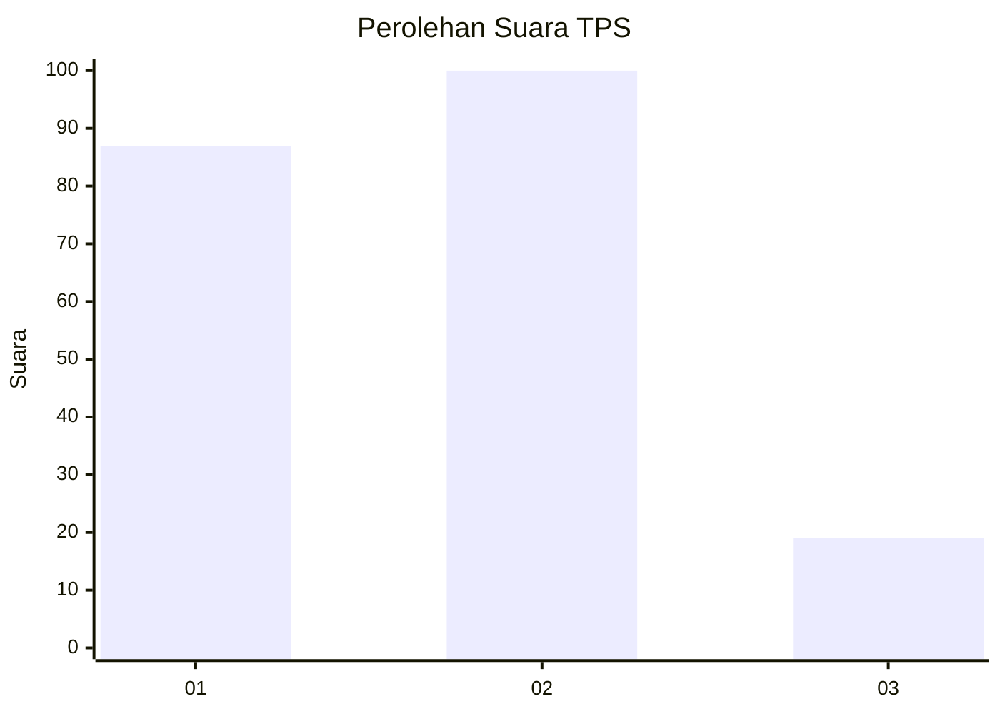
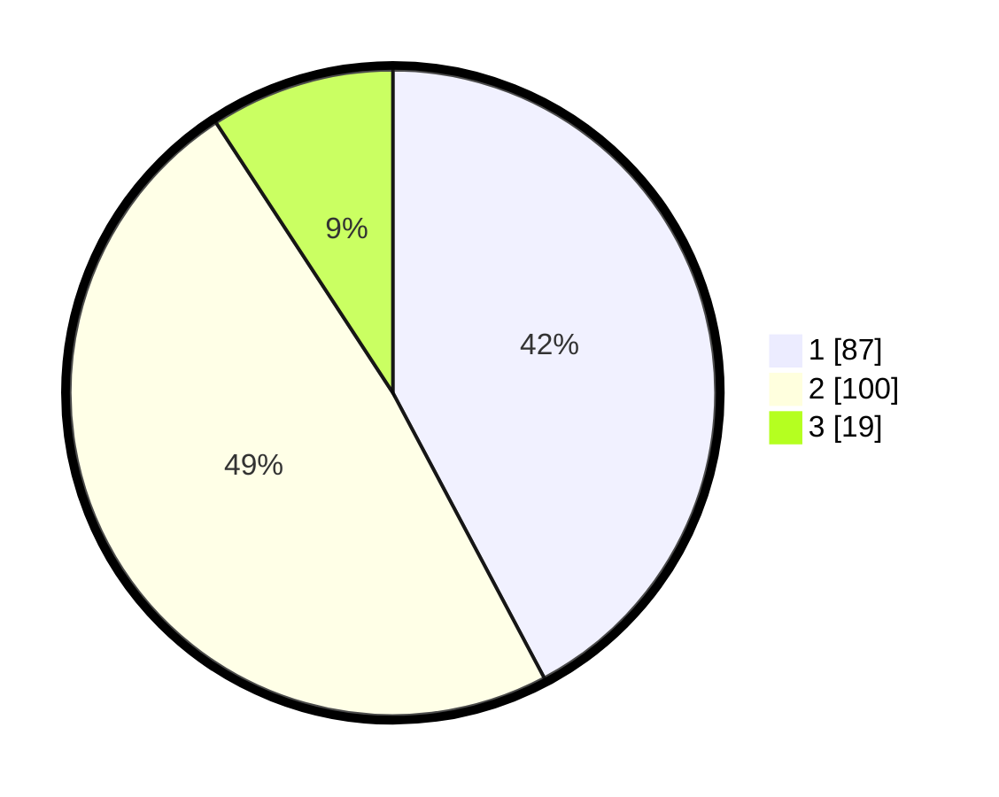

# Hasil

## Grafik

## Tabel

| No. | Nama Paslon    | Suara | Suara (raw) | Persentase |
|:--- |:-------------- | -----:| -----------:| ----------:|
| 1   | ANIES MUHAIMIN | 87    | [87][p-1]   | 42,23      |
| 2   | PRABOWO GIBRAN | 100   | [100][p-2]  | 48,54      |
| 3   | GANJAR MAHFUD  | 19    | [19][p-3]   | 9,22       |

[p-1]: https://github.com/gigit-pemilu/pemilu-2024-17-bengkulu/blob/main/pilpres/hitung-suara/sub/17-bengkulu/sub/71-kota-bengkulu/sub/02-gading-cempaka/sub/1001-padang-harapan/sub/005-tps/sub/paslon-1.txt
[p-2]: https://github.com/gigit-pemilu/pemilu-2024-17-bengkulu/blob/main/pilpres/hitung-suara/sub/17-bengkulu/sub/71-kota-bengkulu/sub/02-gading-cempaka/sub/1001-padang-harapan/sub/005-tps/sub/paslon-2.txt
[p-3]: https://github.com/gigit-pemilu/pemilu-2024-17-bengkulu/blob/main/pilpres/hitung-suara/sub/17-bengkulu/sub/71-kota-bengkulu/sub/02-gading-cempaka/sub/1001-padang-harapan/sub/005-tps/sub/paslon-3.txt

## Foto C Plano

https://sirekap-obj-formc.kpu.go.id/22b9/pemilu/ppwp/17/71/02/10/01/1771021001005-20240215-025857--adfccccd-1ff6-4cc6-a18d-0ee7b3d5d5dd.jpg

https://sirekap-obj-formc.kpu.go.id/22b9/pemilu/ppwp/17/71/02/10/01/1771021001005-20240215-025937--56c19eb6-7293-40bb-b85a-d458723c8d6f.jpg

https://sirekap-obj-formc.kpu.go.id/22b9/pemilu/ppwp/17/71/02/10/01/1771021001005-20240215-030037--c11a1e71-0d9b-4f22-910d-53df64607abe.jpg

## Metadata

| Key        | Value               |
| ---------- | ------------------- |
| Time Stamp | 2024-02-17 17:30:00 |

