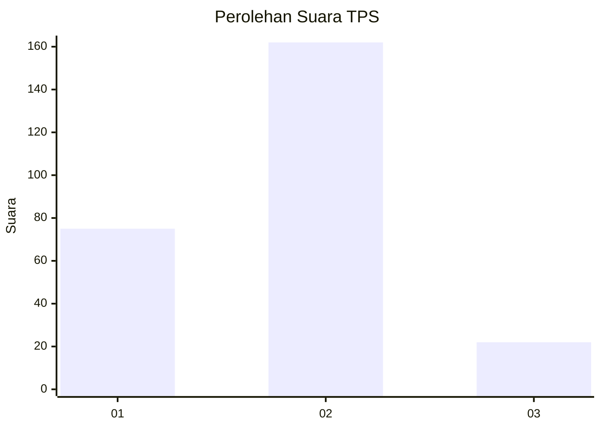
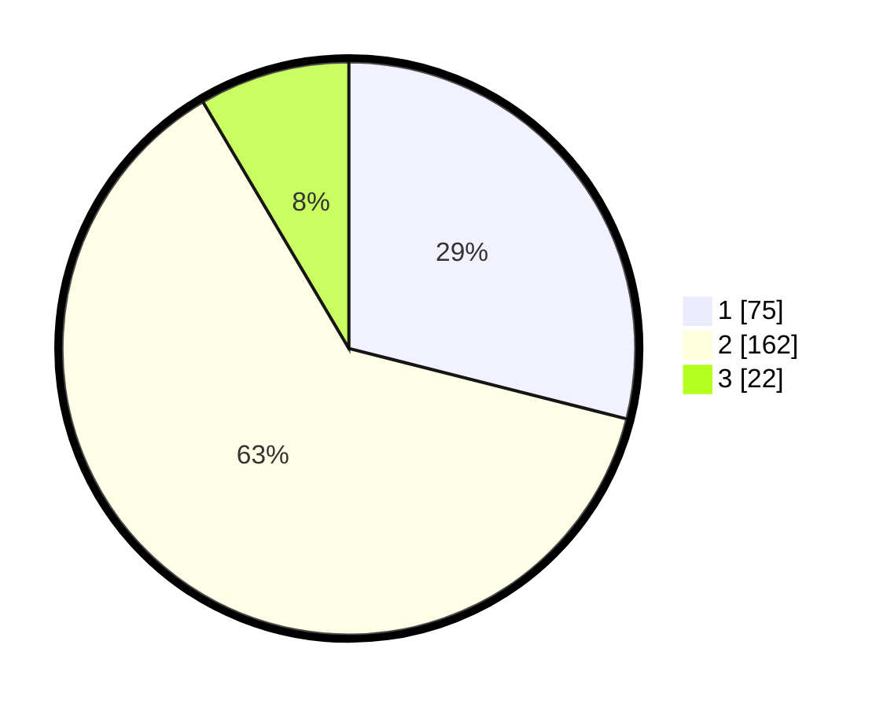

# Hasil

## Grafik

## Tabel

| No. | Nama Paslon    | Suara | Suara (raw) | Persentase |
|:--- |:-------------- | -----:| -----------:| ----------:|
| 1   | ANIES MUHAIMIN | 75    | [75][p-1]   | 28,96      |
| 2   | PRABOWO GIBRAN | 162   | [162][p-2]  | 62,55      |
| 3   | GANJAR MAHFUD  | 22    | [22][p-3]   | 8,49       |

[p-1]: https://github.com/gigit-pemilu/pemilu-2024-17-bengkulu/blob/main/pilpres/hitung-suara/sub/17-bengkulu/sub/71-kota-bengkulu/sub/02-gading-cempaka/sub/1002-jalan-gedang/sub/003-tps/sub/paslon-1.txt
[p-2]: https://github.com/gigit-pemilu/pemilu-2024-17-bengkulu/blob/main/pilpres/hitung-suara/sub/17-bengkulu/sub/71-kota-bengkulu/sub/02-gading-cempaka/sub/1002-jalan-gedang/sub/003-tps/sub/paslon-2.txt
[p-3]: https://github.com/gigit-pemilu/pemilu-2024-17-bengkulu/blob/main/pilpres/hitung-suara/sub/17-bengkulu/sub/71-kota-bengkulu/sub/02-gading-cempaka/sub/1002-jalan-gedang/sub/003-tps/sub/paslon-3.txt

## Foto C Plano

https://sirekap-obj-formc.kpu.go.id/6554/pemilu/ppwp/17/71/02/10/02/1771021002003-20240217-150042--096b6c43-7f62-40a2-8f87-a55ec9d45337.jpg

https://sirekap-obj-formc.kpu.go.id/6554/pemilu/ppwp/17/71/02/10/02/1771021002003-20240217-201159--008b5deb-eaa0-4ae9-96c6-668316095014.jpg

https://sirekap-obj-formc.kpu.go.id/6554/pemilu/ppwp/17/71/02/10/02/1771021002003-20240217-160854--02763b78-4fce-41bb-83c5-519f8eb3a671.jpg

## Metadata

| Key        | Value               |
| ---------- | ------------------- |
| Time Stamp | 2024-02-19 06:16:00 |

