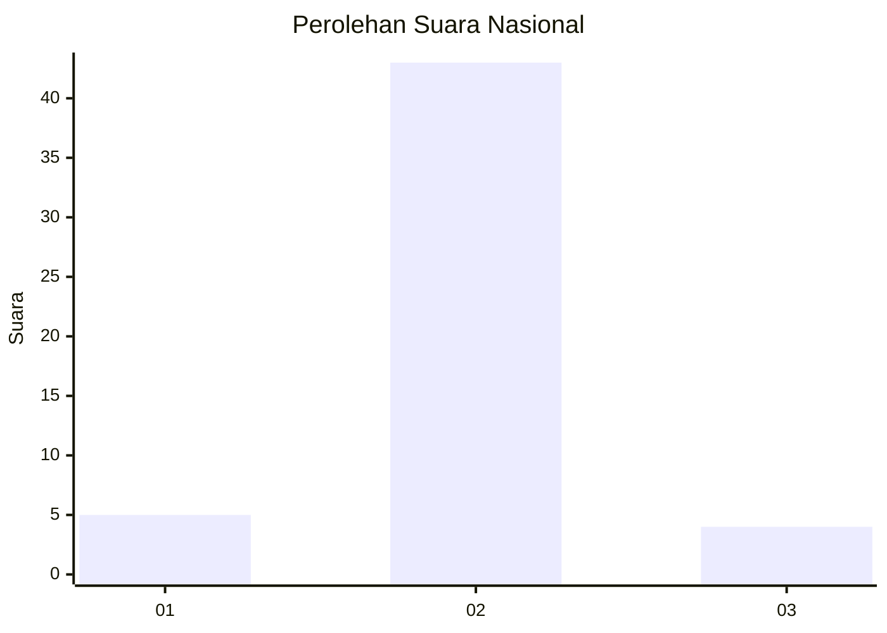
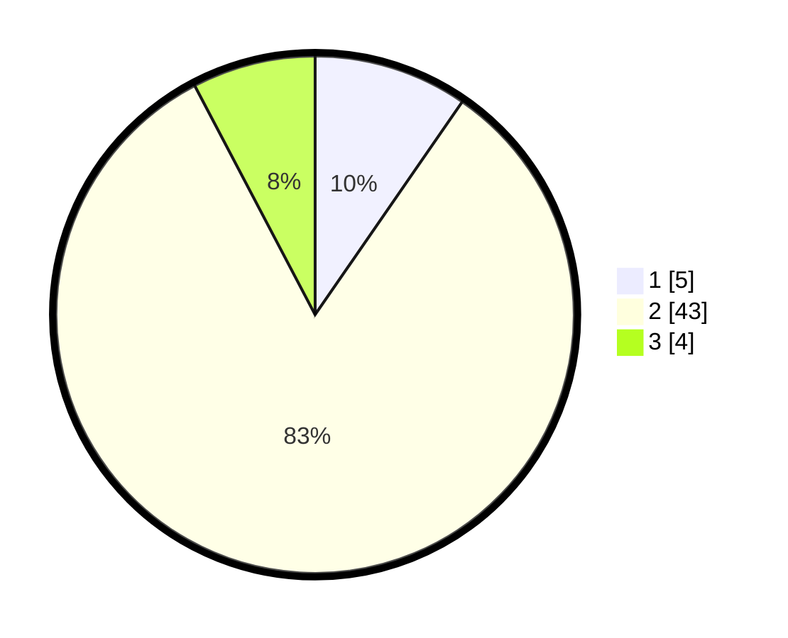

# Hasil

## Grafik

## Tabel

| No. | Nama Paslon    | Suara | Suara (raw) | Persentase |
|:--- |:-------------- | -----:| -----------:| ----------:|
| 1   | ANIES MUHAIMIN | 5     | [5][p-1]    | 9,62       |
| 2   | PRABOWO GIBRAN | 43    | [43][p-2]   | 82,69      |
| 3   | GANJAR MAHFUD  | 4     | [4][p-3]    | 7,69       |

[p-1]: https://github.com/gigit-pemilu/pemilu-2024/blob/main/pilpres/hitung-suara/sub/17-bengkulu/sub/71-kota-bengkulu/sub/03-teluk-segara/sub/1014-malabero/sub/902-tps/sub/paslon-1.txt
[p-2]: https://github.com/gigit-pemilu/pemilu-2024/blob/main/pilpres/hitung-suara/sub/17-bengkulu/sub/71-kota-bengkulu/sub/03-teluk-segara/sub/1014-malabero/sub/902-tps/sub/paslon-2.txt
[p-3]: https://github.com/gigit-pemilu/pemilu-2024/blob/main/pilpres/hitung-suara/sub/17-bengkulu/sub/71-kota-bengkulu/sub/03-teluk-segara/sub/1014-malabero/sub/902-tps/sub/paslon-3.txt

## Foto C Plano

https://sirekap-obj-formc.kpu.go.id/e290/pemilu/ppwp/17/71/03/10/14/1771031014902-20240217-093724--711ac033-0355-4060-8e6e-7e529d15aac3.jpg

https://sirekap-obj-formc.kpu.go.id/e290/pemilu/ppwp/17/71/03/10/14/1771031014902-20240217-093725--31da5f03-3a18-4f2f-b5c7-59e78dddafe6.jpg

https://sirekap-obj-formc.kpu.go.id/e290/pemilu/ppwp/17/71/03/10/14/1771031014902-20240217-093725--b02eca1f-9f61-4b9e-968b-f9bc14c15e41.jpg

## Metadata

| Key        | Value               |
| ---------- | ------------------- |
| Time Stamp | 2024-02-17 11:00:02 |

## DATA PEMILIH TETAP

Jumlah pemilih dalam DPT: **64**.
 * L: **64**.
 * P: **0**.

## DATA PENGGUNA HAK PILIH

Jumlah pengguna hak pilih dalam DPT: **27**.
 * L: **27**.
 * P: **0**.

Jumlah pengguna hak pilih dalam DPTb: **25**.
 * L: **22**.
 * P: **3**.

Jumlah pengguna hak pilih dalam DPK: **0**.
 * L: **0**.
 * P: **0**.

Jumlah pengguna hak pilih: **52**.
 * L: **49**.
 * P: **3**.

## JUMLAH SUARA SAH DAN TIDAK SAH

JUMLAH SELURUH SUARA SAH: **52**.

JUMLAH SUARA TIDAK SAH: **0**.

JUMLAH SELURUH SUARA SAH DAN SUARA TIDAK SAH: **52**.

