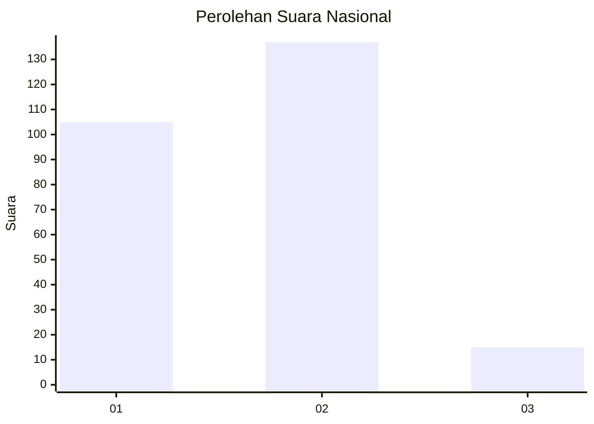
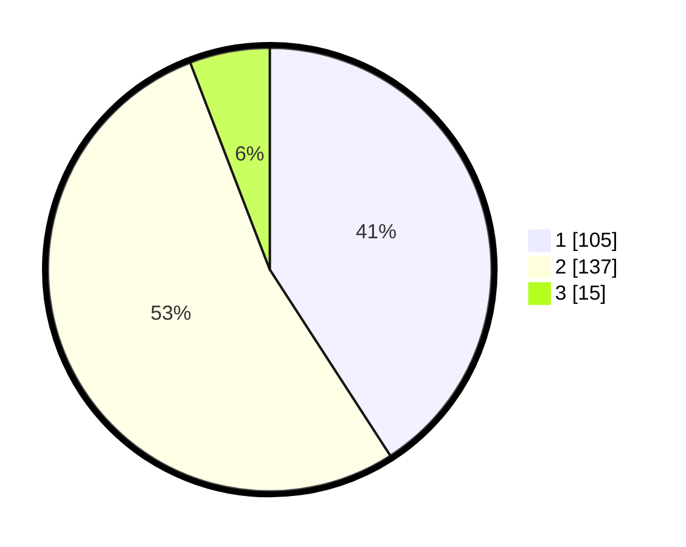

# Hasil

## Grafik

## Tabel

| No. | Nama Paslon    | Suara | Suara (raw) | Persentase |
|:--- |:-------------- | -----:| -----------:| ----------:|
| 1   | ANIES MUHAIMIN | 105   | [105][p-1]  | 40,86      |
| 2   | PRABOWO GIBRAN | 137   | [137][p-2]  | 53,31      |
| 3   | GANJAR MAHFUD  | 15    | [15][p-3]   | 5,84       |

[p-1]: https://github.com/gigit-pemilu/pemilu-2024/blob/main/pilpres/hitung-suara/sub/17-bengkulu/sub/71-kota-bengkulu/sub/04-muara-bangka-hulu/sub/1001-kandang-limun/sub/002-tps/sub/paslon-1.txt
[p-2]: https://github.com/gigit-pemilu/pemilu-2024/blob/main/pilpres/hitung-suara/sub/17-bengkulu/sub/71-kota-bengkulu/sub/04-muara-bangka-hulu/sub/1001-kandang-limun/sub/002-tps/sub/paslon-2.txt
[p-3]: https://github.com/gigit-pemilu/pemilu-2024/blob/main/pilpres/hitung-suara/sub/17-bengkulu/sub/71-kota-bengkulu/sub/04-muara-bangka-hulu/sub/1001-kandang-limun/sub/002-tps/sub/paslon-3.txt

## Foto C Plano

https://sirekap-obj-formc.kpu.go.id/beee/pemilu/ppwp/17/71/04/10/01/1771041001002-20240215-011408--1bc20e95-40f7-4307-82bc-bf1c3b0cd8a9.jpg

https://sirekap-obj-formc.kpu.go.id/beee/pemilu/ppwp/17/71/04/10/01/1771041001002-20240217-160302--4f51bec3-9cbf-4502-8827-7ccd2a296c4e.jpg

https://sirekap-obj-formc.kpu.go.id/beee/pemilu/ppwp/17/71/04/10/01/1771041001002-20240217-182256--989c0ae9-0add-43a6-b157-96b42ec10516.jpg

## Metadata

| Key        | Value               |
| ---------- | ------------------- |
| Time Stamp | 2024-02-19 06:16:00 |

## DATA PEMILIH TETAP

Jumlah pemilih dalam DPT: **299**.
 * L: **756**.
 * P: **143**.

## DATA PENGGUNA HAK PILIH

Jumlah pengguna hak pilih dalam DPT: **252**.
 * L: **123**.
 * P: **129**.

Jumlah pengguna hak pilih dalam DPTb: **242**.
 * L: **770**.
 * P: **442**.

Jumlah pengguna hak pilih dalam DPK: **443**.
 * L: **872**.
 * P: **821**.

Jumlah pengguna hak pilih: **257**.
 * L: **225**.
 * P: **132**.

## JUMLAH SUARA SAH DAN TIDAK SAH

JUMLAH SELURUH SUARA SAH: **257**.

JUMLAH SUARA TIDAK SAH: **0**.

JUMLAH SELURUH SUARA SAH DAN SUARA TIDAK SAH: **257**.

