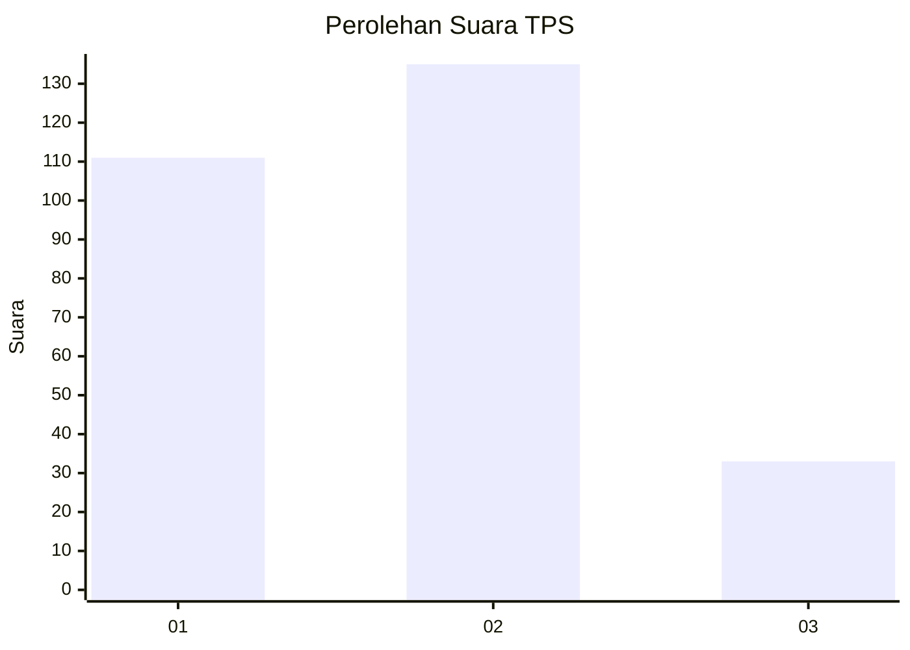
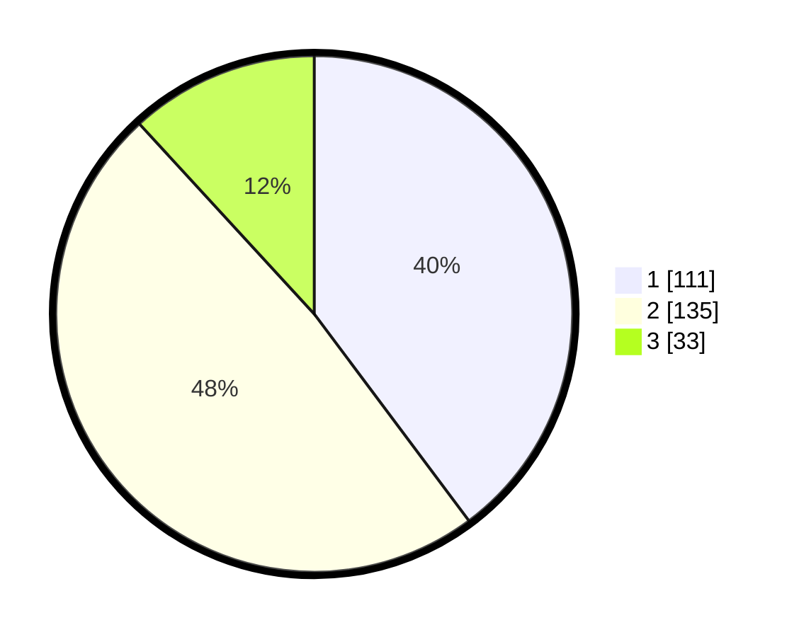

# Hasil

## Grafik

## Tabel

| No. | Nama Paslon    | Suara | Suara (raw) | Persentase |
|:--- |:-------------- | -----:| -----------:| ----------:|
| 1   | ANIES MUHAIMIN | 111   | [111][p-1]  | 39,78      |
| 2   | PRABOWO GIBRAN | 135   | [135][p-2]  | 48,39      |
| 3   | GANJAR MAHFUD  | 33    | [33][p-3]   | 11,83      |

[p-1]: https://github.com/gigit-pemilu/pemilu-2024-17-bengkulu/blob/main/pilpres/hitung-suara/sub/17-bengkulu/sub/71-kota-bengkulu/sub/04-muara-bangka-hulu/sub/1001-kandang-limun/sub/003-tps/sub/paslon-1.txt
[p-2]: https://github.com/gigit-pemilu/pemilu-2024-17-bengkulu/blob/main/pilpres/hitung-suara/sub/17-bengkulu/sub/71-kota-bengkulu/sub/04-muara-bangka-hulu/sub/1001-kandang-limun/sub/003-tps/sub/paslon-2.txt
[p-3]: https://github.com/gigit-pemilu/pemilu-2024-17-bengkulu/blob/main/pilpres/hitung-suara/sub/17-bengkulu/sub/71-kota-bengkulu/sub/04-muara-bangka-hulu/sub/1001-kandang-limun/sub/003-tps/sub/paslon-3.txt

## Foto C Plano

https://sirekap-obj-formc.kpu.go.id/a1e6/pemilu/ppwp/17/71/04/10/01/1771041001003-20240215-003245--eb19f496-825b-48ec-8411-87ba7dca7529.jpg

https://sirekap-obj-formc.kpu.go.id/a1e6/pemilu/ppwp/17/71/04/10/01/1771041001003-20240217-221620--6408132e-0891-4239-832f-d4f8fefb95ac.jpg

https://sirekap-obj-formc.kpu.go.id/a1e6/pemilu/ppwp/17/71/04/10/01/1771041001003-20240217-221619--f1620fec-6b79-42fa-924c-25cfdde4c8b3.jpg

## Metadata

| Key        | Value               |
| ---------- | ------------------- |
| Time Stamp | 2024-02-19 06:16:00 |

## DATA PEMILIH TETAP

Jumlah pemilih dalam DPT: **297**.
 * L: **153**.
 * P: **144**.

## DATA PENGGUNA HAK PILIH

Jumlah pengguna hak pilih dalam DPT: **247**.
 * L: **120**.
 * P: **127**.

Jumlah pengguna hak pilih dalam DPTb: **7**.
 * L: **2**.
 * P: **5**.

Jumlah pengguna hak pilih dalam DPK: **11**.
 * L: **4**.
 * P: **7**.

Jumlah pengguna hak pilih: **265**.
 * L: **126**.
 * P: **139**.

## JUMLAH SUARA SAH DAN TIDAK SAH

JUMLAH SELURUH SUARA SAH: **264**.

JUMLAH SUARA TIDAK SAH: **1**.

JUMLAH SELURUH SUARA SAH DAN SUARA TIDAK SAH: **265**.

