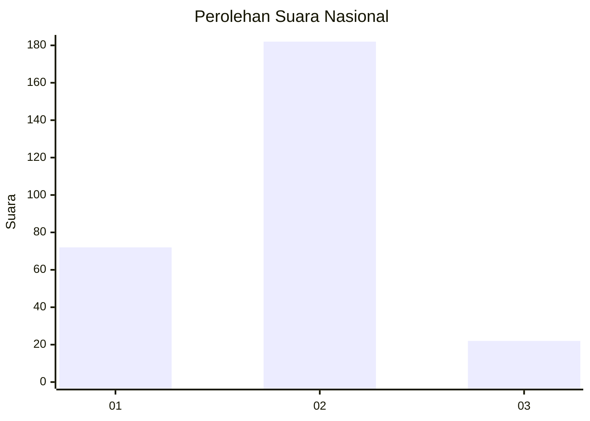
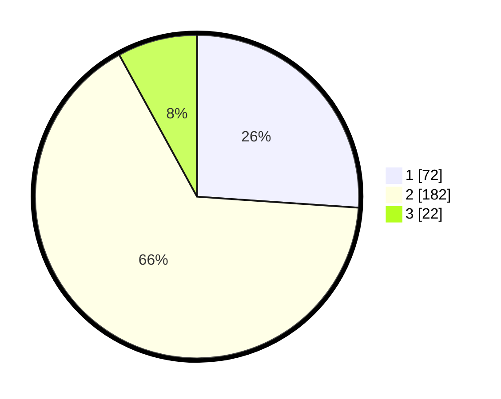

# Hasil

## Grafik

## Tabel

| No. | Nama Paslon    | Suara | Suara (raw) | Persentase |
|:--- |:-------------- | -----:| -----------:| ----------:|
| 1   | ANIES MUHAIMIN | 72    | [72][p-1]   | 26,09      |
| 2   | PRABOWO GIBRAN | 182   | [182][p-2]  | 65,94      |
| 3   | GANJAR MAHFUD  | 22    | [22][p-3]   | 7,97       |

[p-1]: https://github.com/gigit-pemilu/pemilu-2024/blob/main/pilpres/hitung-suara/sub/17-bengkulu/sub/71-kota-bengkulu/sub/04-muara-bangka-hulu/sub/1001-kandang-limun/sub/008-tps/sub/paslon-1.txt
[p-2]: https://github.com/gigit-pemilu/pemilu-2024/blob/main/pilpres/hitung-suara/sub/17-bengkulu/sub/71-kota-bengkulu/sub/04-muara-bangka-hulu/sub/1001-kandang-limun/sub/008-tps/sub/paslon-2.txt
[p-3]: https://github.com/gigit-pemilu/pemilu-2024/blob/main/pilpres/hitung-suara/sub/17-bengkulu/sub/71-kota-bengkulu/sub/04-muara-bangka-hulu/sub/1001-kandang-limun/sub/008-tps/sub/paslon-3.txt

## Foto C Plano

https://sirekap-obj-formc.kpu.go.id/450d/pemilu/ppwp/17/71/04/10/01/1771041001008-20240214-155458--aebddb4a-f6bd-4f33-bb43-1f03a1df7a2b.jpg

https://sirekap-obj-formc.kpu.go.id/450d/pemilu/ppwp/17/71/04/10/01/1771041001008-20240215-155034--725dcf9c-da5d-43ca-aead-0765ed7c6daf.jpg

https://sirekap-obj-formc.kpu.go.id/450d/pemilu/ppwp/17/71/04/10/01/1771041001008-20240214-190435--91e1526c-c040-4615-88f2-baab68a729c8.jpg

## Metadata

| Key        | Value               |
| ---------- | ------------------- |
| Time Stamp | 2024-02-19 23:00:00 |

