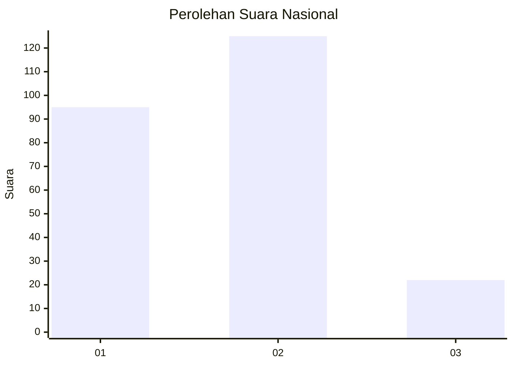
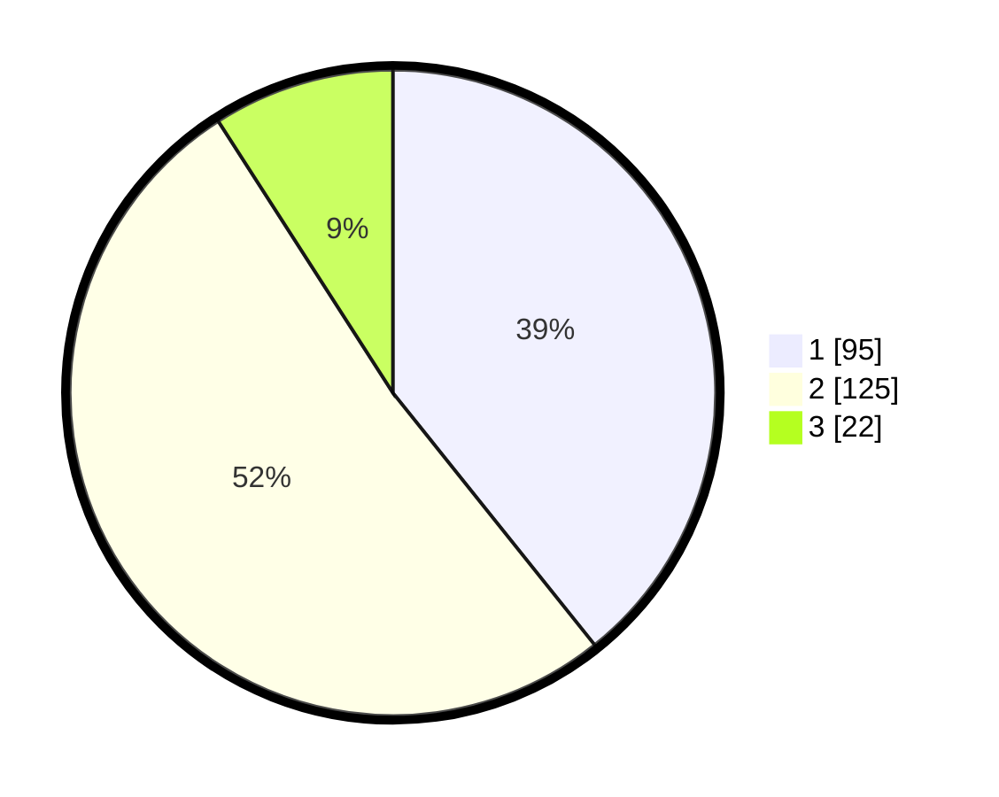

# Hasil

## Grafik

## Tabel

| No. | Nama Paslon    | Suara | Suara (raw) | Persentase |
|:--- |:-------------- | -----:| -----------:| ----------:|
| 1   | ANIES MUHAIMIN | 95    | [95][p-1]   | 39,26      |
| 2   | PRABOWO GIBRAN | 125   | [125][p-2]  | 51,65      |
| 3   | GANJAR MAHFUD  | 22    | [22][p-3]   | 9,09       |

[p-1]: https://github.com/gigit-pemilu/pemilu-2024/blob/main/pilpres/hitung-suara/sub/17-bengkulu/sub/71-kota-bengkulu/sub/04-muara-bangka-hulu/sub/1003-pematang-gubernur/sub/003-tps/sub/paslon-1.txt
[p-2]: https://github.com/gigit-pemilu/pemilu-2024/blob/main/pilpres/hitung-suara/sub/17-bengkulu/sub/71-kota-bengkulu/sub/04-muara-bangka-hulu/sub/1003-pematang-gubernur/sub/003-tps/sub/paslon-2.txt
[p-3]: https://github.com/gigit-pemilu/pemilu-2024/blob/main/pilpres/hitung-suara/sub/17-bengkulu/sub/71-kota-bengkulu/sub/04-muara-bangka-hulu/sub/1003-pematang-gubernur/sub/003-tps/sub/paslon-3.txt

## Foto C Plano

https://sirekap-obj-formc.kpu.go.id/69a9/pemilu/ppwp/17/71/04/10/03/1771041003003-20240224-133808--fede7b91-fd38-4029-96bd-6734ad4e6b65.jpg

https://sirekap-obj-formc.kpu.go.id/69a9/pemilu/ppwp/17/71/04/10/03/1771041003003-20240224-133855--1eceea0b-6002-4c5e-abab-5cb7d01d727d.jpg

https://sirekap-obj-formc.kpu.go.id/69a9/pemilu/ppwp/17/71/04/10/03/1771041003003-20240224-133935--ea63c6ac-92ba-4f50-bd2b-8d1e16a4966e.jpg

## Metadata

| Key        | Value               |
| ---------- | ------------------- |
| Time Stamp | 2024-02-24 22:31:28 |

