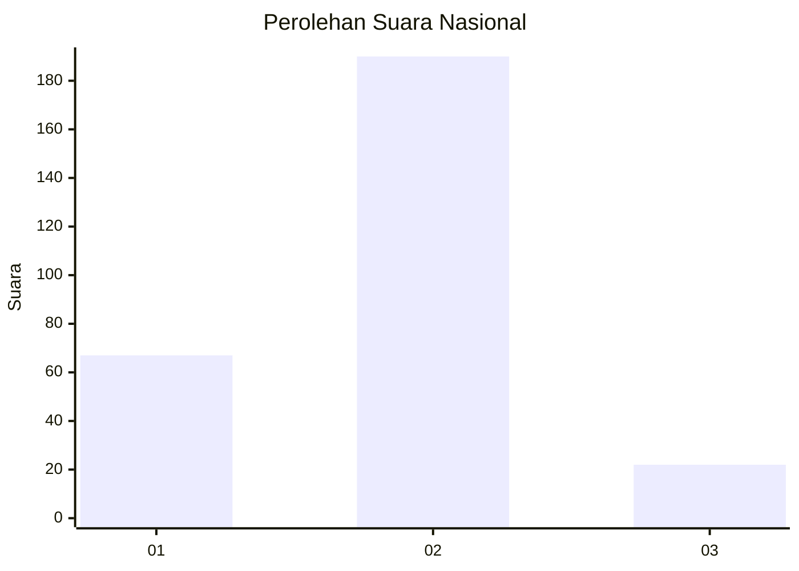
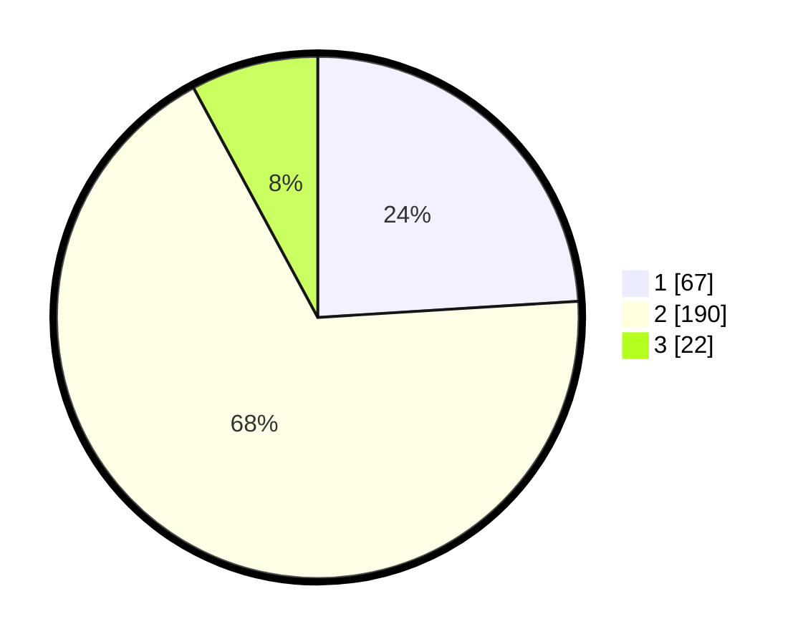

# Hasil

## Grafik

## Tabel

| No. | Nama Paslon    | Suara | Suara (raw) | Persentase |
|:--- |:-------------- | -----:| -----------:| ----------:|
| 1   | ANIES MUHAIMIN | 67    | [67][p-1]   | 24,01      |
| 2   | PRABOWO GIBRAN | 190   | [190][p-2]  | 68,10      |
| 3   | GANJAR MAHFUD  | 22    | [22][p-3]   | 7,89       |

[p-1]: https://github.com/gigit-pemilu/pemilu-2024/blob/main/pilpres/hitung-suara/sub/17-bengkulu/sub/71-kota-bengkulu/sub/04-muara-bangka-hulu/sub/1003-pematang-gubernur/sub/027-tps/sub/paslon-1.txt
[p-2]: https://github.com/gigit-pemilu/pemilu-2024/blob/main/pilpres/hitung-suara/sub/17-bengkulu/sub/71-kota-bengkulu/sub/04-muara-bangka-hulu/sub/1003-pematang-gubernur/sub/027-tps/sub/paslon-2.txt
[p-3]: https://github.com/gigit-pemilu/pemilu-2024/blob/main/pilpres/hitung-suara/sub/17-bengkulu/sub/71-kota-bengkulu/sub/04-muara-bangka-hulu/sub/1003-pematang-gubernur/sub/027-tps/sub/paslon-3.txt

## Foto C Plano

https://sirekap-obj-formc.kpu.go.id/9a39/pemilu/ppwp/17/71/04/10/03/1771041003027-20240215-192608--095956f0-44a4-4a93-9458-32f115ffe461.jpg

https://sirekap-obj-formc.kpu.go.id/9a39/pemilu/ppwp/17/71/04/10/03/1771041003027-20240215-192558--20707689-8fba-414a-b979-b4fff8253446.jpg

https://sirekap-obj-formc.kpu.go.id/9a39/pemilu/ppwp/17/71/04/10/03/1771041003027-20240215-192614--5863ac3b-6327-4ec9-8656-47416489a817.jpg

## Metadata

| Key        | Value               |
| ---------- | ------------------- |
| Time Stamp | 2024-02-20 22:00:00 |

