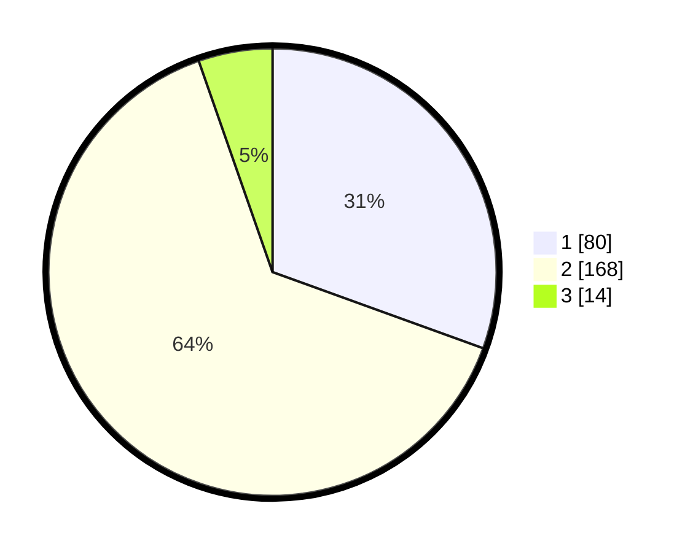

# Hasil

## Grafik

## Tabel

| No. | Nama Paslon    | Suara | Suara (raw) | Persentase |
|:--- |:-------------- | -----:| -----------:| ----------:|
| 1   | ANIES MUHAIMIN | 80    | [80][p-1]   | 30,53      |
| 2   | PRABOWO GIBRAN | 168   | [168][p-2]  | 64,12      |
| 3   | GANJAR MAHFUD  | 14    | [14][p-3]   | 5,34       |

[p-1]: https://github.com/gigit-pemilu/pemilu-2024-17-bengkulu/blob/main/pilpres/hitung-suara/sub/17-bengkulu/sub/71-kota-bengkulu/sub/04-muara-bangka-hulu/sub/1006-bentiring-permai/sub/007-tps/sub/paslon-1.txt
[p-2]: https://github.com/gigit-pemilu/pemilu-2024-17-bengkulu/blob/main/pilpres/hitung-suara/sub/17-bengkulu/sub/71-kota-bengkulu/sub/04-muara-bangka-hulu/sub/1006-bentiring-permai/sub/007-tps/sub/paslon-2.txt
[p-3]: https://github.com/gigit-pemilu/pemilu-2024-17-bengkulu/blob/main/pilpres/hitung-suara/sub/17-bengkulu/sub/71-kota-bengkulu/sub/04-muara-bangka-hulu/sub/1006-bentiring-permai/sub/007-tps/sub/paslon-3.txt

## Foto C Plano

https://sirekap-obj-formc.kpu.go.id/dd82/pemilu/ppwp/17/71/04/10/06/1771041006007-20240223-104940--8690edb9-f5dc-41cc-acc3-01e90824a503.jpg

https://sirekap-obj-formc.kpu.go.id/dd82/pemilu/ppwp/17/71/04/10/06/1771041006007-20240223-105102--40e58596-3913-4931-bc4d-5915903ee9a6.jpg

https://sirekap-obj-formc.kpu.go.id/dd82/pemilu/ppwp/17/71/04/10/06/1771041006007-20240223-105154--b185ee08-9e6d-4048-8d97-e727d61d0eb2.jpg

## Metadata

| Key        | Value               |
| ---------- | ------------------- |
| Time Stamp | 2024-02-24 22:31:28 |

