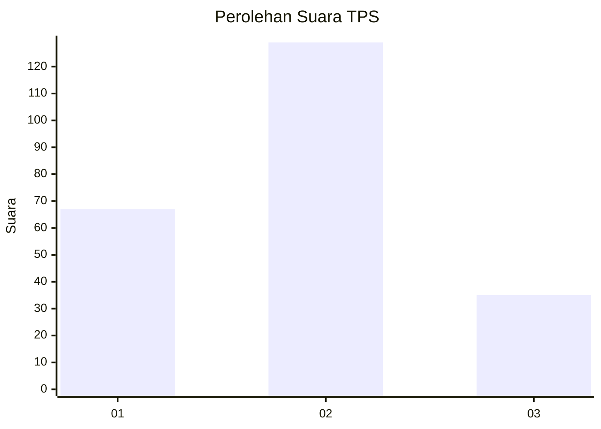
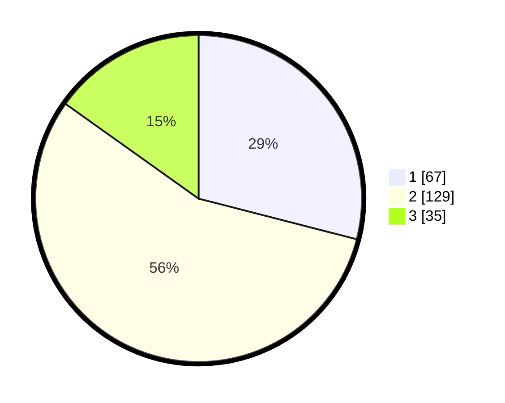

# Hasil

## Grafik

## Tabel

| No. | Nama Paslon    | Suara | Suara (raw) | Persentase |
|:--- |:-------------- | -----:| -----------:| ----------:|
| 1   | ANIES MUHAIMIN | 67    | [67][p-1]   | 29,00      |
| 2   | PRABOWO GIBRAN | 129   | [129][p-2]  | 55,84      |
| 3   | GANJAR MAHFUD  | 35    | [35][p-3]   | 15,15      |

[p-1]: https://github.com/gigit-pemilu/pemilu-2024-17-bengkulu/blob/main/pilpres/hitung-suara/sub/17-bengkulu/sub/71-kota-bengkulu/sub/06-ratu-agung/sub/1001-kebun-tebeng/sub/002-tps/sub/paslon-1.txt
[p-2]: https://github.com/gigit-pemilu/pemilu-2024-17-bengkulu/blob/main/pilpres/hitung-suara/sub/17-bengkulu/sub/71-kota-bengkulu/sub/06-ratu-agung/sub/1001-kebun-tebeng/sub/002-tps/sub/paslon-2.txt
[p-3]: https://github.com/gigit-pemilu/pemilu-2024-17-bengkulu/blob/main/pilpres/hitung-suara/sub/17-bengkulu/sub/71-kota-bengkulu/sub/06-ratu-agung/sub/1001-kebun-tebeng/sub/002-tps/sub/paslon-3.txt

## Foto C Plano

https://sirekap-obj-formc.kpu.go.id/0c4d/pemilu/ppwp/17/71/06/10/01/1771061001002-20240214-224655--e5c95ee3-2cb7-4b68-81d5-0d2e5ab7dd27.jpg

https://sirekap-obj-formc.kpu.go.id/0c4d/pemilu/ppwp/17/71/06/10/01/1771061001002-20240214-225009--1f1bd9f7-4648-4917-b63e-961ff62ebe5c.jpg

https://sirekap-obj-formc.kpu.go.id/0c4d/pemilu/ppwp/17/71/06/10/01/1771061001002-20240214-225012--b51feb9b-1a0d-42d9-b52b-f83ccf1ba782.jpg

## Metadata

| Key        | Value               |
| ---------- | ------------------- |
| Time Stamp | 2024-02-15 15:00:29 |

