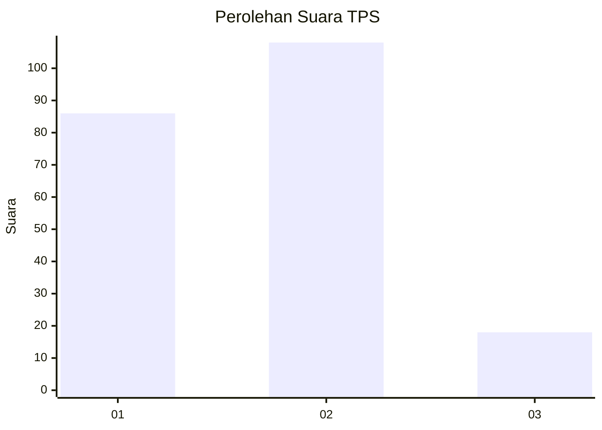
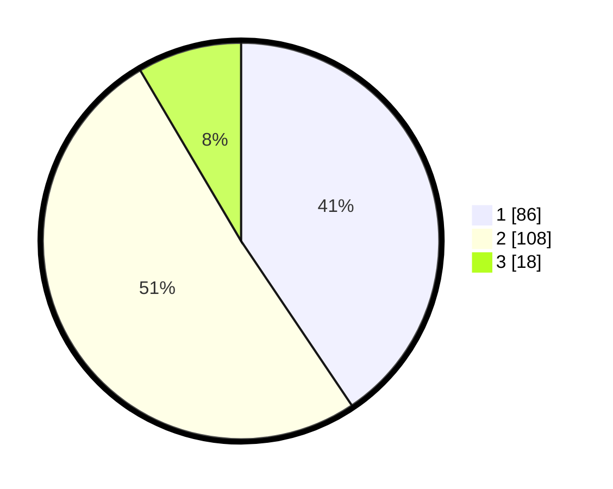

# Hasil

## Grafik

## Tabel

| No. | Nama Paslon    | Suara | Suara (raw) | Persentase |
|:--- |:-------------- | -----:| -----------:| ----------:|
| 1   | ANIES MUHAIMIN | 86    | [86][p-1]   | 40,57      |
| 2   | PRABOWO GIBRAN | 108   | [108][p-2]  | 50,94      |
| 3   | GANJAR MAHFUD  | 18    | [18][p-3]   | 8,49       |

[p-1]: https://github.com/gigit-pemilu/pemilu-2024-17-bengkulu/blob/main/pilpres/hitung-suara/sub/17-bengkulu/sub/71-kota-bengkulu/sub/06-ratu-agung/sub/1001-kebun-tebeng/sub/003-tps/sub/paslon-1.txt
[p-2]: https://github.com/gigit-pemilu/pemilu-2024-17-bengkulu/blob/main/pilpres/hitung-suara/sub/17-bengkulu/sub/71-kota-bengkulu/sub/06-ratu-agung/sub/1001-kebun-tebeng/sub/003-tps/sub/paslon-2.txt
[p-3]: https://github.com/gigit-pemilu/pemilu-2024-17-bengkulu/blob/main/pilpres/hitung-suara/sub/17-bengkulu/sub/71-kota-bengkulu/sub/06-ratu-agung/sub/1001-kebun-tebeng/sub/003-tps/sub/paslon-3.txt

## Foto C Plano

https://sirekap-obj-formc.kpu.go.id/3221/pemilu/ppwp/17/71/06/10/01/1771061001003-20240215-024042--b79da4fd-b007-49e9-92d6-7d59d432154b.jpg

https://sirekap-obj-formc.kpu.go.id/3221/pemilu/ppwp/17/71/06/10/01/1771061001003-20240215-024606--28741dfa-da34-4019-b775-9b1582c432f9.jpg

https://sirekap-obj-formc.kpu.go.id/3221/pemilu/ppwp/17/71/06/10/01/1771061001003-20240215-024930--0934f224-586b-42bc-b0e8-291f9e6a9bd8.jpg

## Metadata

| Key        | Value               |
| ---------- | ------------------- |
| Time Stamp | 2024-02-15 12:00:28 |

