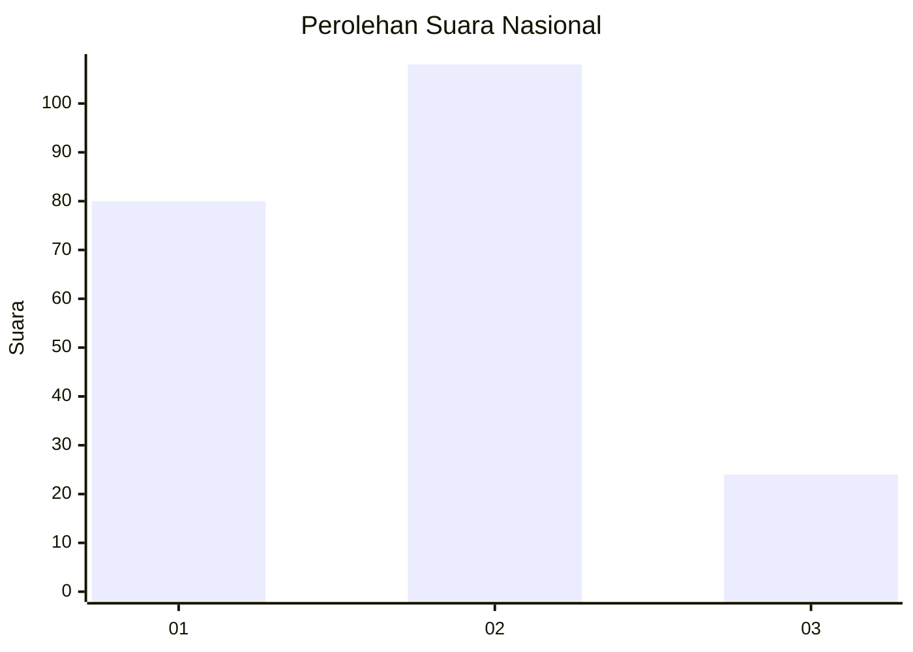
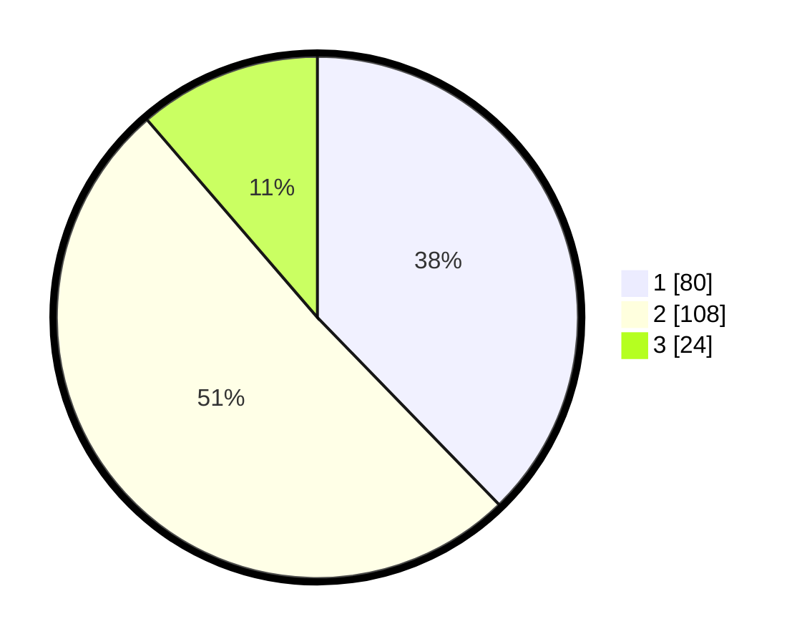

# Hasil

## Grafik

## Tabel

| No. | Nama Paslon    | Suara | Suara (raw) | Persentase |
|:--- |:-------------- | -----:| -----------:| ----------:|
| 1   | ANIES MUHAIMIN | 80    | [80][p-1]   | 37,74      |
| 2   | PRABOWO GIBRAN | 108   | [108][p-2]  | 50,94      |
| 3   | GANJAR MAHFUD  | 24    | [24][p-3]   | 11,32      |

[p-1]: https://github.com/gigit-pemilu/pemilu-2024/blob/main/pilpres/hitung-suara/sub/17-bengkulu/sub/71-kota-bengkulu/sub/06-ratu-agung/sub/1004-kebun-beler/sub/001-tps/sub/paslon-1.txt
[p-2]: https://github.com/gigit-pemilu/pemilu-2024/blob/main/pilpres/hitung-suara/sub/17-bengkulu/sub/71-kota-bengkulu/sub/06-ratu-agung/sub/1004-kebun-beler/sub/001-tps/sub/paslon-2.txt
[p-3]: https://github.com/gigit-pemilu/pemilu-2024/blob/main/pilpres/hitung-suara/sub/17-bengkulu/sub/71-kota-bengkulu/sub/06-ratu-agung/sub/1004-kebun-beler/sub/001-tps/sub/paslon-3.txt

## Foto C Plano

https://sirekap-obj-formc.kpu.go.id/f5e9/pemilu/ppwp/17/71/06/10/04/1771061004001-20240215-063514--e010f8ac-445f-4faf-ae89-e458d70b73e3.jpg

https://sirekap-obj-formc.kpu.go.id/f5e9/pemilu/ppwp/17/71/06/10/04/1771061004001-20240215-063627--2910aed7-4575-40a8-8d8e-153bc90fe3d8.jpg

https://sirekap-obj-formc.kpu.go.id/f5e9/pemilu/ppwp/17/71/06/10/04/1771061004001-20240215-063744--b05dfcf9-dbc8-4ba6-92e1-325659022836.jpg

## Metadata

| Key        | Value               |
| ---------- | ------------------- |
| Time Stamp | 2024-02-15 12:00:28 |

