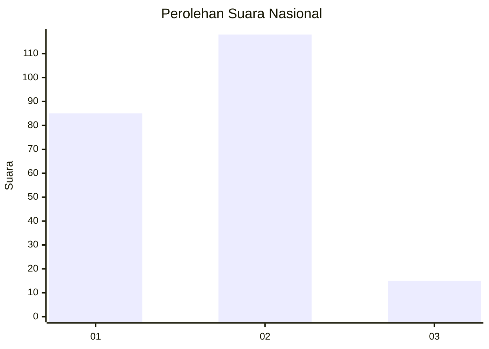

# Hasil

## Grafik

## Tabel

| No. | Nama Paslon    | Suara | Suara (raw) | Persentase |
|:--- |:-------------- | -----:| -----------:| ----------:|
| 1   | ANIES MUHAIMIN | 85    | [85][p-1]   | 38,99      |
| 2   | PRABOWO GIBRAN | 118   | [118][p-2]  | 54,13      |
| 3   | GANJAR MAHFUD  | 15    | [15][p-3]   | 6,88       |

[p-1]: https://github.com/gigit-pemilu/pemilu-2024/blob/main/pilpres/hitung-suara/sub/17-bengkulu/sub/71-kota-bengkulu/sub/06-ratu-agung/sub/1005-kebun-kenanga/sub/002-tps/sub/paslon-1.txt
[p-2]: https://github.com/gigit-pemilu/pemilu-2024/blob/main/pilpres/hitung-suara/sub/17-bengkulu/sub/71-kota-bengkulu/sub/06-ratu-agung/sub/1005-kebun-kenanga/sub/002-tps/sub/paslon-2.txt
[p-3]: https://github.com/gigit-pemilu/pemilu-2024/blob/main/pilpres/hitung-suara/sub/17-bengkulu/sub/71-kota-bengkulu/sub/06-ratu-agung/sub/1005-kebun-kenanga/sub/002-tps/sub/paslon-3.txt

## Foto C Plano

https://sirekap-obj-formc.kpu.go.id/7ae4/pemilu/ppwp/17/71/06/10/05/1771061005002-20240214-221109--4f50f8c3-84f0-4903-8fa5-26728ef70f1e.jpg

https://sirekap-obj-formc.kpu.go.id/7ae4/pemilu/ppwp/17/71/06/10/05/1771061005002-20240214-221347--27c060b4-5751-4e3a-963e-c1d229d7d9c3.jpg

https://sirekap-obj-formc.kpu.go.id/7ae4/pemilu/ppwp/17/71/06/10/05/1771061005002-20240214-221815--5d48465c-0fcf-4c23-b280-917a1827e2c9.jpg

## Metadata

| Key        | Value               |
| ---------- | ------------------- |
| Time Stamp | 2024-02-17 11:30:03 |

