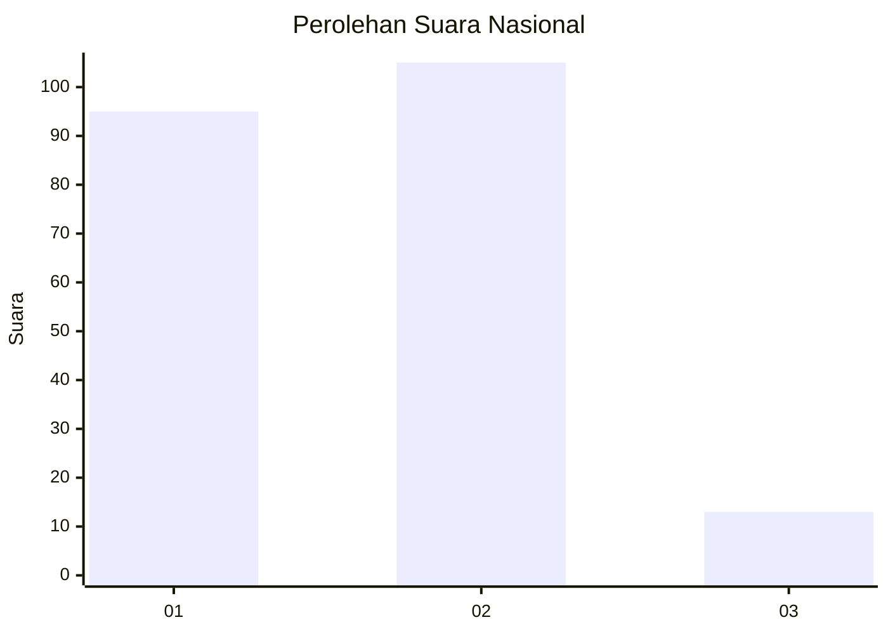
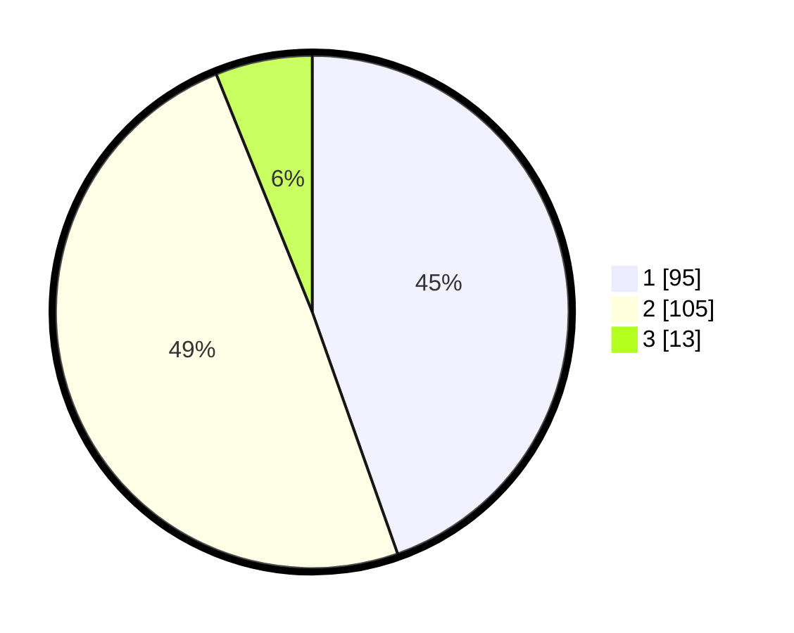

# Hasil

## Grafik

## Tabel

| No. | Nama Paslon    | Suara | Suara (raw) | Persentase |
|:--- |:-------------- | -----:| -----------:| ----------:|
| 1   | ANIES MUHAIMIN | 95    | [95][p-1]   | 44,60      |
| 2   | PRABOWO GIBRAN | 105   | [105][p-2]  | 49,30      |
| 3   | GANJAR MAHFUD  | 13    | [13][p-3]   | 6,10       |

[p-1]: https://github.com/gigit-pemilu/pemilu-2024/blob/main/pilpres/hitung-suara/sub/17-bengkulu/sub/71-kota-bengkulu/sub/07-ratu-samban/sub/1003-belakang-pondok/sub/005-tps/sub/paslon-1.txt
[p-2]: https://github.com/gigit-pemilu/pemilu-2024/blob/main/pilpres/hitung-suara/sub/17-bengkulu/sub/71-kota-bengkulu/sub/07-ratu-samban/sub/1003-belakang-pondok/sub/005-tps/sub/paslon-2.txt
[p-3]: https://github.com/gigit-pemilu/pemilu-2024/blob/main/pilpres/hitung-suara/sub/17-bengkulu/sub/71-kota-bengkulu/sub/07-ratu-samban/sub/1003-belakang-pondok/sub/005-tps/sub/paslon-3.txt

## Foto C Plano

https://sirekap-obj-formc.kpu.go.id/3757/pemilu/ppwp/17/71/07/10/03/1771071003005-20240217-220116--8a444a06-3470-4de8-a7bb-d66e0e3871bb.jpg

https://sirekap-obj-formc.kpu.go.id/3757/pemilu/ppwp/17/71/07/10/03/1771071003005-20240217-220213--466bb472-e399-4caf-9f42-b5d7abc02fd0.jpg

https://sirekap-obj-formc.kpu.go.id/3757/pemilu/ppwp/17/71/07/10/03/1771071003005-20240217-220541--391cecec-5329-4a23-afdc-44da508aec90.jpg

## Metadata

| Key        | Value               |
| ---------- | ------------------- |
| Time Stamp | 2024-02-19 21:00:00 |

## DATA PEMILIH TETAP

Jumlah pemilih dalam DPT: **279**.
 * L: **139**.
 * P: **790**.

## DATA PENGGUNA HAK PILIH

Jumlah pengguna hak pilih dalam DPT: **350**.
 * L: **147**.
 * P: **403**.

Jumlah pengguna hak pilih dalam DPTb: **550**.
 * L: **82**.
 * P: **550**.

Jumlah pengguna hak pilih dalam DPK: **2**.
 * L: **255**.
 * P: **4**.

Jumlah pengguna hak pilih: **442**.
 * L: **757**.
 * P: **333**.

## JUMLAH SUARA SAH DAN TIDAK SAH

JUMLAH SELURUH SUARA SAH: **213**.

JUMLAH SUARA TIDAK SAH: **3**.

JUMLAH SELURUH SUARA SAH DAN SUARA TIDAK SAH: **216**.

