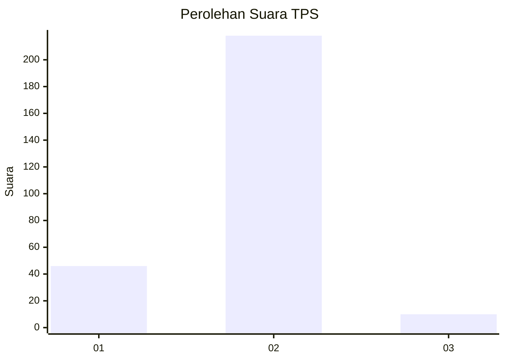
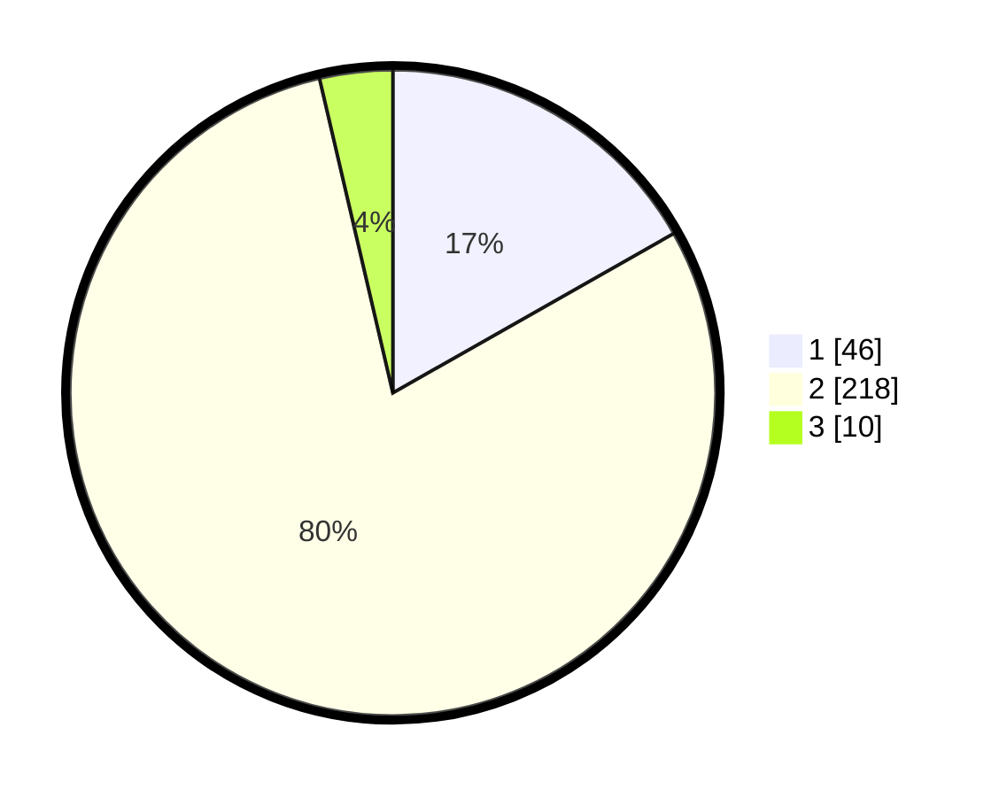

# Hasil

## Grafik

## Tabel

| No. | Nama Paslon    | Suara | Suara (raw) | Persentase |
|:--- |:-------------- | -----:| -----------:| ----------:|
| 1   | ANIES MUHAIMIN | 46    | [46][p-1]   | 16,79      |
| 2   | PRABOWO GIBRAN | 218   | [218][p-2]  | 79,56      |
| 3   | GANJAR MAHFUD  | 10    | [10][p-3]   | 3,65       |

[p-1]: https://github.com/gigit-pemilu/pemilu-2024-17-bengkulu/blob/main/pilpres/hitung-suara/sub/17-bengkulu/sub/71-kota-bengkulu/sub/09-singaran-pati/sub/1004-padang-nangka/sub/014-tps/sub/paslon-1.txt
[p-2]: https://github.com/gigit-pemilu/pemilu-2024-17-bengkulu/blob/main/pilpres/hitung-suara/sub/17-bengkulu/sub/71-kota-bengkulu/sub/09-singaran-pati/sub/1004-padang-nangka/sub/014-tps/sub/paslon-2.txt
[p-3]: https://github.com/gigit-pemilu/pemilu-2024-17-bengkulu/blob/main/pilpres/hitung-suara/sub/17-bengkulu/sub/71-kota-bengkulu/sub/09-singaran-pati/sub/1004-padang-nangka/sub/014-tps/sub/paslon-3.txt

## Foto C Plano

https://sirekap-obj-formc.kpu.go.id/7bda/pemilu/ppwp/17/71/09/10/04/1771091004014-20240215-042508--c135662f-77a9-4cd6-9844-fdb2d7b73e83.jpg

https://sirekap-obj-formc.kpu.go.id/7bda/pemilu/ppwp/17/71/09/10/04/1771091004014-20240215-042557--d2617825-72bd-4306-8ab7-4877a37f4f20.jpg

https://sirekap-obj-formc.kpu.go.id/7bda/pemilu/ppwp/17/71/09/10/04/1771091004014-20240215-042703--578da2a0-cc4f-4eb3-9e6b-7f57488388c5.jpg

## Metadata

| Key        | Value               |
| ---------- | ------------------- |
| Time Stamp | 2024-02-15 17:30:25 |

